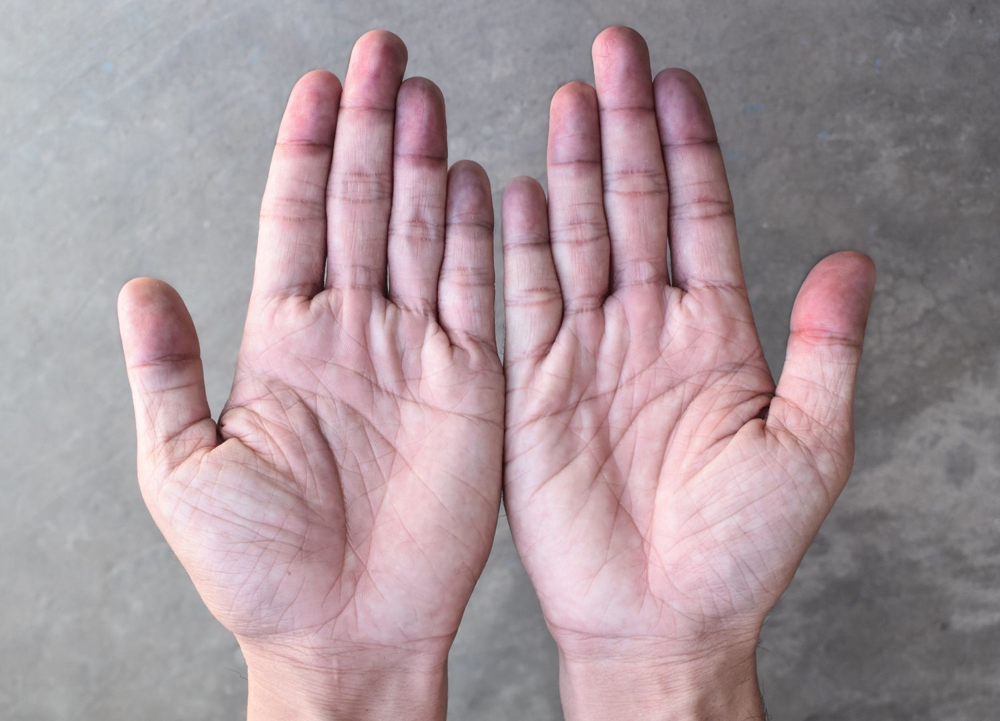
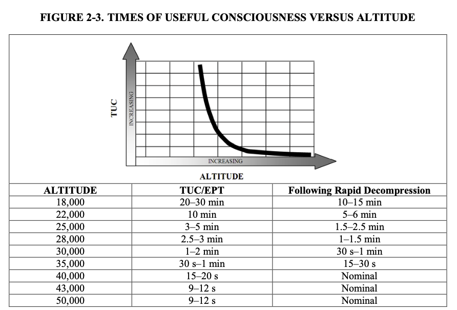
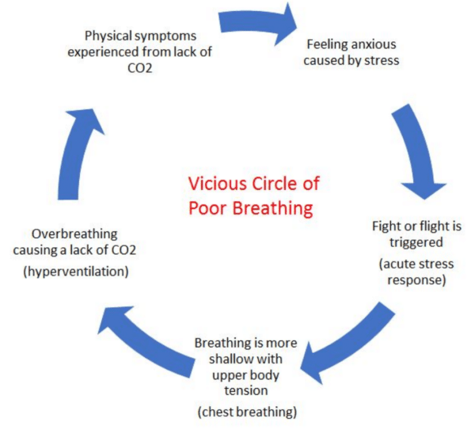
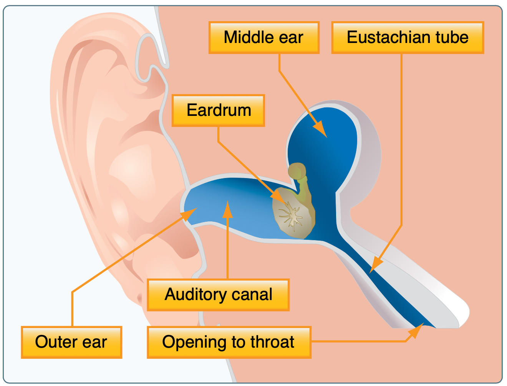
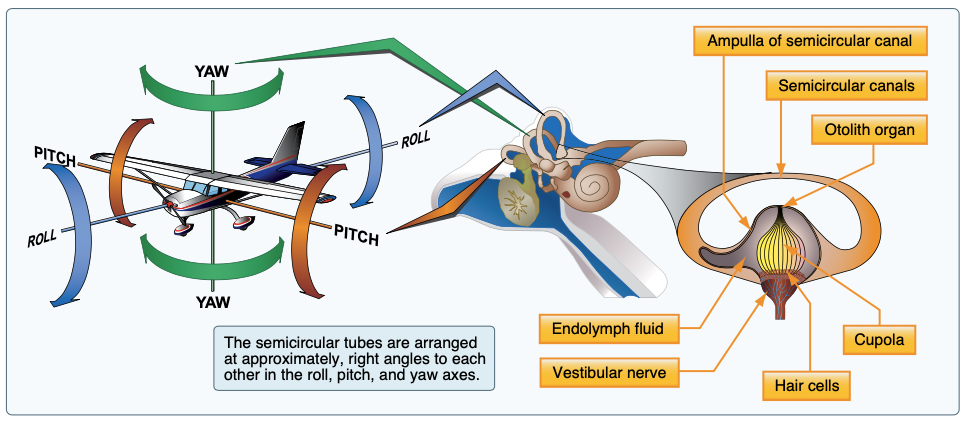
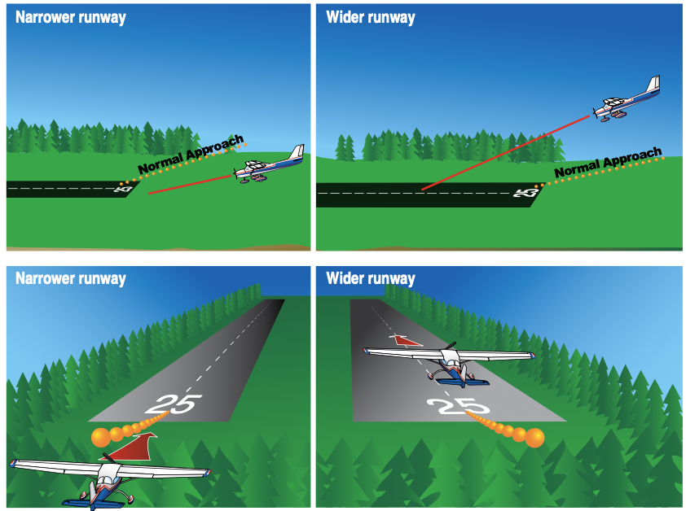
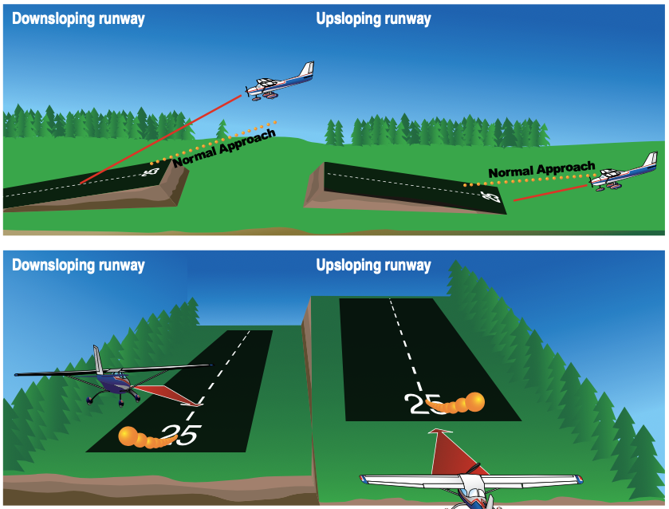
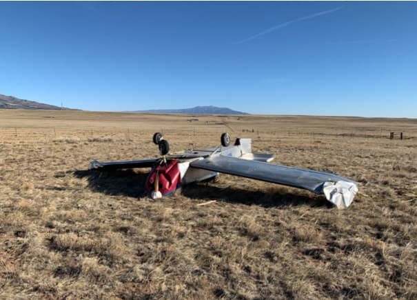
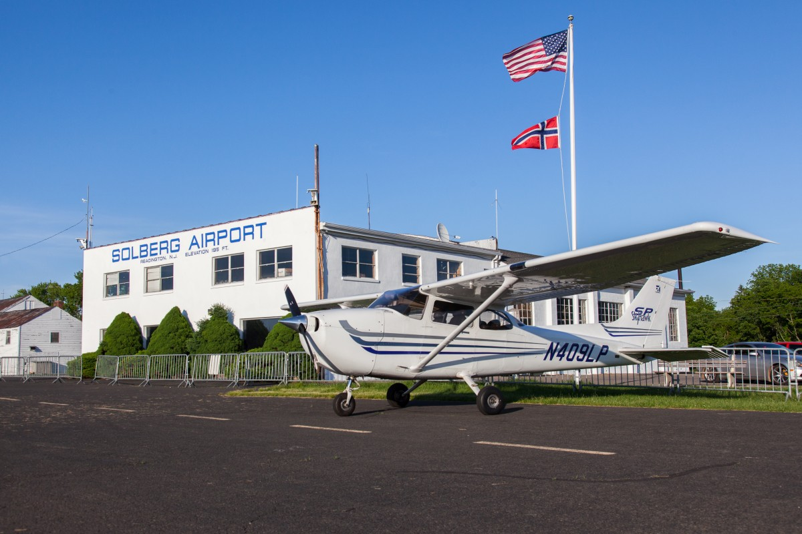

# Human Factors

---

## Objective

To become familiar with human and aeromedical factors that can affect flight safety, and apply corrective actions to mitigate them.

## Motivation

Understand the risks and mitigations for aeromedical factors that can effect flight safety, as they may happen to you, another pilot, or your passengers.

---

## Overview

- Aeromedical Factors
  - Hypoxia
  - Hyperventilation
  - Middle Ear/Sinuses
  - Motion Sickness
  - Carbon Monoxide
  - Stress and Fatigue
  - Dehydration
  - Hypothermia
  - Alcohol and Drugs
  - SCUBA diving

- IMSAFE Checklist
- Illusions in Flight
- Psychological Hazards
  - Hazardous Attitudes
  - Get-There-itis

---

# Hypoxia

Hypoxia is a state of oxygen deficiency in the body sufficient to impair functions of the brain and other organs

### Symptoms

Cyanosis, headache, dizziness, euphoria, impaired vision, drowsiness

### Corrective Actions

- Use supplemental oxygen
- Fly at a lower altitude
- Address any pollution in the air

---

## Time of Useful Consciousness

- From AC 61-107B

---

## Types of Hypoxia

- **Hypoxic**: Caused by the reduction in partial pressure of oxygen at high altitude
- **Hypemic**: Caused by the blood not being able to take up and transport a sufficient amount of oxygen; CO poisoning
- **Stagnant**: Caused by a lack of circulation of oxygenated blood in the body; can occur during high-G maneuvers

---

# Hyperventilation

Excessive rate and depth of respiration, body expels more carbon dioxide than the body can produce.

<!-- This leads to a low level of CO2 in your blood, which can cause breathlessness. -->

### Symptoms

- Rapid breathing, visual impairment, sweaty skin, dizziness
- Often occurs with stress or anxiety

### Corrective Actions

- Breath slowly
- Speak something slowly
- Breathe into a bag

---

# Middle Ear and Sinus Problems

- Blockage of the Eustachian tube which equalizes pressure between both sides of your ear drum, which often happens with inflammation

---

## Middle Ear and Sinus Problems

- **Symptoms**:
  - Ear pain and pressure
  - Muffled hearing
- **Corrective Actions**
  - Valsalva method
  - Descend slowly
  - Avoid flying with any sinus blockage
    - Decongestants can be helpful (for passengers)

---

# Spatial disorientation

Disagreement or confusion between your sensory systems about the aircraft's position, attitude, or movement.

<!-- vestibular system is sort of like a gyroscope -->

---

### Illusions and Spatial Disorientation

## "The Leans"

- After a long gradual turn, the airplane is returned to level
- The plane may feel as though it's banking in the opposite direction

# Graveyard Spiral

- The pilot erroneous banks back into the turn
- The airplane will tend to lose altitude, so the pilot pulls back on the elevator
- The result is a nose-low, descending, high-G turn

---

### Illusions and Spatial Disorientation

## Coriolis illusion

- Rapid head movement during a turn
- The plane may feel as though it's banking in the opposite direction

---

## Somatogravic Illusion

- Acceleration may feel like a pitching-up movement
- Especially true with limited visual reference, like at night
- Pilot may consequently push into a nose-low attitude
- Likewise, deceleration may cause the sensation of pitching down

---

### Illusions and Spatial Disorientation

## Inversion illusion

- Abrupt change from climbing to straight-and-level flight can create the illusion of tumbling backwards
- Pilots may then push the aircraft into a nose-low attitude

---

### Illusions and Spatial Disorientation

## Elevator Illusion

- Upward vertical acceleration like an updraft can create the illusion of being in a climb
- Pilots may push the aircraft into a nose-low attitude
- Likewise a downward acceleration can create the illusion of being in a descent

---

## Overcoming Disorienting Illusions

- Trust flight instruments
- Limit maneuvering, especially high-load factor maneuvers
- Limit rapid head movements
- Use autopilot if needed

---

## Motion Sickness

Discomfort caused by the brain receiving conflicting messages about the state of the body's position in space.

- **Symptoms**
  - Paleness, sweaty, clammy skin
  - Nausea, vomiting, dizziness
- **Corrective Actions**
  - Fresh air
  - Focus on objects outside the airplane
  - Avoid unnecessary head movements
  - Always have a bag

---

# Carbon monoxide poisoning

Hypemic hypoxia caused by the presence of CO in the air, which attaches to hemoglobin in the blood.

<!-- CO attaches to hemoglobin in the blood about 200 times more easily than oxygen -->

- **Symptoms**
  - Headache, drowsiness
  - Blurred vision
  - Loss of muscle power
- **Corrective Actions**
  - Close heater vent
  - Land and ventilate the cabin
  - Open fresh air vents

---

# Stress

The body’s response to physical and psychological demands placed upon it. Stress can be chronic or acute.

- **Symptoms**
  - Agitation
  - Not thinking well
  - Fatigue
- **Corrective Actions**
  - Correct underlying stressors
  - Chronic stress require medical treatment

---

# Fatigue

- Acute fatigue is caused by lack of sleep
- Chronic fatigue usually has medical underpinnings

### Symptoms

- Drowsiness
- Errors in judgment, timing, computation
- Loss of muscle control

### Corrective Actions

- Chronic fatigue: correct underlying issues, may require medical attention
- Acute fatigue: Rest

---

# Dehydration

A critical loss of water or electrolytes from the body.

- **Symptoms**
  - Headache
  - Fatigue
  - Drowsiness
  - Cramps
- **Corrective Actions**
  - Drink plenty of fluids and electrolytes
  - Drink before you become thirsty

<!-- Your thirst response may work too slowly to warn of the onset of dehydration -->

---

# Hypothermia

- **Cause**: Exposure to cold temperature for extended periods.
- **Symptoms**:
  - Coldness, shivering
  - Drowsiness
  - Loss of consciousness
- **Corrective Actions**
  - Move to a warmer environment
  - Add clothing, blankets, or coats
  - Cover exposed areas

---

# Alcohol

## Effects

- Symptoms similar to that of hypoxia
- Impaired judgement, coordination, reaction time

## Regulations

Part [91.17](/_references/14-CFR/91.17):

- 8 hours "bottle to throttle"
- 0.04% BAC limit
- Cannot carry drunk passengers, except in an emergency

---

# Drugs

### Regulations

Part [61.53](/_references/14-CFR/61.53):

A pilot cannot act as PIC if:

- They have any known condition that would make them ineligible for a medical
- Are receiving treatment or taking medication that would make them ineligible for a medical

### AOPA Drug Database

https://www.aopa.org/go-fly/medical-resources/medications-database

- Check the half-life of any drug you intend to take

---

# Drugs

## Substances to Avoid

- Nicotine: Impaired night vision, CO poisoning
- Amphetamines: Impaired vision, impaired judgement
- Caffeine: Impaired judgement, dehydration, headaches
- Antacids: Release CO2 at altitude
- Antihistamines: Drowsiness, dizziness
- Aspirin: Contribute to hypoxia
- Prescription pain killers
- Illicit drugs

---

# Dissolved Nitrogen After SCUBA dives

Dissolved nitrogen in the blood being forced out of the body's tissues.

## Guidance

- Flights below 8,0000' MSL:
  - Dive does _not_ require a controlled ascent: Wait at least **12 hours**
  - Dive require controlled ascent: Wait at least **24 hours**
- Flights above 8,000' MSL: At least **24 hours**

---

# IMSAFE Checklist

Preflight self-evaluation:

1. Illness
2. Medication
3. Stress
4. Alcohol
5. Fatigue
6. Emotion

---

## Illusions in Flight

---

### False Horizon

---

## Runway Width Illusion

---

## Sloping Runway Illusion

---

## Other Illusions

- Featureless terrain
  - Over water at night
  - Aircraft may appear higher than it actually is
  - "Black hole" approaches
- Water on windscreen
  - The aircraft seems higher than it actually is
- Haze
  - Aircraft may appear to be further away
- Fog
  - Flying into fog: Illusion of pitching up
- Mistaking city lights for runway lights

---

# Psychological Hazards

---

## Hazardous Attitudes

- **Anti-authority**: "Don't tell me what to do"
- **Impulsivity**: "I can do it quickly"
- **Invulnerability**: "It won't happen to me"
- **Macho**: "I can do it"
- **Resignation**: "What's the use?"

---

## Hazardous Attitudes - Antidotes

Learn to recognize these attitudes when they occur. Slow down and state the antidote to yourself:

- **Anti-authority**: Follow the rules, they are usually right.
- **Impulsivity**: Not so fast, think first.
- **Invulnerability**: It could happen to me.
- **Macho**: Taking chances is foolish.
- **Resignation**: I am not helpless, I can make a difference.
- **Stress**: I can manage stress.

---

## Get-There-itis

- The desire to get to a destination, complete the mission, or meet a schedule
- Pilots can feel pressured to continue, even when conditions are unsafe
- Consequences of not getting there are _immediate_ and _specific_
- Consequences of an accident are _vague_ and _hypothetical_

---

## Combatting Get-There-itis

- Recognize the symptoms
- Avoid situations where you feel pressured to continue
- Avoid situations where peer pressure would be strong

---

## Summary

---

## Knowledge Check

You are flying at 7,500 feet and your passenger complains of fatigue and a headache.

What might you suspect?

---

## Knowledge Check

You are flying at 7,500 feet and your passenger complains of fatigue and a headache.

- Suspect some form of hypoxia
- Check CO detector, if installed
- Use a pulse-oximeter if you have one
- Descend if possible

---

## Knowledge Check

You are flying at 9,500 feet and your passenger is become abnormally euphoric and giddy.

What might you suspect?

---

## Knowledge Check

You are flying at 9,500 feet and your passenger is become abnormally euphoric and giddy.

- Suspect hypoxia
- Use a pulse-oximeter if you have one
- Descend if possible
- Use supplemental oxygen if available
- Suspect that **you may also be hypoxic**

---

## Knowledge Check

You want to take your three friends flying shortly after you receive your private pilot certificate. You're flying a Cessna 172, and from your weight and balance calculations, you know that the aircraft will be above gross weight with the four of them.

You'd still like to take your friends flying. What should you do?
