

# Approaches - Types, Limitations, Regulations

---

## Objective

To demonstrate the kinds of approaches, approach limitations, and regulations that govern how we fly approach procedures.

Introduce basic approach concepts for precision, non-precision, GPS, and other types of approaches.

---

## Overview

- Getting established on an approach
- Types of approaches
  - Precision (ILS)
  - Non-precision (VOR)
  - GPS approaches (LNAV, LPV)
- When can we land?
- Circle to land, sidesteps

- Other Approach Types
  - LDA Approaches
  - Backcourse Approaches
  - Visual and Contact Approaches
- Inoperative Equipment
- Cold Weather Operations

---

## Getting Established on an Approach

How do we get from the enroute phase to the final approach phase?

- **Direct to an IAF** (e.g. LOATH)
- **Published transition routes** (e.g. COUGA)
- **Vectors to final**
  - ATC-assigned headings, intercept to the final approach course
  - Entry behind the FAF

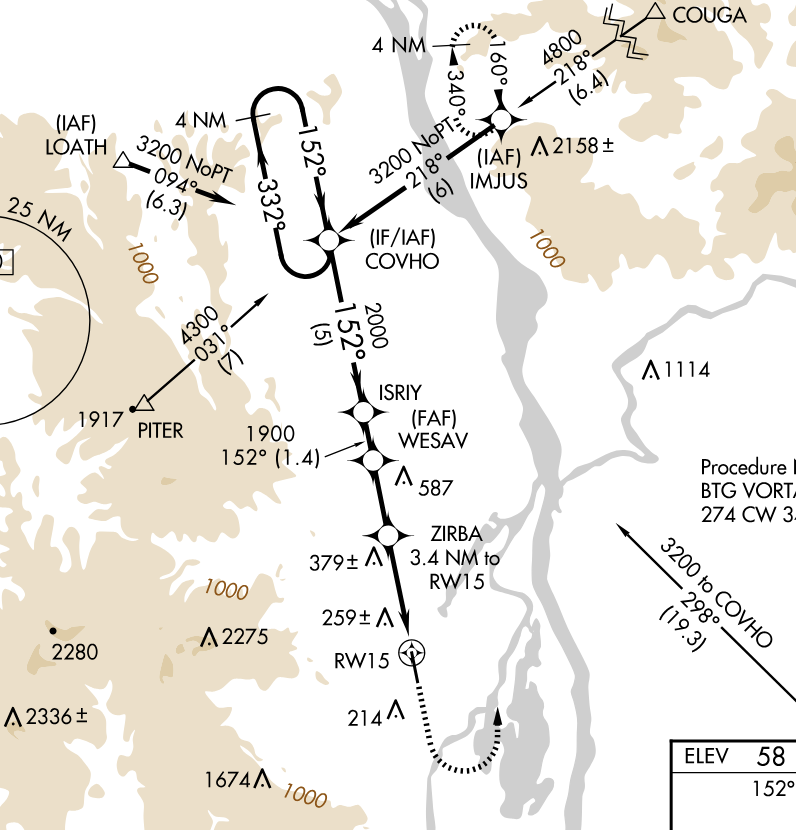

---

## Procedure Turns

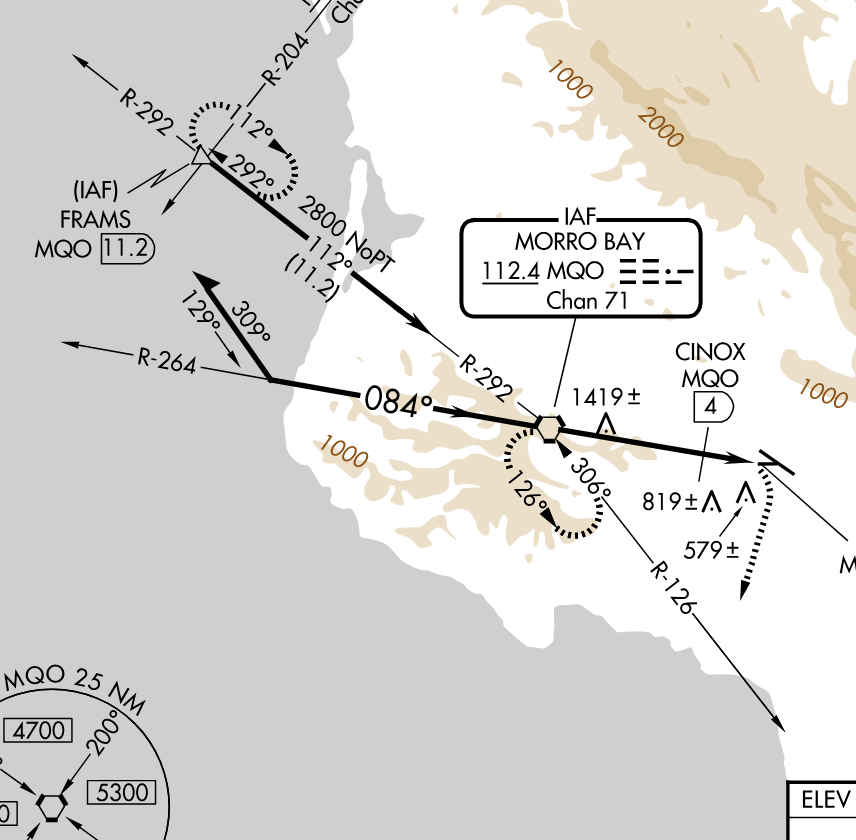

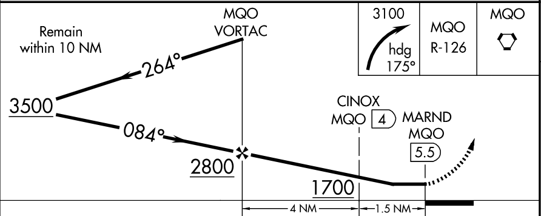

A published 180-degree turn to align you with the final approach course.

- Types of turns, up to the pilot what to use
  - 45/180
  - 80/260
  - Teardrop
  - Racetrack
- Defined protected turn area, usually says "Remain within 10NM" on profile view

---

## Hold-in-Lieu of Procedure Turn (HILPT)

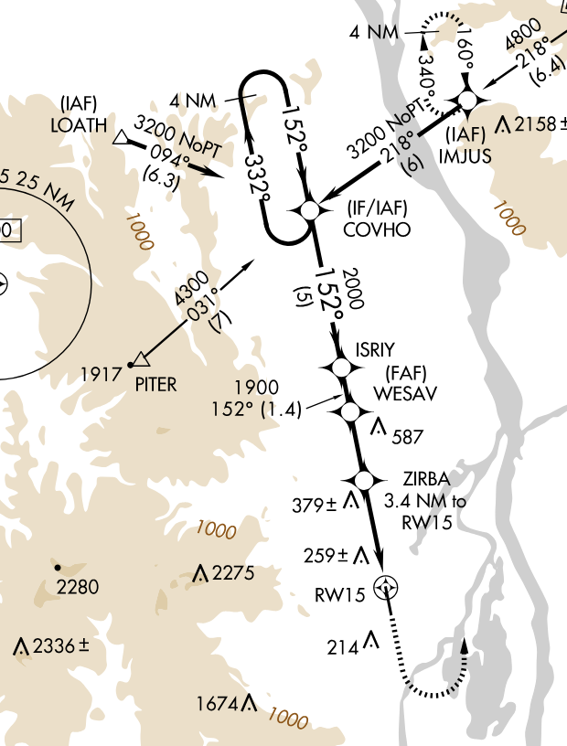

- Published hold used for getting you aligned with final approach course (e.g. PITER transition)
- Fly standard hold entry and begin the approach
- ATC will not expect you to make additional turns in the hold
- These are become more common than barbed PTs

---

## When _not_ to Fly a PT/HILPT - SNoRT

- **S:** "Straight-in approach" from ATC
  - "Cross COVHO at 2000, cleared straight-in RNAV runway 15 approach Scappoose airport"
- **No:** NoPT on approach chart
- **R:** Radar vectored
  - "Turn right heading 100, vectors for final approach course"
- **T:** Timed approach from a fix

---

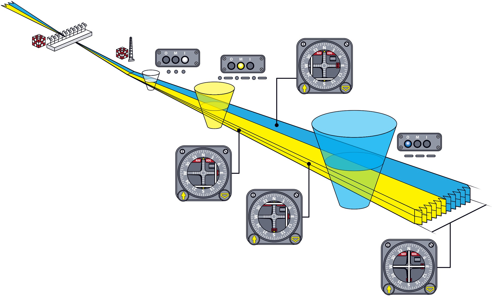

# Approach Types

- Precision
- Non-precision
- GPS Approaches

---

## Precision Approaches

Precision approaches are characterized by **vertical and horizontal guidance** that position the aircraft close to the runway from where it can safely land.

Type of precision approaches:

- **PAR** - Precision approach radar
- **GLS** - GBAS landing system
- **ILS** - Instrument landing system

**ILS typically have minimums of 200 feet above TDZE**

---

## Components of an ILS

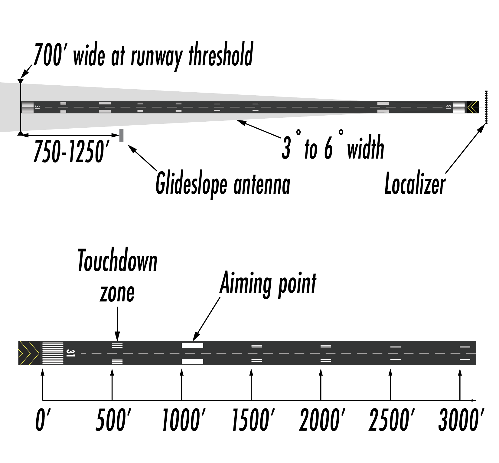

**Localizer:**

- Positioned at the end of the runway
- Angular width is 700' wide at the threshold
- Gives precise angular guidance aligned with the runway
- Sensitivity depends on runway length

---

## Components of an ILS

**Glideslope:**

- Positioned to the side of the runway
- Gives vertical guidance, usually for a 3° glideslope
- **Beware of false glideslopes**

---

## ILS Marker Beacons

Marker becaons used to be standard on an ILS. They were identified with a tone and light on the audio panel.

- **Outer marker:** FAF
- **Middle marker:** Standard minimums
- **Inner marker:** Used to identify lower minimums of CAT II or III ILS

We now use DME or a secondary VOR to identify these points.

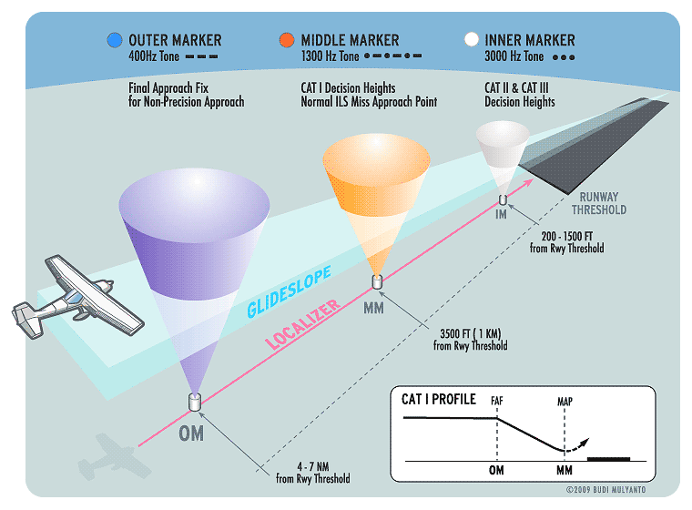

---

## Capturing an ILS

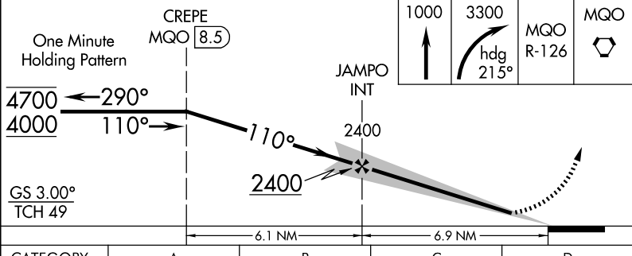

- Glideslope needle starts above us
- As we approach the GS intercept (lightning bolt), glideslope needle will come down
- One dot below glideslope: Reconfigure for your approach

---

## Flying an ILS

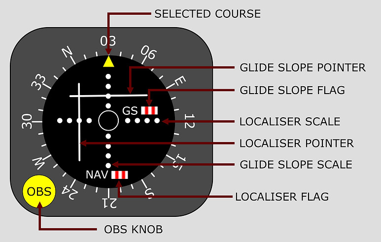

Fly to keep the needles centered

- GS needle moves up: Too low
- GS needle moves down: Too high
- LOC needle moves left: Right of course
- LOC needle moves right: Left of course

Both needles get more sensitive as we get closer to the runway.

---

## Precision Approaches Minimums

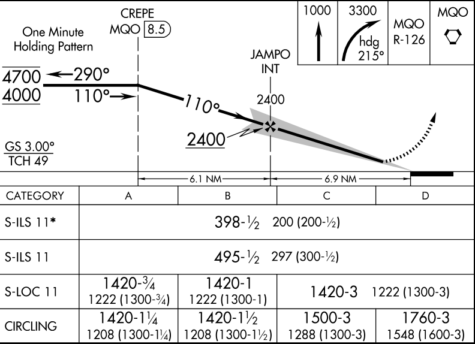

- We fly until reaching our decision altitude (DA)
- If we have the runway environment in sight and are able to make a safe landing, we can continue our descent and land

---

## When Can We Land? - FAR 91.175

An aircraft may not descend from the DA/MDA unless:

1. Aircraft is continuously in a position from which a descent to a landing can be made on the intended runway
2. The descent can be made at a normal rate of descent using normal maneuvers
3. For 121/135 ops: A descent that allows for touchdown in the touchdown zone
4. The **flight visibility** must be greater than prescribed on the chart
5. At least one of the following visual references for the intended runway is visible

---

## Visual References

- Approach lighting system\*
- Threshold marking/lights
- Runway end identifier lights (REILs)
- PAPI/VASI
- Touchdown markings/lights
- Runway or runway markings
- Runway lights

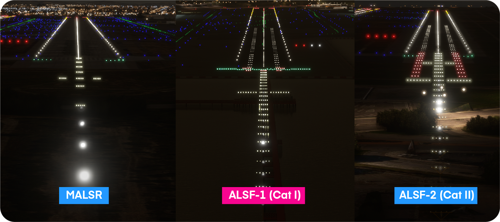

\*The red terminating bars allow you to descend to 100' above TDZ (regardless of the approach)

---

## Non-Precision Approaches

Non-precision approaches are characterized by **step-down fixes** and a **minimum descent altitude (MDA)** .

**Types:**

- **VOR** - VOR approach
- **TACAN** - TACAN approach
- **LOC** - Localizer approach
- **LDA** - Localizer directional aid
- **LOC BC** - Localizer back course approach
- **ASR** - Approach surveillance radar

---

## Flying a Non-Precision Approach

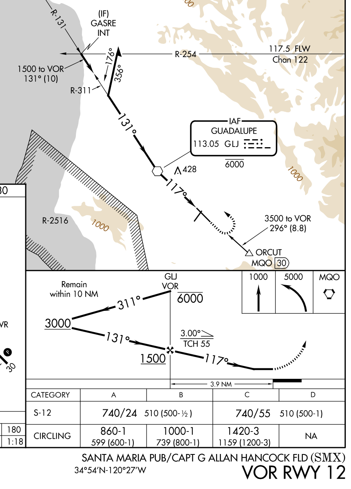

- Use the primary navaid for L/R guidance
- Descent to the lowest altitude for each segment based on the profile view
- After the final step-down fix, descend to the approariate MDA
- Fly at the MDA until
  - The runway is in sight and a landing can be made (91.175)
  - Or, the missed approach point and execute the missed procedure

---

## Flying VOR Approaches with RNAV

**AIM 1-2-3:** "Use of a suitable RNAV system as a means to navigate on the final approach segment of an instrument approach procedure based on VOR, TACAN or NDB signal is allowable."

**Requirements:**

- The underlying NAVAID must be operational
- The NAVAID must be monitored for the final approach course alignment
- Secondary CDI or bearing pointer should monitor the underlying NAVAID
- Guidance can be used from the GPS

---

## RNAV (GPS) Approaches

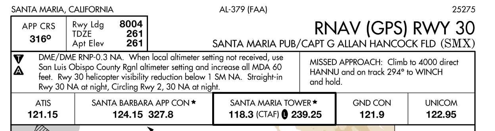

**Approaches with Vertical Guidance:**

- **LPV**: Localizer Performance with Vertical guidance
- **LNAV/VNAV**: Lateral/vertical navigation

**Without Vertical Guidance:**

- **LP** - Akin to a LOC approach
- **LNAV** - Lateral guidance

---

## LPV Approaches: Localizer Performance with Vertical Guidance

- **ILS-like minimums** (200' minima)
- Flown similar to an ILS
- Gives L/R angular guidance, similar to an ILS
- **Not technically a "precision approach"** (for the purposes of alternate planning)

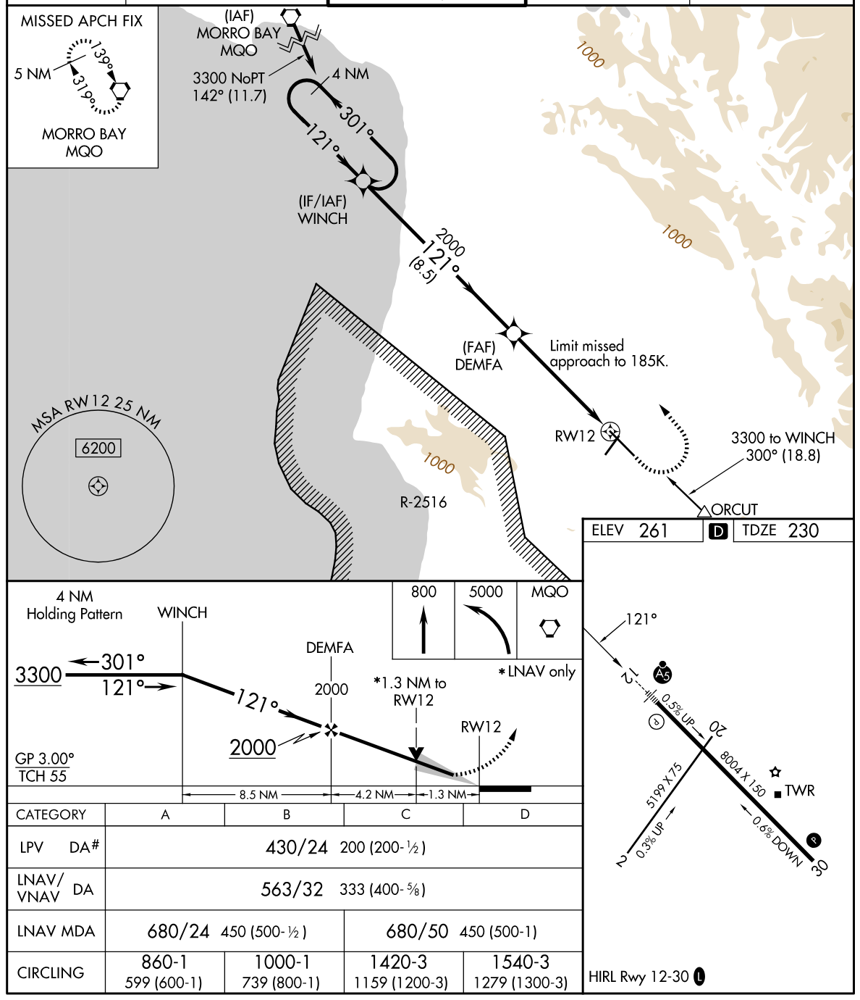

---

## LPV Approach CDI Sensitivity

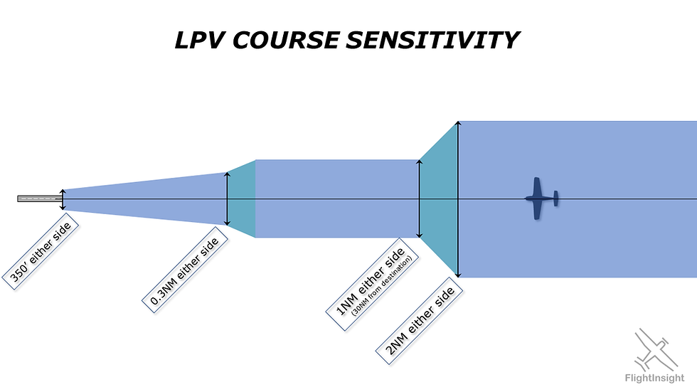

- CDI sensitivity becomes more accurate as you get closer to the runway
- Final segment has angular guidance

---

## LNAV/VNAV Lateral/vertical Approaches

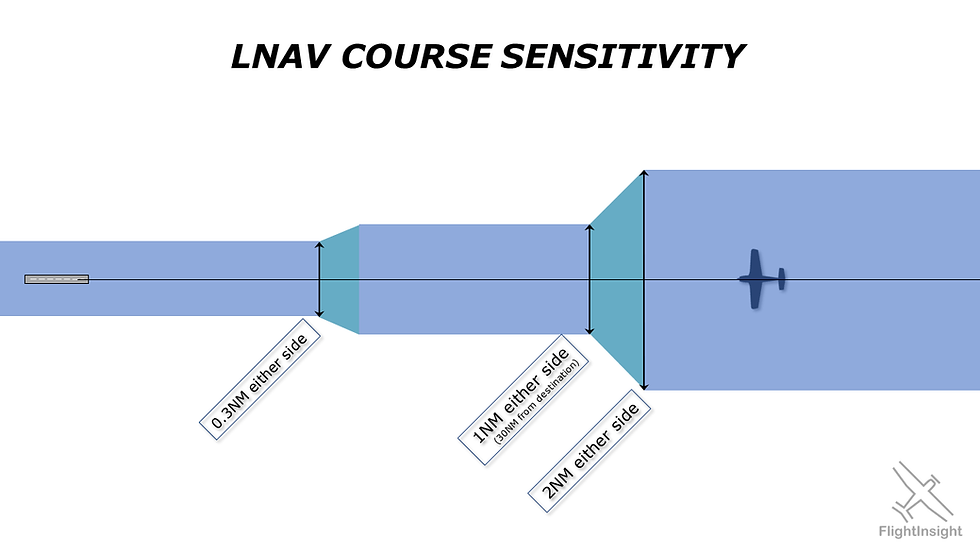

- Final approach has **fixed 0.3NM sensitivity** (not angular like LPV)
- Doesn't require a WAAS-based navigator
- These were initially designed for baro-aided FMS systems
- Garmin annunciation: Garmin L/VNAV

---

## GPS Mode Annunications

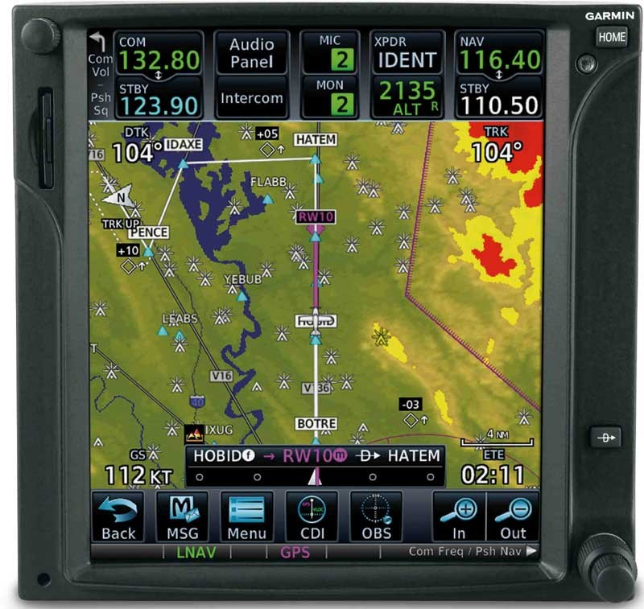

- **ENR**: Enroute
- **TERM**: Terminal
- **LNAV**: Lateral navigation
- **LNAV +V**: Lateral navigation w/ advisory vertical guidance
- **LP**: Localizer performance
- **LP +V**: Localizer performance w/ advisory vertical guidance

---

## Advisory Vertical Guidance

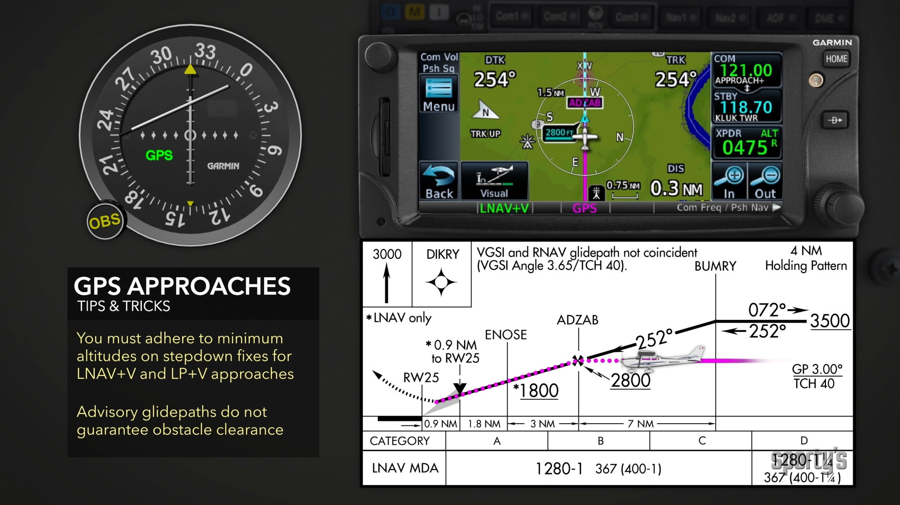

**LP+V, LNAV+V**

A glideslope generated the navigator which meets the crossing requirements of the step-down fixes of a non-precision approach.

Follow the guidance to the **MDA** (not a DA).

---

## Circling Approaches

Allow you to fly an approach to one runway, but "circle" to land on a different runway

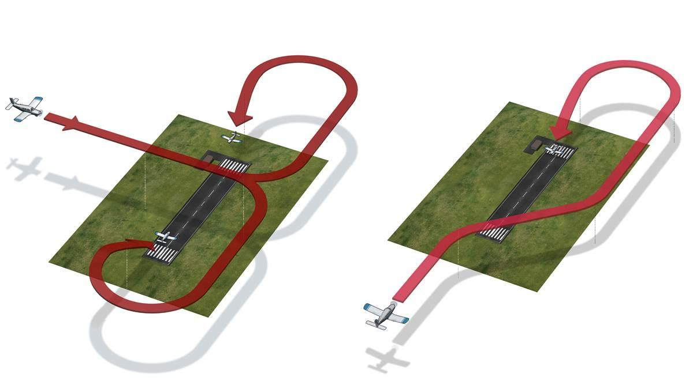

- This requires **higher minimums** to ensure obstacle clearance
- Should maneuver to the "shortest path to the base or downwind leg"
- **Missed approach procedure:**
  - Climbing turn towards the runway, the execute missed turn procedure
- **Expanded circling protections:** Introduced in 2012, indicated by negative C on minima line

---

## Circling Approach Minimums

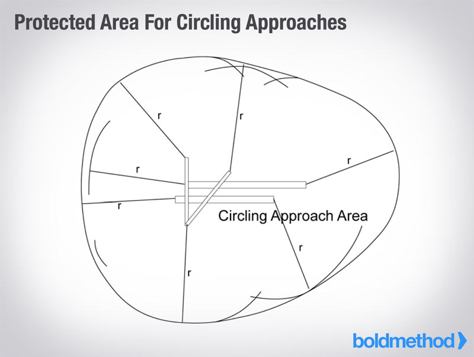

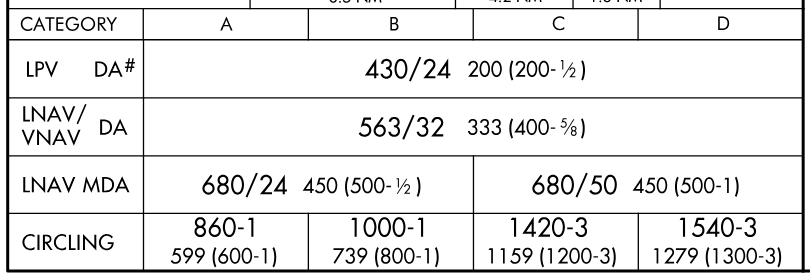

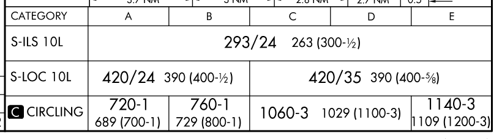

---

## Sidestep Maneuver

**Sidestep Maneuver:**

- Parallel runways less than 1200 ft. apart
- ATC can say "cleared ILS runway 7 left approach, side-step to runway 7 right"
- **Commence the side-step maneuver as soon as possible** after the runway or runway environment is in sight

---

## LDA Approaches

**Localizer Directional Aid Approaches**

- Localizer (and sometimes glideslope) which provide approach guidance **not aligned with a runway**
- Example: KDLS LDA/DME RWY 25
- Think of them as **non-precision approaches** (even if they had a glideslope)
- **S-LDA minimums are treated as an MDA**

---

## Backcourse Approaches

**Backcourse Approaches:**

- The signal from a localizer also extends beyond the runway
- **Disregard any glideslope indication**
- You'll have to read a CDI backwards

**Important:** When flying with an HSI, set the **inbound/front course** into your OBS

- Then the green needles will read correctly (since the needles are flipped upside down)

---

## Visual and Contact Approaches

**Visual Approaches:**

- If the airport has VFR weather, controllers can assign a visual approach
- We're still IFR, so VFR cloud clearance (91.255) don't apply
- We need visual separation from other aircraft

**Charted Visual Procedures:**

- Often used for noise-abatement
- Example: KPIE North Bay Visual

---

## Contact Approaches

**Contact Approaches:**

- Gives us permission to descend to and land
- Need ground-visibility >1 s.m.
- **Pilot needs to ask for a contact approach**

---

## Inoperative Equipment - Navigation

**Failure of navigation component:**

**Primary navaid failure (VOR, LOC):**

- Execute missed approach procedure

**Glideslope failure:**

- **Outside the FAF:** Inform ATC, ask for the localizer approach
- **Inside the FAF:** "Fail-down" to the LOC approach, follow LOC guidance and climb/descend to the MDA per the LOC minimums, inform ATC

---

## Inoperative Equipment - Visual Aids

**Approach lighting system inoperative:**

- Published minimums are based on full operation of all associated components and visual aids
- **Higher minimums are required** with inoperative equipment
- If more than one component is inoperative, each minimum is raised to the **highest minimum** required by any single inoperative component
- See **Inoperative Components or Visual Aids Table**

---

## Cold Weather Operations

**Important considerations for cold weather:**

- See Backseat Pilot Lesson Plans pg. 279
- Altimeter corrections may be required
- Performance calculations affected by temperature
- Engine and system performance considerations

---

# Summary

**Key Points:**

- Multiple ways to get established on approaches
- Precision vs. non-precision vs. GPS approaches
- 91.175 landing requirements
- Special procedures: circling, sidestep, backcourse
- Equipment failures and procedures
- Cold weather considerations

---

## References

- https://planeandpilotmag.com/looking-for-the-lights/
- https://www.ecfr.gov/current/title-14/chapter-I/subchapter-F/part-91/subpart-B/subject-group-ECFRef6e8c57f580cfd/section-91.175
- [Sporty's RNAV/GPS Approach Video](https://courses.sportys.com/training/portal/course/INSTRUMENT/volumes/VIDEO_TRAINING/1aa2e10e-8d56-4525-b222-49e9113499bc/e9499203-6826-484a-9eeb-6be7bb808daa)
