

# Approaches - Types, Limitations, Regulations

---

## Objective

To demonstrate the kinds of approaches, approach limitations, and regulations that govern how we fly approach procedures.

Introduce basic approach concepts for precision, non-precision, GPS, and other types of approaches.

 

Based on ASA IFR Syllabus:

- Stage 2 / Module 3: GPS Approaches
- Stage 2 / Module 4: ILS Approaches
- Stage 2 / Module 5: RNAV Approaches

(60 minutes)

---

## Overview

- Getting established on an approach
- Types of approaches
  - Precision (ILS)
  - Non-precision (VOR)
  - GPS approaches (LNAV, LPV)
- When can we land?
- Circle to land, sidesteps

- Other Approach Types
  - LDA Approaches
  - Backcourse Approaches
  - Visual and Contact Approaches
- Inoperative Equipment
- Cold Weather Operations

---

## Getting Established on an Approach

How do we get from the enroute phase to the final approach phase?

- **Direct to an IAF** (e.g. LOATH)
  - Or an IF if RNAV equipped
- **Via a feeder route** (e.g. COUGA)
- **Vectors to final**
  - ATC-assigned headings, intercept to the final approach course
  - Entry behind the FAF

AIM 5-4-6, IFH Ch 10

---

## Procedure Turns

A published 180-degree turn to align you with the final approach course.

- Types of turns, up to the pilot what to use
  - 45/180
  - 80/260
  - Teardrop
  - Racetrack
- Protected turn area, "Remain within 10NM"
- Descend to lower altitude after established inbound

AIM 5-4-9, IFH Ch 10

---

## Hold-in-Lieu of Procedure Turn (HILPT)

- Published hold used for getting you aligned with final approach course (e.g. PITER transition)
- Fly standard hold entry and begin the approach
- ATC will not expect you to make additional turns in the hold
- These are become more common than barbed PTs
- Tip: Always confirm with ATC if you're going to fly the course reversal

AIM 5-4-9, IFH Ch 10

---

## When _not_ to Fly a PT/HILPT - SNoRT

- **S:** "Straight-in approach" from ATC
  - "Cross COVHO at 2000, cleared straight-in RNAV runway 15 approach Scappoose airport"
- **No:** NoPT on approach chart
- **R:** Radar vectored
  - "Turn right heading 100, vectors for final approach course"
- **T:** Timed approach from a fix

AIM 5-4-9, IFH 10-13

---

# Approach Types

- Precision
- Non-precision
- GPS Approaches

---

## Precision Approaches

Precision approaches are characterized by **vertical and horizontal guidance** that position the aircraft close to the runway from where it can safely land.

Type of precision approaches:

- **PAR** - Precision approach radar
- **GLS** - GBAS landing system
- **ILS** - Instrument landing system

**ILS typically have minimums of 200 feet above TDZE**

AIM 5-4-5, 5-4-11, IFH Ch 10

---

## Components of an ILS

**Localizer:**

- Positioned at the end of the runway
- Angular width is 700' wide at the threshold
  - Two signals: 150HZ and 90HZ signals
- Gives precise L/R angular guidance aligned with the runway
- Note: Sensitivity depends on runway length

AIM 1-1-9, IFH Ch 10

---

## Components of an ILS

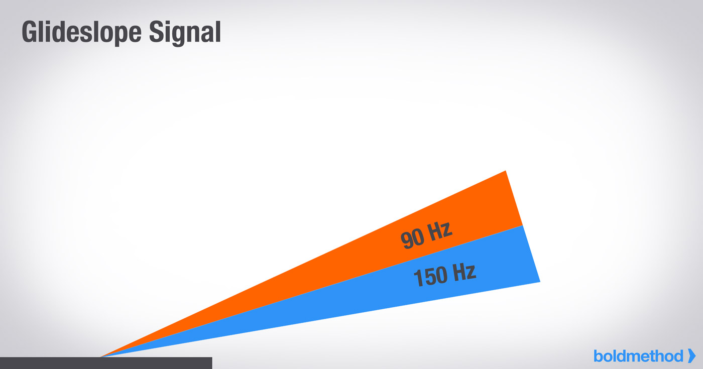

**Glideslope:**

- Positioned to the side of the runway
- Gives angular vertical guidance, usually a 3° glideslope
- Gets more sensitive as we get closer to the runway
- Note: There can be interference on the glideslope signal which can cause "false" glideslopes

AIM 1-1-9

---

## ILS Marker Beacons

Used to be standard on an ILS. They were identified with a tone and light on the audio panel.

- **Outer marker:** FAF ([tone](https://www.youtube.com/watch?v=AW8IF9WdoD0))
- **Middle marker:** Standard minimums ([tone](https://www.youtube.com/watch?v=sSdlsB5NSsw))
- **Inner marker:** Used to identify lower minimums of CAT II or III ILS ([tone](https://www.youtube.com/watch?v=xYit3zKbZkw))

We now use DME, 2nd VOR, or GPS to identify these points

AIM 1-1-9

---

## Capturing an ILS

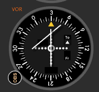

- Glideslope [needle starts above us](https://www.luizmonteiro.com/Learning_VOR_Sim.aspx)
- As we approach the GS intercept (lightning bolt), glideslope needle will come down
- One dot below glideslope: Reconfigure for your approach

IFH Ch 9

---

## Rule of Thumb for a 3&deg; Descent

Descent rate = (Ground speed in knots) / 2 \* 10

90 knots / 2 \* 10 = 450 fpm

How would wind affect our descent rate?

---

## Flying an ILS

Fly to keep the needles centered

- GS needle moves up: Too low
- GS needle moves down: Too high
- LOC needle moves left: Right of course
- LOC needle moves right: Left of course

Both needles get more sensitive as we get closer to the runway.

IFH Ch 8

---

## Precision Approaches Minimums

- We fly our glideslope and localizer until the **Decision Altitude**
- DA is listed in MSL altitude., along with required flight visibility
  - E.g. 398 ft MSL, 1/2 s.m. vis.
- At the D.A. we can continue our descent if we have the required visibility and have the runway envionment in sight
  - More on this

AIM 5-4-20, 14 CFR 91.175

---

## When Can We Land? - FAR 91.175

An aircraft may not descend from the DA/MDA unless:

1. Aircraft is continuously in a position from which a descent to a landing can be made on the intended runway
2. The descent can be made at a normal rate of descent using normal maneuvers
3. For 121/135 ops: A descent that allows for touchdown in the touchdown zone
4. The **flight visibility** must be greater than prescribed on the chart
5. At least one of the following visual references for the intended runway is visible

14 CFR 91.175, AIM 5-4-5

---

## Visual References

- Approach lighting system\*
- Threshold marking/lights
- Runway end identifier lights (REILs)
- PAPI/VASI
- Touchdown markings/lights
- Runway or runway markings
- Runway lights

\*The red terminating bars allow you to descend to 100' above TDZ (regardless of the approach)

14 CFR 91.175, AIM 5-4-5

---

## Non-Precision Approaches

Non-precision approaches are characterized by **step-down fixes** and a **minimum descent altitude (MDA)** .

**Types:**

- **VOR** - VOR approach
- **TACAN** - TACAN approach
- **LOC** - Localizer approach
- **LDA** - Localizer directional aid
- **LOC BC** - Localizer back course approach
- **ASR** - Approach surveillance radar

AIM 5-4-5, IFH Ch 10

---

## Flying a Non-Precision Approach

- Use the primary navaid for L/R guidance
- Descent to the lowest altitude for each segment based on the profile view
- After the final step-down fix, descend to the approariate MDA
- Fly at the MDA until
  - The runway is in sight and a landing can be made (91.175)
  - Or, the missed approach point and execute the missed procedure

IFH Ch 10, 14 CFR 91.175

---

## Going Missed on a Non-Precision Approach

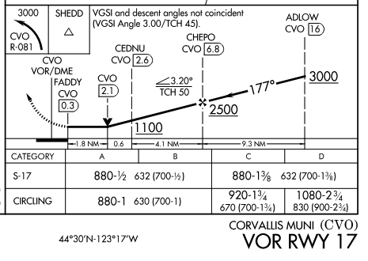

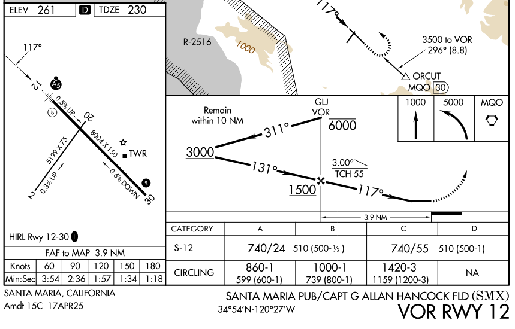

---

## Flying VOR Approaches with RNAV

**AIM 1-2-3:** "Use of a suitable RNAV system as a means to navigate on the final approach segment of an instrument approach procedure based on VOR, TACAN or NDB signal is allowable."

**Requirements:**

- The underlying NAVAID must be operational
- The NAVAID must be monitored for the final approach course alignment
- Secondary CDI or bearing pointer should monitor the underlying NAVAID
- Guidance can be used from the GPS

AIM 1-2-3

---

## RNAV (GPS) Approaches

**Approaches with Vertical Guidance:**

- **LPV**: Localizer Performance with Vertical guidance
- **LNAV/VNAV**: Lateral/vertical navigation

**Without Vertical Guidance:**

- **LP** - Akin to a LOC approach
- **LNAV** - Lateral guidance

AIM 5-4-5, IFH Ch 10

---

## LPV Approaches: Localizer Performance with Vertical Guidance

- **ILS-like minimums** (200' minima)
- Flown just like an ILS:
  - Intercept the "localizer"
  - Capture the glideslope from below
- Gives angular L/R guidance which gets more sensitive as you descend
- **Not technically a "precision approach"** (for the purposes of alternate planning)

AIM 5-4-5, IFH Ch 10

---

## LPV Approach CDI Sensitivity

- CDI sensitivity becomes more accurate as you get closer to the runway
- Final segment has angular guidance like an ILS

IFH Ch 10

---

## LNAV/VNAV Lateral/vertical Approaches

- Final approach has **fixed 0.3NM sensitivity** (not angular like LPV)
- Doesn't require a WAAS-based navigator
- These were initially designed for baro-aided FMS systems
- Garmin annunciation: Garmin L/VNAV

AIM 5-4-5, IFH Ch 10

---

## GPS Mode Annunications

- **ENR**: Enroute
- **TERM**: Terminal
- **LNAV**: Lateral navigation
- **LNAV +V**: Lateral navigation w/ advisory vertical guidance
- **LP**: Localizer performance
- **LP +V**: Localizer performance w/ advisory vertical guidance

IFH Ch 10

---

## Advisory Vertical Guidance

**LP+V, LNAV+V**

A glideslope generated the navigator which meets the crossing requirements of the step-down fixes of a non-precision approach.

Follow the guidance to the **MDA** (not a DA).

IFH Ch 10

---

## Circling Approaches

Allow you to fly an approach to one runway, but "circle" to land on a different runway

- This requires **higher minimums** to ensure obstacle clearance
- Should maneuver to the "shortest path to the base or downwind leg"
- **Missed approach procedure:**
  - Climbing turn towards the runway, the execute missed turn procedure
  - Additional turns in the protected area may be required

---

## Circling Approach Minimums

**Expanded circling protections:** Introduced in 2012, indicated by negative C on minima line

---

## Sidestep Maneuver

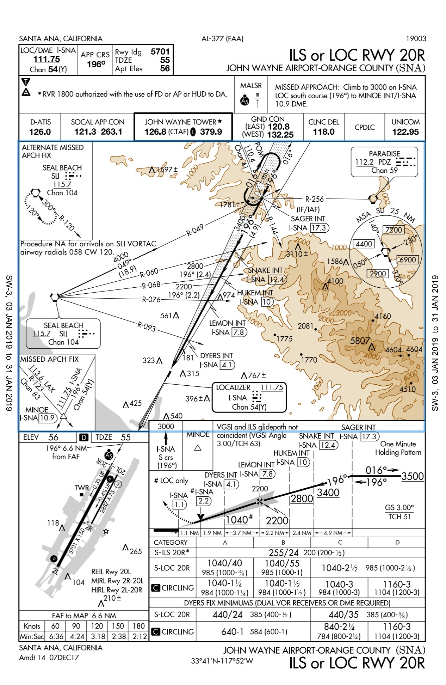

- Parallel runways less than 1200 ft. apart
- ATC can say "cleared ILS runway 20R approach, side-step runway 20L"
- **Commence the side-step maneuver as soon as possible** after the runway or runway environment is in sight

AIM 5-4-19

---

## LDA - Localizer Directional Aid Approaches

- Localizer (and sometimes glideslope) which provide approach guidance **not aligned with a runway**
- Example: KDLS LDA/DME RWY 25
- They are **non-precision approaches**, even if they had a glideslope
- **S-LDA minimums are treated as an MDA**

AIM 5-4-5, IFH Ch 10

---

## Localizer Backcourse Approaches - LOC BC

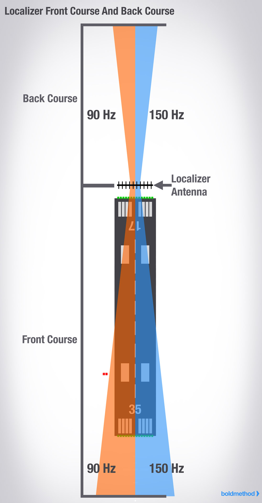

The signal from a localizer also extends behind the primary runway, and can be used to guidance to the opposing runway.

- Disregard any glideslope indication
- A standard CDI will be read L/R backwards
  - Fly away from the needle instead of towards it
  - ["You are the needle"](https://www.luizmonteiro.com/Learning_VOR_Sim.aspx)
- With an HSI, set the **inbound/front course** into your OBS
  - Then the green needles will read correctly (since the needles are flipped upside down)

AIM 5-4-5, IFH Ch 10

---

## Example LOC BC Approach - KSLE LOC BC RWY 13

---

## Visual and Contact Approaches

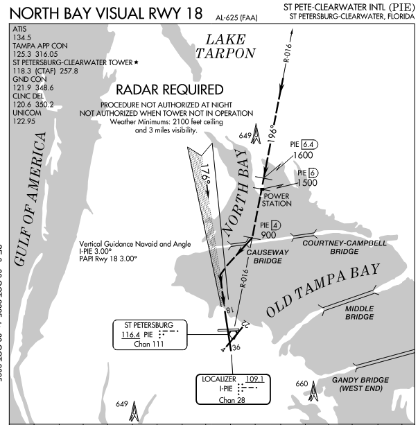

**Visual Approaches:**

- If the airport has VFR weather (1000 + 3), controllers can assign a visual approach
- We're still IFR, so VFR cloud clearance rules (91.255) don't apply
- Expectation that we land visually, traffic + terrain clearance is our responsbility

**Charted Visual Procedures:**

- These are uncommon
- Often used for noise-abatement

AIM 5-5-11, 5-4-23

---

## Contact Approaches

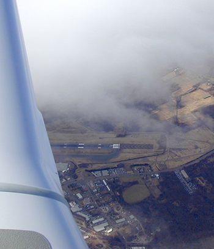

- Gives us permission to descend to and land visually
- Need flight visibility of >1 s.m. and need to remain clear of clouds
- **Pilot needs to ask for a contact approach**

Note that these would only be used if the conditions are less than VFR at the airport, so we'd be maneuver at low altitude for the airport in &lt;3 s.m. conditions

AIM 4-4-12, IFH Ch 10

---

## Inoperative Equipment - Navigation

**Primary navaid failure (VOR, LOC):**

- Before the FAF: Notify ATC and choose a different approach, or divert
- After the FAF: Execute missed approach procedure

**Glideslope failure:**

- **Outside the FAF:** Inform ATC, ask for the localizer approach
- **Inside the FAF:** "Fail-down" to the LOC approach, follow LOC guidance and climb/descend to the MDA

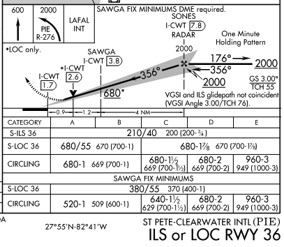

AIM 1-1-9

---

## Inoperative Equipment - Visual Aids

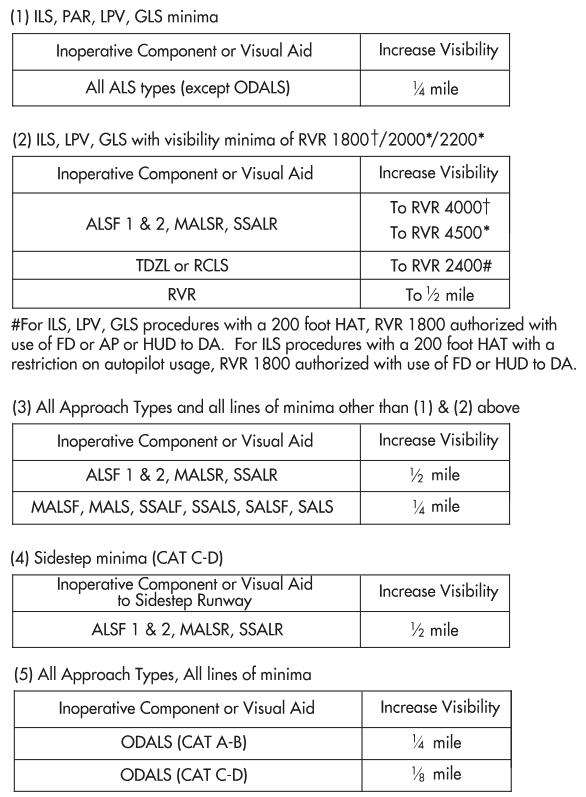

**Approach lighting system inoperative:**

- **Higher minimums are required** with inoperative ALS
- If more than one component is inoperative, each minimum is raised to the **highest minimum** required by any single inoperative component
- See **Inoperative Components or Visual Aids Table**

AIM 5-4-5, IFH Ch 10

---

## Cold Weather Operations

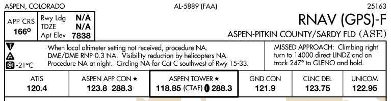

- The snowflake symbol on an approach indicates cold-weather corrections are required when the reported temperature is at or below the given value
- Raise any cross-altitude restrictions and minimum altitude by the amount in the cold-weather correction chart in the TPP

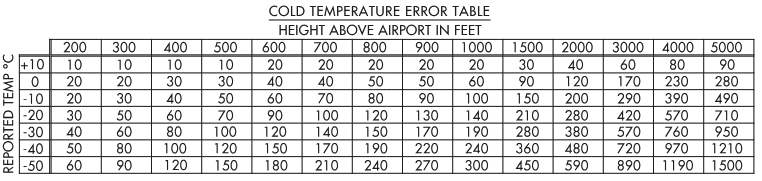

AIM 5-4-5, IFH Ch 10

---

# Summary

**Approach Types:**

- **Precision:** ILS (200' minimums, DA)
- **Non-Precision:** VOR, LOC, LDA (step-down fixes, MDA)
- **GPS:**
  - LPV, LNAV/VNAV (vertical guidance)
  - LP, LNAV (no vertical guidance)

**Entry Methods:**

- IAF, transitions, vectors to final
- Procedure turns, HILPT, SNoRT exceptions

**Special Procedures:**

- Circling approaches, sidestep maneuvers
- LDA, LOC BC, visual/contact approaches

**Operational:**

- Equipment failures
- Cold weather corrections
- Visual references (91.175)

---

## Knowledge Check

While breifing an approach chart you come across a symbol on the airport sketch that you don't recognize. Where can you find its meaning?

---

## Knowledge Check

When flying a localizer back-course approach you notice the glideslope needle falling. What should you do?

---

## Knowledge Check

While circling to land to the opposing runway you lose sight of the airfield. You're currently at 600 feet AGL and abeam the mid point of the runway. How should initiate the missed approach procedure?

---

## Knowledge Check

You're approaching an airport to land and you notice that the VOR navaid on the field is out-of-service. You were hoping to fly the VOR-16 approach to land. You have a WAAS-based GPS system installed in your airplane. Can you fly the approach?

---

## References

- [AIM Chapter 1](https://www.faa.gov/air_traffic/publications/atpubs/aim_html/chap1_section_1.html)
- [AIM Chapter 5](https://www.faa.gov/air_traffic/publications/atpubs/aim_html/chap5_section_1.html)
- [Looking for the Lights](https://planeandpilotmag.com/looking-for-the-lights/)
- [14 CFR 91.175](https://www.ecfr.gov/current/title-14/chapter-I/subchapter-F/part-91/subpart-B/subject-group-ECFRef6e8c57f580cfd/section-91.175)
- [Sporty's RNAV/GPS Approach Video](https://courses.sportys.com/training/portal/course/INSTRUMENT/volumes/VIDEO_TRAINING/1aa2e10e-8d56-4525-b222-49e9113499bc/e9499203-6826-484a-9eeb-6be7bb808daa)
