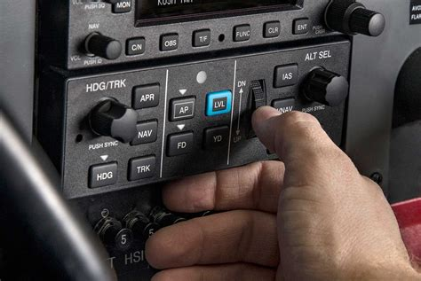
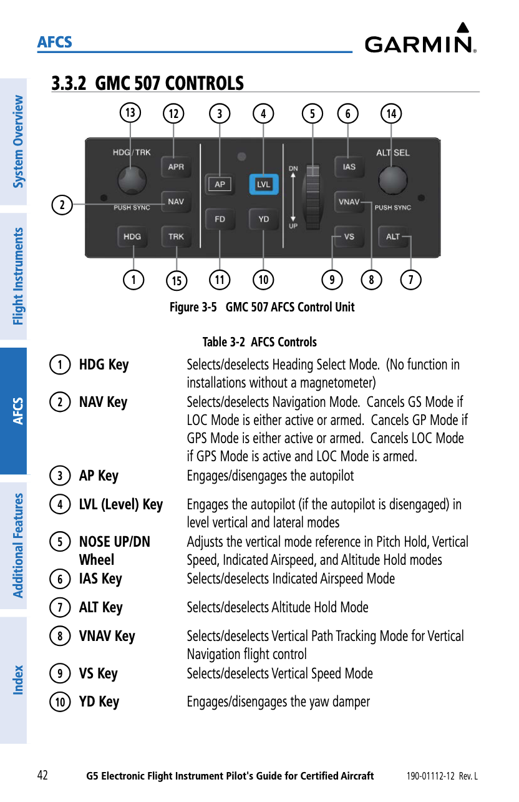
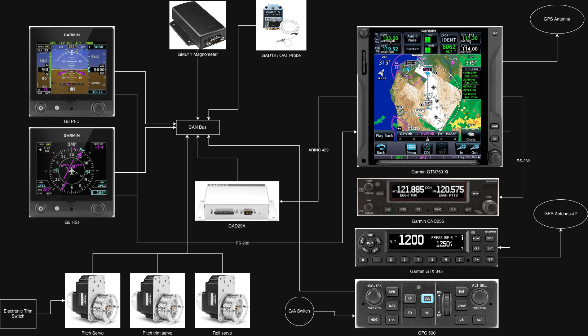
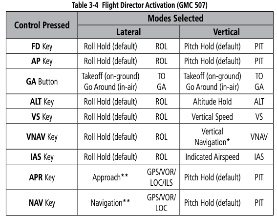
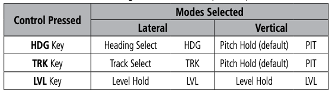
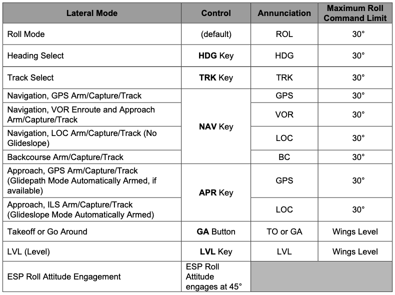
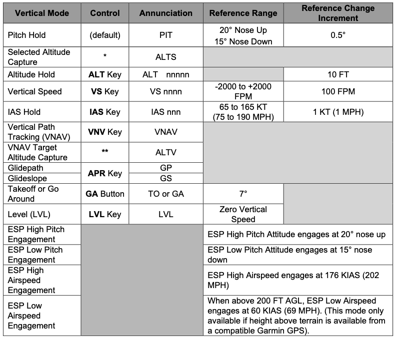
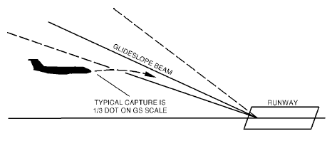
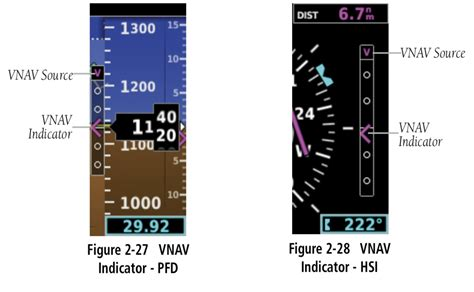
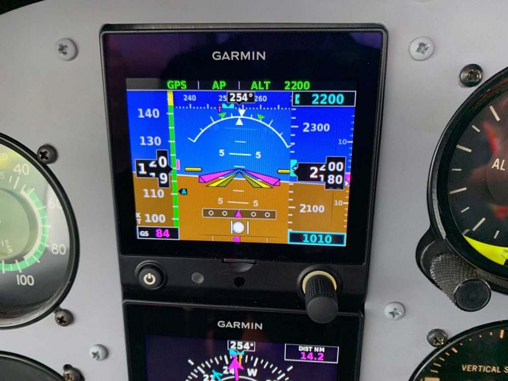

# IFR Usage of the GPS

---

## Objective

Understand and apply the different autopilot modes, how the autopilot operates, and how it's effective use in an IFR environment.

## Timing

30 minutes

---

## Overview

- Effective use of the autopilot
- Autopilot Documents
- Mode Annunciations
- Lateral Modes
- Vertical Modes
- Approach Modes
- Specific scenarios
  - How to use VNAV Mode
  - Fully-Coupled Go-Around

---

## Effective Use of the Autopilot

- Workload reduction
- Allows you to focus your attention elsewhere. Thinking of heads-down work:
  - Talking to ATC
  - Briefing and approach
  - Programming avionics
  - Dealing with passengers
- Spatial disorientation (LVL button)

---

## Autopilot Documents

- Retrofit autopilots are installed per an STC
- [GFC 500 Pilots's Guide](https://static.garmin.com/pumac/190-01112-12_B)
- [GFC 500 AFMS](https://static.garmin.com/pumac/190-02291-06_10.pdf) - Flight Manual Supplement
  - Must be in the plane

---

---

# Garmin GFC 500 Operations

---

## Mode Annunciations

- Green: Mode active
- White: Mode armed

---

Initial Mode Activation

---

## Lateral Modes

---

## Vertical Modes

---

## Approach Modes

- APR: Approach mode
  - Follows glideslope and localizer
  - Will only capture glideslope from below
- Note that NAV mode can also be used for approaches without vertical guidance

---

## How to use VNAV Mode

1. Ensure altitudes are configured on the GTN
2. Ensure you're in GPS mode on the CDI
3. Altitude preselect: Set to clearance limit
4. Press the VNAV button to arm VNAV (white VNAV)
5. "Vertical Track" audio alert 1 minute before TOD (similar to a GS capture)
6. Intermediate level offs will show with ALTV annunciation

Note: "VNAV mode will not capture a descending profile unless the selected altitude is valid and at least 75 feet below the current aircraft altitude."

---

## Fully-Coupled Go-Around

- Ensure the missed approach altitude is set in the altitude preselect
- At the go-around point, hit GA switch twice
  - This will put the AP in G/A mode, which pitches up to 7&deg;, wings level
- Switch to IAS or VS mode, as appropriate to follow missed altitudes
- Switch to NAV or HDG mode, as appropriate to follow missed procedure

---

# Summary

- Use autopilot to shed workload in a busy cockpit
- Beware of mode confusion
  - Particularly around PIT and ROL modes (which are usually not what you want)
  - VNAV requires altitude bug set below you at your final altitude
  - Glideslope only capture from below
  - G/A around mode uses 7&deg; nose-up and wings level (with ALT mode armed)
