

# Icing and FIKI

---

## Objective

To understand how in-flight icing forms, why it is hazardous, how to avoid it, and to understand aircraft which are certified for Flight Into Known Icing (FIKI)

---

## Motivation

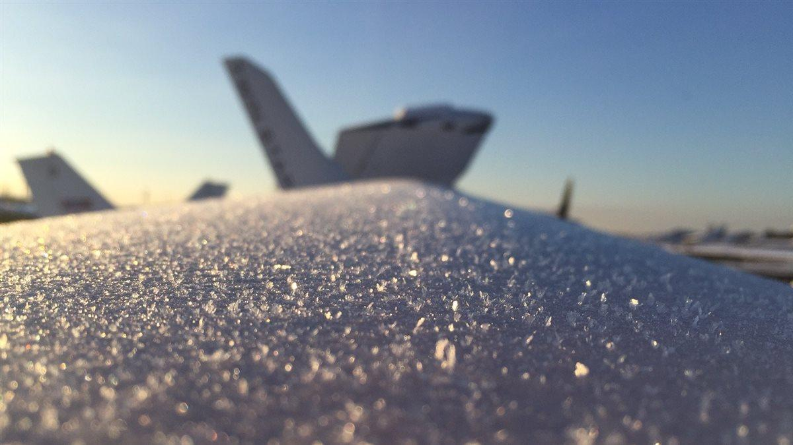

- Even a small amount of ice can seriously degrade performance and controllability
- IFR flight places aircraft in places where icing is common
- Understanding forecasts, icing products, and aircraft limitations is essential
- Flight-into-known-icing adds capability to aircraft, but is not a free pass

---

## Overview

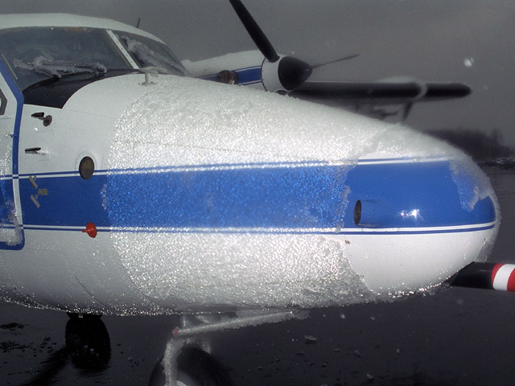

- What is icing?
- Induction system icing
- Structural icing and hazards
- Factors affecting accumulation
- Accumulation rates and PIREPs
- Frost/ground icing
- Icing weather products
- Conditions that create icing
- What to do if you encounter ice
- FIKI certification and its limitations

---

## What Is Aircraft Icing?

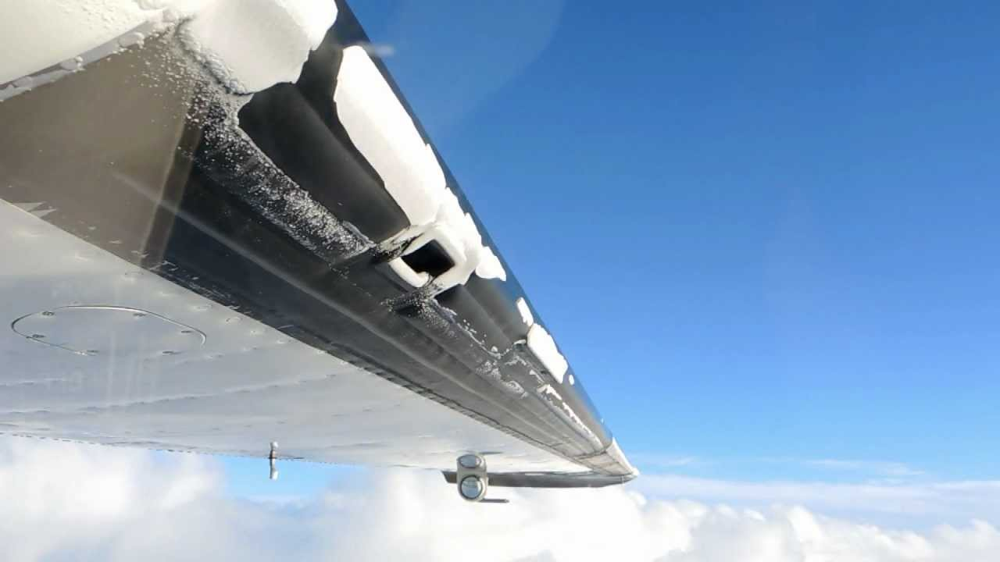

Ice that accumulates on the airframe or in the induction system during flight

- **Structural icing**
  - Ice forming on external surfaces such as wings, tail, propeller, and antennas
- **Induction system icing**
  - Ice forming inside the engine’s air induction system (e.g., carburetor, alternate air)

---

## Induction System Icing

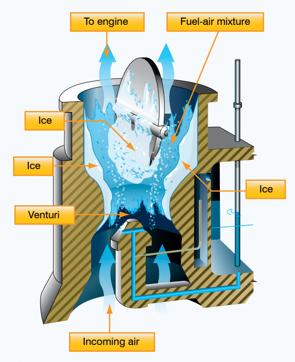

- **Carburetor icing mechanism**
  - Fuel vaporization and pressure drop in the venturi cause a sharp temperature decrease
  - Water vapor can condense and freeze on internal carburetor surfaces and throttle plate
- **Typical conditions**
  - Most likely when outside air temperature is below about 70°F and humidity above 80%
  - Can still occur with temperatures as high as 100°F and humidity as low as 50%

---

## Induction System Icing (cont.)

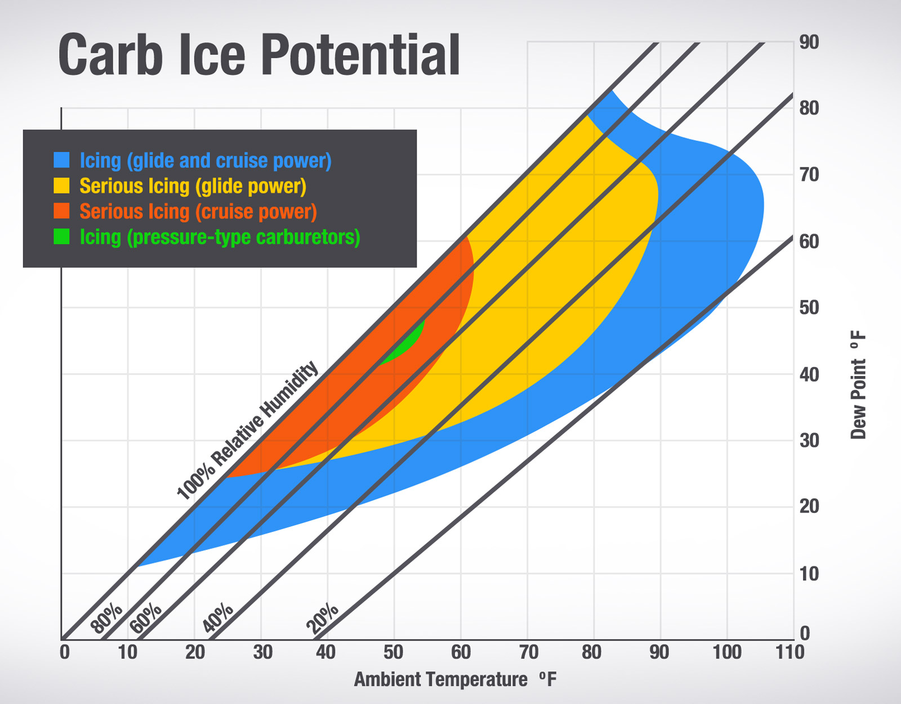

- **Symptoms**: Slow reduction in RPM, low IAT (if equipped)
- **Remedy**: Apply carburetor heat, may experience some engine roughness as the ice is ingested

---

## Structural Icing

- Ice that forms on the aircraft’s exterior surfaces in visible moisture and near-freezing temps
- Tends to form on leading edges, thin or narrow parts (tail surfaces, antennas, control surface gaps)

---

## Types of Structural Icing: Clear Icing

- Forms in warmer subfreezing temperatures with larger droplets and higher water content
- Water “runs back” before freezing, sometimes beyond protected areas
- Often more dangerous due to the smooth, heavy accretion and possible runback ice

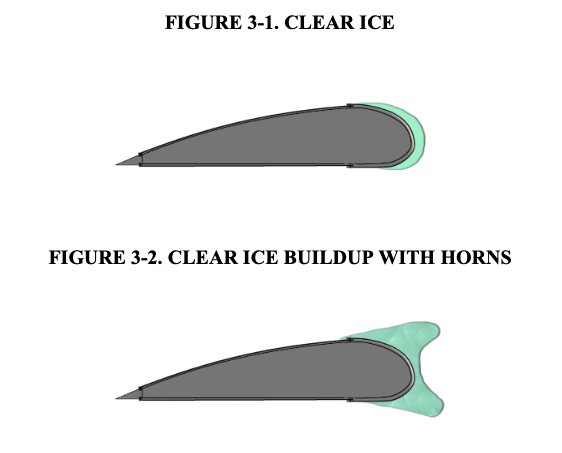

---

## Types of Structural Icing: Rime Icing

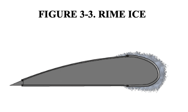

- Usually forms in colder temperatures with smaller droplets and less water content
- Builds a rough surface that disturbs airflow but tends to stay near leading edges

---

## Types of Structural Icing: Mixed Ice

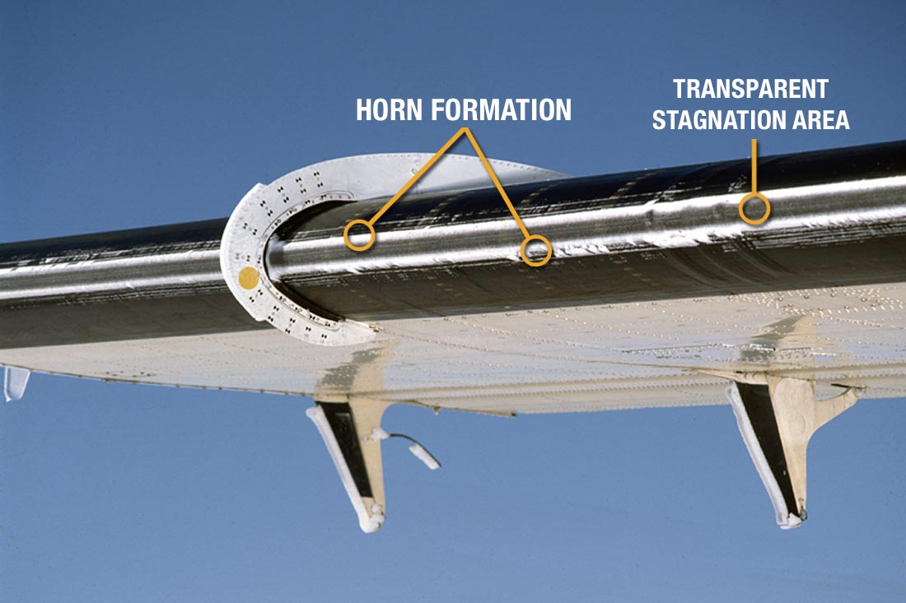

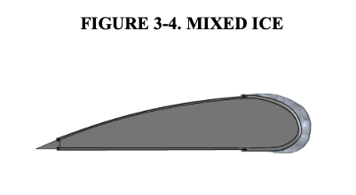

---

## Hazards of Structural Icing

- **Airfoil performance changes**
  - Ice reshapes the airfoil and can reduce the critical angle of attack
  - Stability and controllability may be adequate in cruise, but significantly degrade during approach and landing
- **Control effectiveness**
  - Ice can restrict or jam control surfaces and hinges
  - Roll upset can occur if ailerons self-deflect due to uneven ice buildup
- **Weight and drag**
  - Ice adds weight and increases drag, reducing climb performance and cruise speed

---

## Effect of Icing of Lift

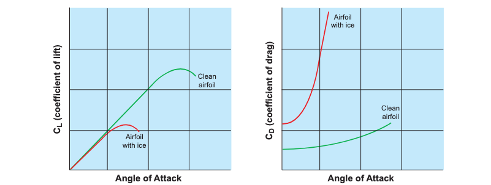

---

## Ice-Contaminated Tailplane Stall (ICTS)

- The horizontal stabilizer is thinner than the main wing and can ice up faster
- Symptoms: Abrupt nose-down pitch, changes in elevator feel, trim changes, pulsing or vibrations (especially after flap extension)
- **If a tailplane stall is suspected**
  - Retract flaps if they are extended
  - Add power and return to a known straight-and-level attitude and airspeed

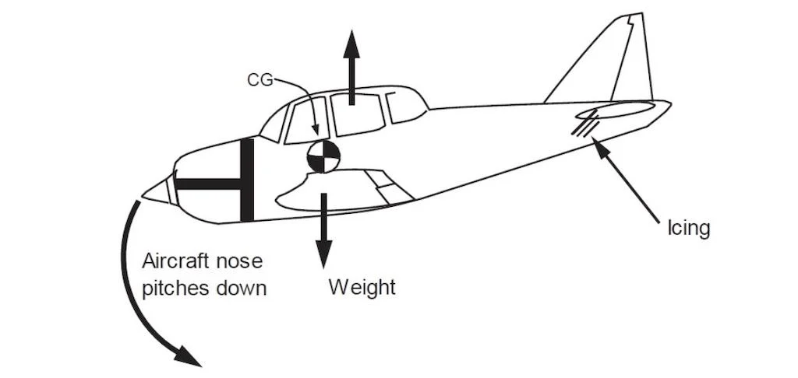

---

## Propeller and Windshield Icing

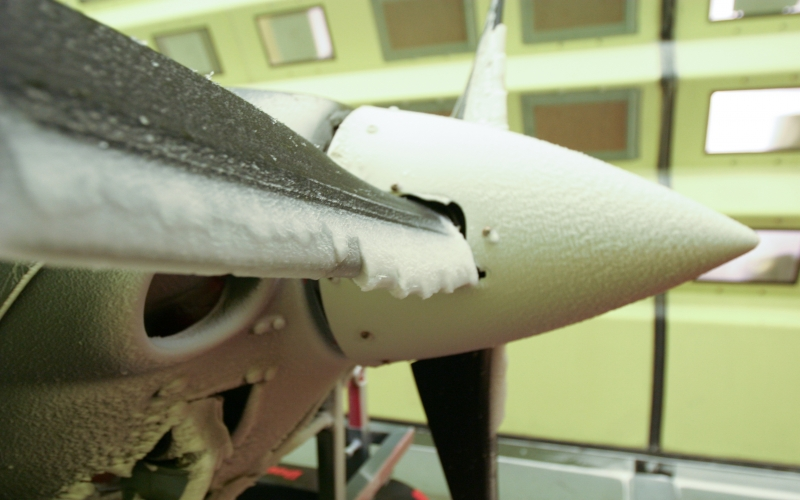

- **Propeller icing**
  - Ice accumulates on the spinner and inner portions of the blades
  - Reduces thrust because the propeller becomes less aerodynamically efficient
- **Windshield icing**
  - Can severely limit forward visibility and make landing and taxiing hazardous

---

## Other Hazards

- **Sensor and system icing**
  - Stall warning vanes, AoA sensors, and pitot-static components can become blocked
- **Antenna icing**
  - Protruding antennas accumulate ice rapidly, degrading radio reception
  - In severe cases, antennas can break off from ice weight or shedding

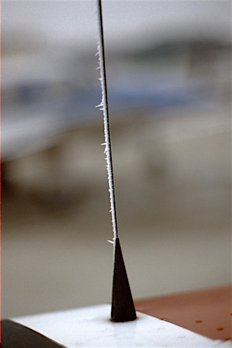

---

## Factors Affecting Ice Accumulation

- **Water content**
  - More liquid water in the cloud generally means faster ice buildup
- **Temperature**
  - Greatest icing threat typically between about -20°C and 0°C
- **Droplet size**
  - Larger supercooled droplets (SLD) can cause severe clear or runback icing
- **Aircraft design**
  - Wing shape, surface finish, and location of inlets and probes affect ice patterns
- **Airspeed**
  - Higher speeds increase the rate at which droplets strike the airframe

---

## Accumulation Risk

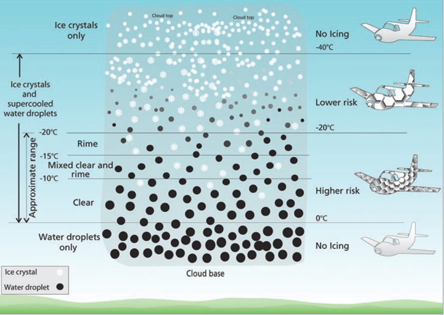

---

## Icing Accumulation Rates (AIM 7-1-19)

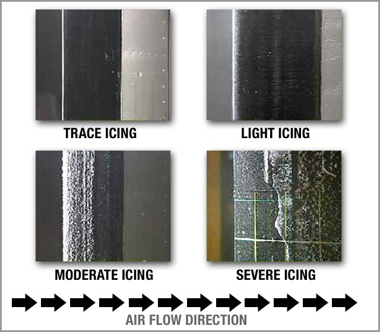

- **Trace**: Ice is just becoming noticeable; accumulation slightly exceeds sublimation. Can be managed for longer periods but still requires monitoring
- **Light**: Occasional use of deicing systems is needed. Can be hazardous for an hour or more
- **Moderate**: Continuous use of ice protection systems is needed. Diversion or exit from icing conditions
- **Severe**: Ice protection systems cannot remove faster than accumulation. Immediate exit from icing conditions is required

---

## Ground Icing – Frost

- Formation: Occurs when moisture in the air freezes on cold surfaces, often overnight
- Effect: Roughens the wing surface, disrupting airflow and reducing lift. Adds weight
- Regulations prohibit takeoff with frost, ice, or snow adhering to aircraft surfaces
- Deicing fluid and rags, approved deicing sprays, or gentle brushing as appropriate

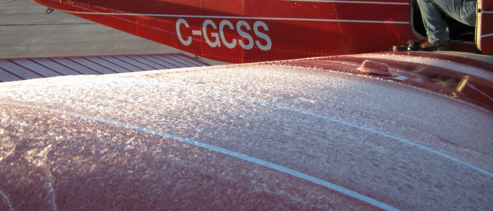

---

## Conditions That Create In-Flight Icing

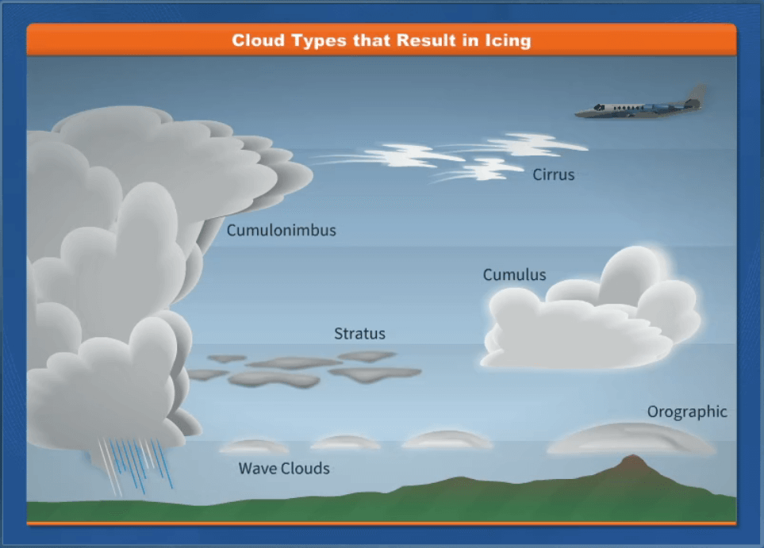

1. Visible moisture (cloud, precipitation, fog)
   - Cumulus clouds: icing possible at many levels, often with SLD aloft
   - Stratiform clouds: typically trace to light icing; vertical extent may allow climb or descent out
2. Freezing air temperatures
   - Most icing reports occur between about -20°C and 0°C
   - Many reports cluster between -8°C and -12°C and altitudes of roughly 5,000–13,000 ft

---

## Freezing Rain and SLD

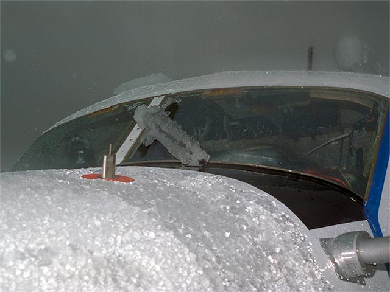

- **Freezing rain**
  - Often associated with warm fronts and temperature inversions
  - Can lead to extremely rapid, severe clear or runback icing
- **Supercooled large droplets (SLD)**
  - Droplets remain liquid well below freezing and freeze upon impact
  - Can cause ice to form beyond protected leading edges

---

## SLD and Freezing Rain Near a Front

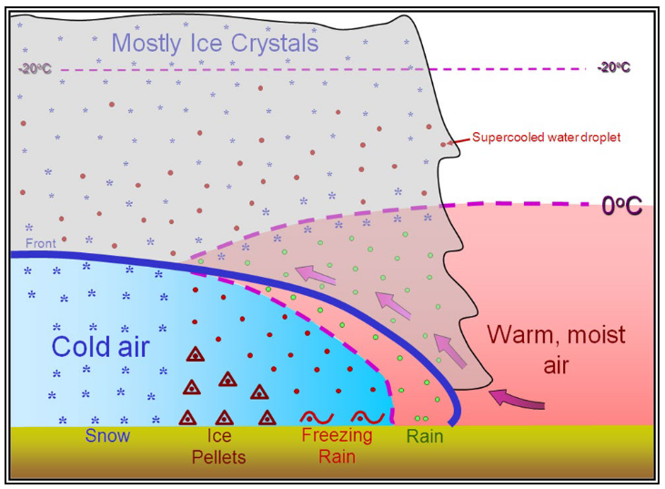

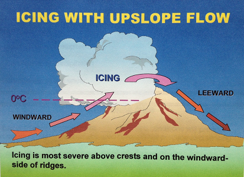

---

## Freezing Fog

Fine droplets in subfreezing temperatures cause rapid surface icing, especially during approach and landing

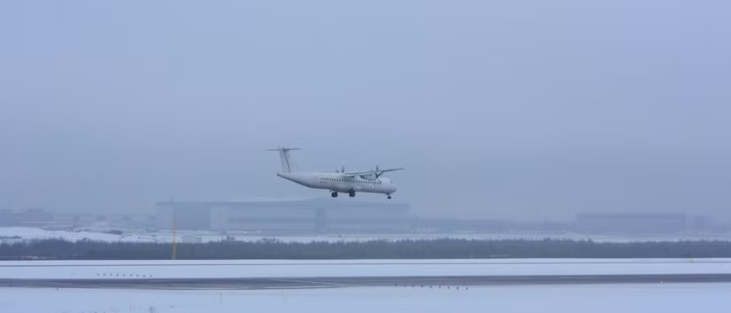

- Freezing Rain: `FZRA`
- Freezing Drizzle: `FZDZ`
- Freezing Fog: `FZFG `

---

## Icing Weather Products

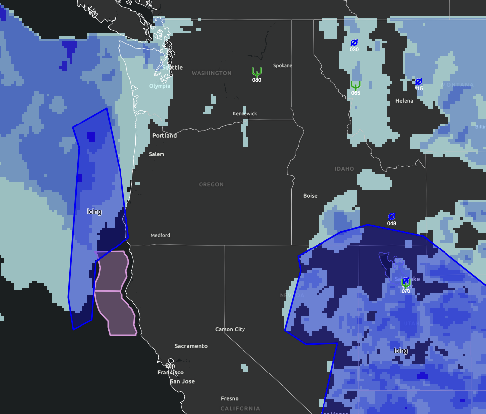

- **Freezing level analysis**
  - Identifies the altitude of the 0°C isotherm and helps plan safe cruise and escape altitudes
- **AIRMET Zulu and G-AIRMET**
  - Identify areas of widespread moderate or greater icing and low freezing levels
- **SIGMETs**
  - Highlight severe icing or conditions like widespread freezing rain

---

## Ice Accumulation Playbook

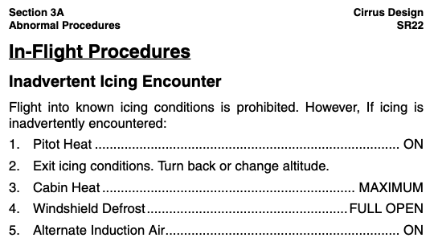

- **Initial actions when ice is encountered**
  - Turn pitot heat ON
  - Activate ice protection systems (boots, TKS, etc.) as recommended in the POH/AFM
  - Turn windshield defrost or anti-ice ON as available
- **Next steps**
  - Plan and execute an exit: climb, descend, or turn to get out of icing conditions
  - Use the aircraft’s inadvertent icing or FIKI checklist as appropriate

---

## Removing Ice in Flight

- **Leaving icing conditions**
  - Moving into clear, dry air allows ice to sublimate, but this can be slow
  - Descending into warmer air will often melt accumulated ice more quickly
- **System limitations**
  - Boots and TKS remove or slow accumulation, but do not guarantee a clean airframe
  - Do not assume that systems will remove all ice behind or between protected areas

---

## Landing With Accumulated Ice

- Be very caution of configuration changes, particularly flaps. Deploy flaps in stages
- Perform a reduced-flap landing on a long runway, if possible
- Carry a higher-than-normal power setting into the approach
- Refer to the POH/AFM for approach airspeed with ice
  - Increase approach airspeed by at least 25 percent above non-icing airspeed for the applicable flap setting

---

## Icing Regulations (91.527)

- **Takeoff restrictions**
  - No takeoff with frost, ice, or snow adhering to propellers, windshields, control surfaces, powerplant installations, or critical instruments and wings
- **Flight into known or forecast icing**
  - Prohibited flight into known or forecast light or moderate icing unless the aircraft is properly equipped and certified (FIKI)
  - "Known icing" is based on all available information: forecasts, PIREPs, and real-time observations

---

## Flight Into Known Icing (FIKI)

- **"Flight into known icing"**
  - Any flight conditions where you’d expect the possibility of ice forming or adhering to the aircraft based on all available preflight information
- **FIKI Certification** The aircraft has been tested and approved to operate in specified icing envelopes
  - Certification is done during design and certification
- **FIKI limitations**
  - Does not authorize flight into severe icing, freezing rain, or freezing drizzle
  - Does not guarantee safety if you remain in icing conditions indefinitely

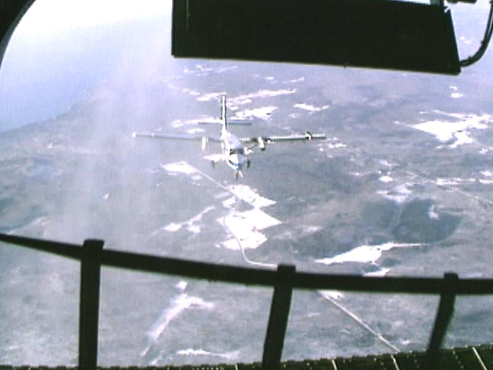

---

## Is This Aircraft FIKI-Certified?

- **How to determine FIKI status**
  - Check the AFM or POH for references to icing certification standards (e.g., Part 25 Appendix C or similar language)
  - Review the Minimum Equipment List (if applicable) for items required in icing conditions
- **Don't assume FIKI based on equipment**
  - Some aircraft may have ice protection (boots, TKS, heated props, heated pitot, etc.) but are not FIKI-certified (like our SR22)

---

## Typical Features of a FIKI-Certified Aircraft

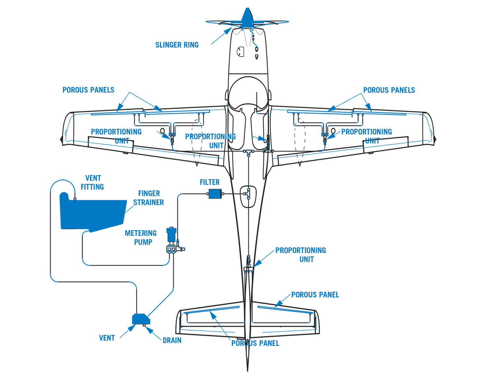

- **Enhanced anti-ice and deice systems**
  - Higher-capacity pitot heat and windshield defrost or anti-ice panels
  - Leading-edge boots or TKS “weeping wing” systems with fluid quantity indicators
  - Propeller anti-ice or deice systems
- **Protected sensors and systems**
  - Heated stall warning vanes or AoA sensors
  - Carburetor heat or alternate air for engines that require it

---

## Summary

- **Icing formation and types**
  - Structural and induction icing
  - Rime, clear, and mixed icing
- **Hazards**
  - Icing degrades lift, increases drag and weight
  - Ice can compromise control surfaces, tailplane, propeller, and sensors
- **Weather and avoidance**
  - Use icing forecasts, frezzing levels, and PIREPs
- **FIKI operations**
  - FIKI aircraft provide more options but still require conservative planning, timely exits, and strict adherence to procedures

---

## Knowledge Check

Youu are cruising in IMC at -5°C and begin to see light ice forming on the wings. What immediate actions should you take, and how will you plan your exit?

---

## Knowledge Check

Your aircraft has boots, heated pitot, and a heated propeller, but the POH does not list any FIKI approval. What does this mean for your ability to launch into forecast light icing?

---

## Knowledge Check

On approach with known ice on the airframe, how will you adjust your flap usage, power settings, and approach speed?
