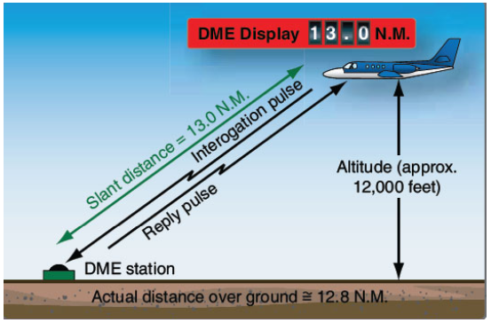
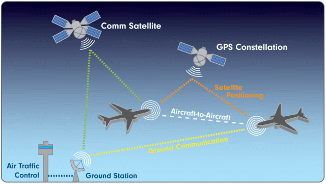

# Navigation Systems

---

## Objective

To understand how the navigation systems installed in our aircraft work and how to use them to navigate, also to understand radar services that are available to us.

## Motivation

Pilots rely on navigation systems to fly to unfamiliar locations, making it essential for cross-country flying. Understanding radar services provided by ATC is also important for safety and efficiency.

---

## Overview

- Radio Navigation
  - Principle of Operation
  - Frequency Ranges
  - Types of Navigation Systems (VOR, NDB, DME)
- Flying with Radio Navigation
  - Tuning and IDing Stations
  - CDIs and HSIs
  - Intercepting a Course or Radial

- Transponders
- ADS-B
- GPS
- EFB
- Radar Services

---

# Radio Navigation

---

## Principle of Operation

- Ground navigation stations emit radio signals
- Equipment on the aircraft receives these signals and interprets them
- Operates on different frequency ranges
  - LF, Low Frequency: NDB
  - VHF, Very High Frequency (108 - 136 Mhz): VOR, LOC, Radio Communications
  - UHF, Ultra High Frequency (Above 800 Mhz): Glideslope and GPS
  - Radar (Above 900 Mhz): Transponder, DME.

---

## VHF Omnidirectional Range (VOR)

- Ground-station which broadcasts two VHF signals
- Emits two signals:
  - Reference signal (the 360 radial)
  - Variable signal (modulates as it sweeps around magnetic north)
- VOR receiver on the aircraft compares the two signals and determines the bearing to the station
- Limited to line-of-sight from the station

---

## VOR in the Cockpit

- Course deviation indicator (CDI) shows the angular difference between the CDI's selected bearing and the aircraft's current bearing
- Makes it easy to track to or from a VOR station on a specific radial

---

## Flavors of VORs

- VOR: VHF Omnidirectional Range
- VOR/DME: VOR with Distance Measuring Equipment (DME)
- VORTAC: VOR with TACAN (Tactical Air Navigation, a military system)

---

## VOR Service Volumes

Different VORs have different power outputs.

---

## Updated VOR Service Volumes

---

## Service Volumes on Chart Supplement

---

## Distance Measuring Equipment (DME)

- DME equipment on the aircraft emits a pulse, which is reflected back by the DME station
- Requires line-of-sight to the DME station
- Measures the slant distance from the aircraft to the DME

---

## DME Slant Range

- If you were 6000' above a DME, it would show you as ~1nm away
- As long as your at least 1nm away for at least 1,000 ft., the slant error is negligible
  - Example: 8 miles from VOR at 6,000', slant range is negligible

---

## Non-Directional Beacons (NDB)

- Aircraft equipped with ADF (Automatic Direction Finder)
- ADF receives signals from NDBs and provides a bearing pointer to the station
- No radial information

---

# Using Radio Navigation

---

## Tuning and Identifying Stations

- Select VOR frequency in navigation radio
- Identify the station
  - VORs transmit a Morse code identifier on its frequency
  - Enable the NAV radio in your audio panel to listen to it
  - The absence of a code indicates the station is out of service

---

## Reading a CDI

- Each dot represents 2&deg; difference
- Red flag means signal unreliable
- Change selected course with OBS (omni-bearing selector knob)

---

## Bearing vs Radial

- Bearing is the magnetic course **TO** the station
- Radial is the magnetic course **FROM** the station

---

## Using a VOR - Simulation

[VOR simulation](https://canvaslib.erau.edu/coa-flight/trainingaids/navigation/vor.html)

---

## Tracking a Radial

- Goal is to fly a heading so the CDI needed remains centered (with TO indication)
- Bracketing technique
  - Start with 350&deg; (course = heading)
  - Notice the wind blows you to the left
  - Turn 10&deg; right (360 &deg; heading)
  - This takes you back over the CDI radial, but the correction is too great
  - Turn 5&deg; left (355 &deg; heading)
  - Make small adjustments to keep the needle centered

---

## Intercepting a Radial

- Tune the VOR station
- Determine your current position relative to that NAVAID
- Establish an intercept angle (&lt; 90&deg;) and hold that heading
- As the needle centers on the new radial, turn to the new course

---

## Horizontal Situation Indicator (HSI)

- Combination of a heading indicator and a CDI
- CDI indicator turns with the heading of the airplane

---

## EFIS-Displayed HSI

---

# GPS and Radar Services

---

## Global Positioning System - GPS

- Uses a satellite array to triangulate aircraft's position on the Earth surface
  - Needs at least 4 satellites
- Used for Area Navigation: Allows point-to-point navigation without VORs
- Can be made more accurate with WAAS: Wide-Area Augmentation System
  - Uses a series of ground stations to apply corrections to GPS signal

---

## Global Positioning System - GPS (cont.)

- For IFR flights: Receiver Autonomous Integrity and Monitoring (RAIM)
  - Computes if enough satellites will be available at any given time
- Database need to updated
  - Aviation data updated every 28 days
  - Charts updated every 56 days
- GPS Outages
  - Atmospheric interference can cause outages
  - Check NOTAMs

---

## Transponders

- A transponder emits a signal to a ground radar facility
- 4-digit code ("squawk code") can be entered
- Transponder modes
  - Mode A - Location and squawk code
  - Mode C - Location, squawk code, and barometric altitude
  - Mode S - Location, squawk code, altitude, callsign
- Emergency squawk codes
  - 7500: Hijacking
  - 7600: Loss of radio communications
  - 7700: General emergency

---

## Automatic Dependent Surveillance - Broadcast (ADS-B)

- Continual broadcast of velocity and position information
  - Requires a WAAS-based GPS position source
- Two flavors
  - ADS-B Out: Mandated in many areas since 2019
  - ADS-B In: Voluntary, traffic + weather information on cockpit displays

---

## Electronic Flight Bags (EFBs)

- Perform flight planning, get briefings, show charts
- Keep databases up-to-date
  - Aviation data updated every 28 days
  - Charts updated every 56 days
- Beware of delays when looking at ADS-B weather information

---

## Radar Services

---

# Summary

- Radio Navigation
  - Principle of Operation
  - Frequency Ranges
  - Types of Navigation Systems (VOR, NDB, DME)
- Flying with Radio Navigation
  - Tuning and IDing Stations
  - CDIs and HSIs
  - Intercepting a Course or Radial

- Transponders
- ADS-B
- GPS
- EFB
- Radar Services

---

- VOR out-of-service
- How far can use a terminal VOR?
