

# Night Operations

---

## Objective

To understand the risks and challenges for operating aircraft at night.

## Motivation

Night flying is a privilege of a private pilots, and involves numerous additional risk factors from day flying. We want to know how to identify and mitigate those risk, and fly effectively when its dark.

---

## Overview

- The eye and night vision
- Definitions of night
- Disorientation and night illusions
- Personal equipment
- Night preflight
- Engine start
- Taxiing
- Takeoff
- In-flight orientation
- Use of flight instruments
- Emergency procedures
- Traffic patterns
- Approaches
- Go-arounds

---

## The Eye and Night Vision

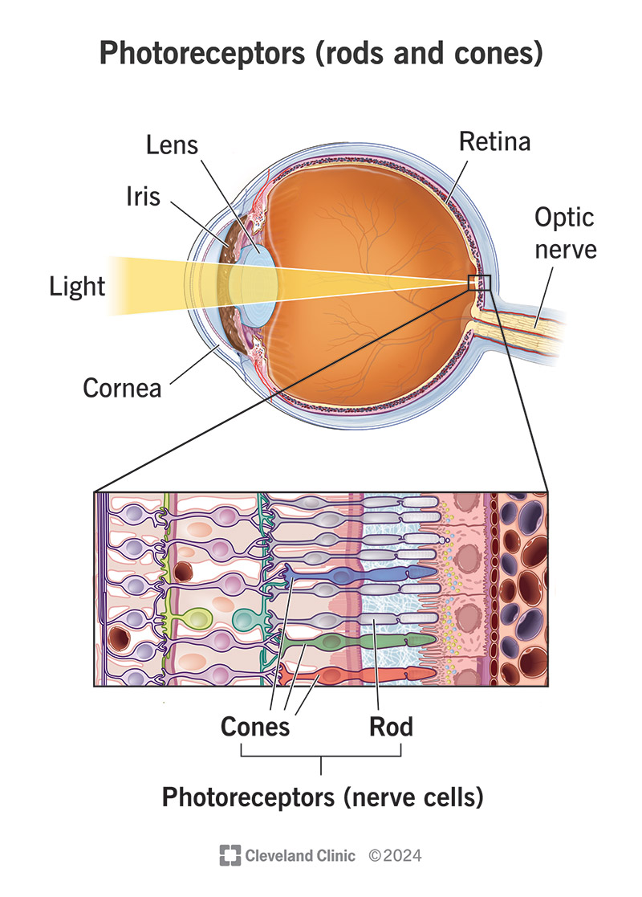

Visual receptors in our eyes:

- Cones: Very acute, color, detail, daytime
- Rods: Very sensitive, gray, peripheral, day and night
  - Become deficient with even mild hypoxia

---

## Vision Types

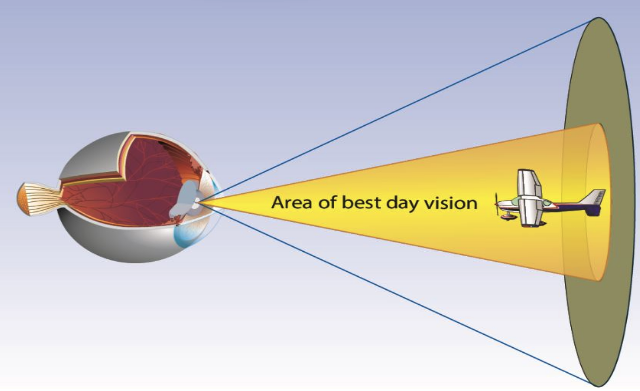

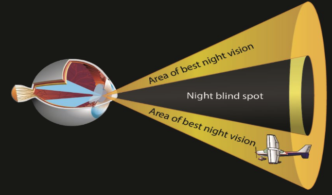

Vision types:

- Photopic vision: Primary central vision - cones
- Mesopic vision: Fading light vision - mix of cones and rods
- Scotopic vision: Dark conditions - rods

---

## Dark Adaptation

- Dark to light: Adaptation is almost instant
- Light to dark: Upwards of 30 minutes
  - Avoid bright light exposure for 30 minutes
  - Cones adjust in 5-10 minutes, the eyes become 100 times more sensitive to light
  - Rods adjust in 30 minutes, the eyes become 100,000 time more sensitive
  - White light can cause temporary blindness and illusions

---

## Factors Affecting Eyesight

- Rods require oxygen to function well
  - They can be impaired by cabin altitudes over 5,000 ft.
  - For this reason, oxygen use is recommended at night over 5,000'
- Fatigue
- Illness
- Smoking
- Drugs
- Alcohol
- Diet

---

## Legal Definitions of Night

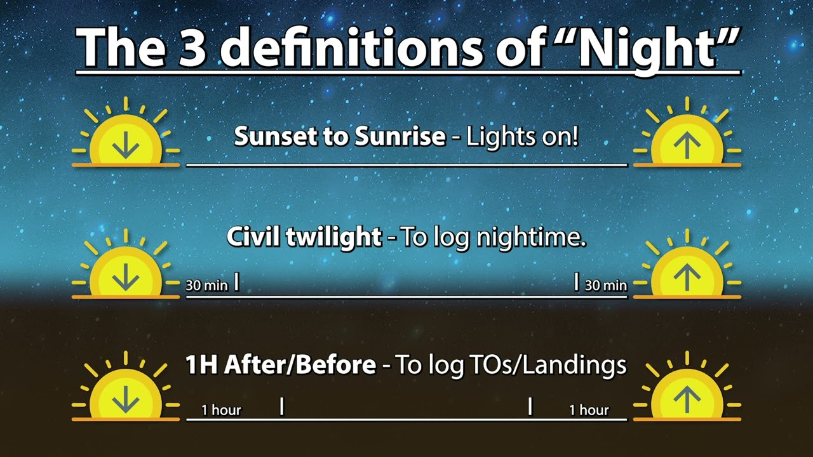

There are three different legal definitions of night.

- Aircraft lights (91.209): Sunset to sunrise
  - Position/nav lights on
- Night flight (FAR Part 1) - End of evening civil twilight to start of morning civil twilight
  - Needed to log night flight hours for a certificate/rating
- 90-day night currency (61.57) - 1 hour after sunset to 1 hour before sunrise

---

# Night Illusions

---

## False Horizon

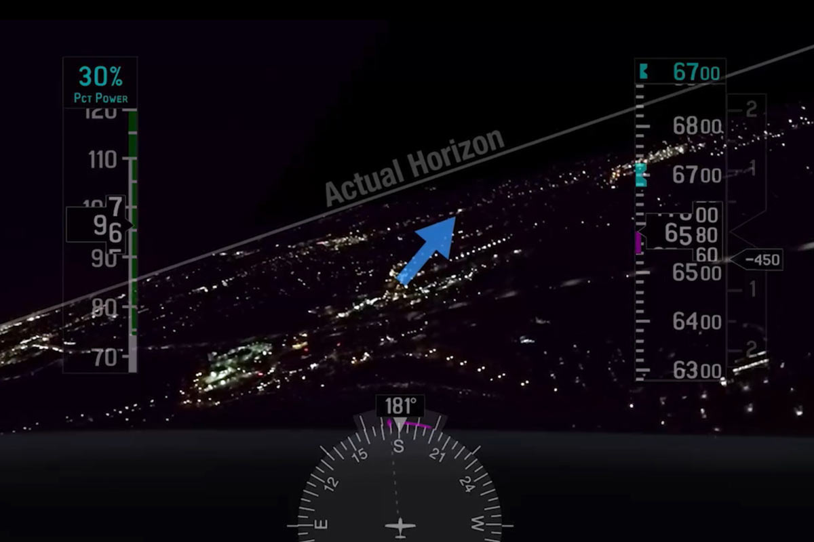

---

## Autokinesis

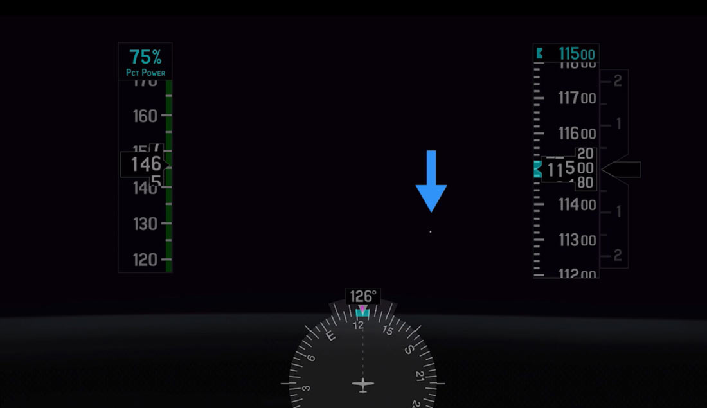

- Staring at a single point of light against a dark background for several seconds
- The light will appear to move on its own
- Avoid fixating on single points of light and vary the focus of your eye
- Use good visual scanning technique, scanning the sky in chunks for a few seconds at a time

---

## Flicker Vertigo

- Light flickering at a rate between 4 and 20 cycles per second
- Can produce unpleasant or dangerous reactions
- Nausea, vomiting, and vertigo
- Use good visual scanning techniques, avoiding fixation

---

## Black Hole

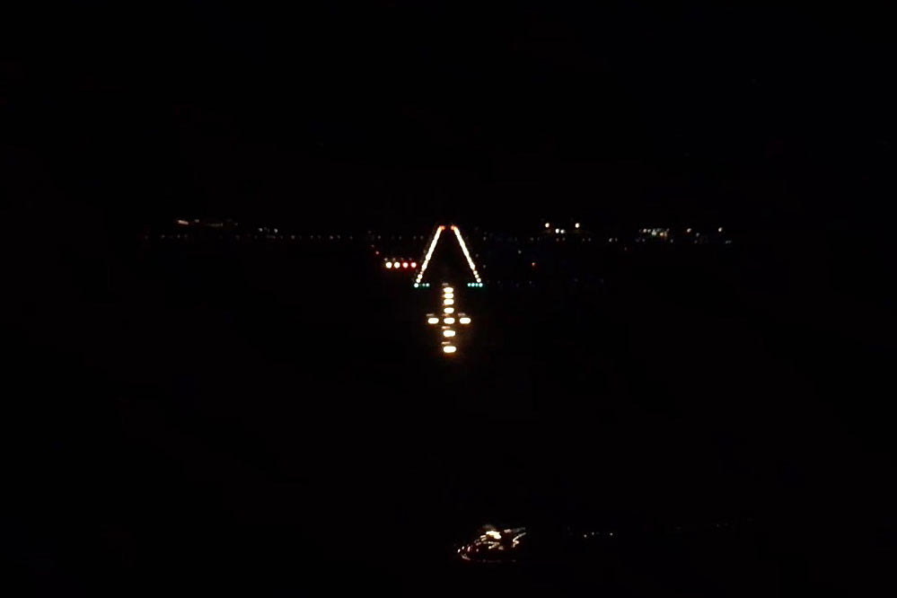

Use caution when approaching to land with no lights except the runway lights, like over water or rural areas.

- This can cause the pilot to fly the approach lower than intended
- Use a runway with a VASI or PAPI
- Overfly the airport and fly a regular traffic pattern
- IFR pilots: Use an approach with vertical guidance (ILS, LPV, or Garmin visual)

---

## Bright Approach Lights

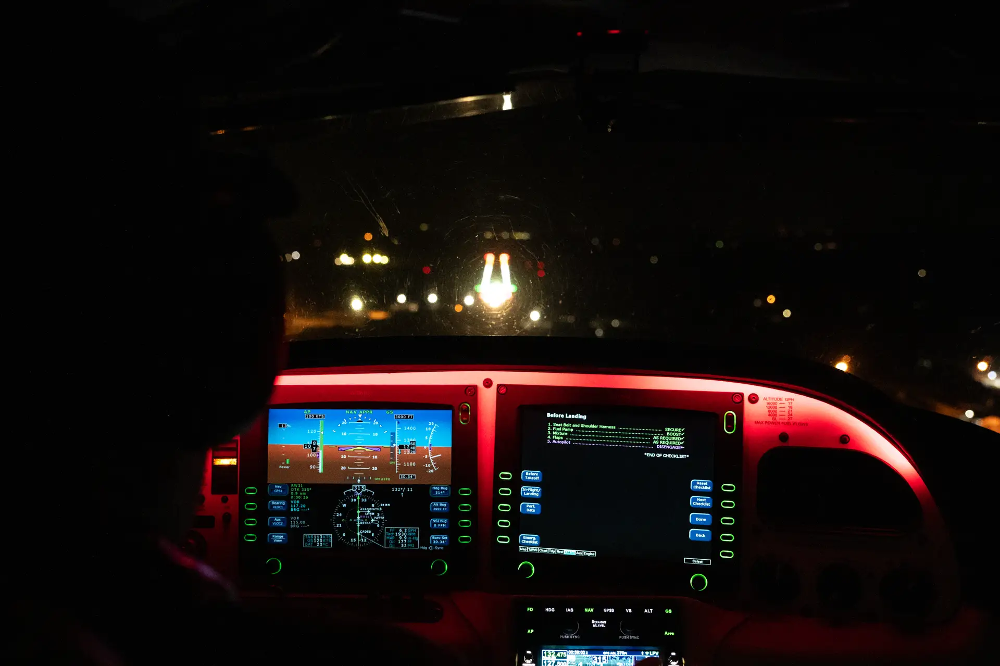

- Bright approach lights can make you seem closer than you actually are
- Add glare on the windscreen
- Can become blinding as you approach the runway
- For pilot-controlled lighting, use a lower intensity

---

## Using Landing Lights in Clouds

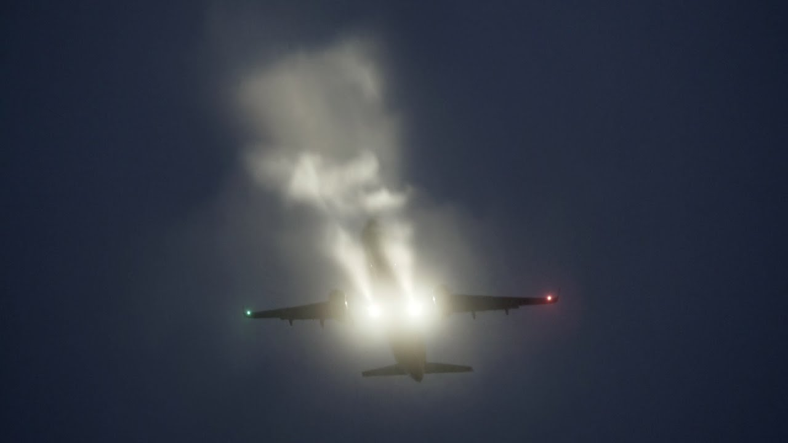

- Illumination of the clouds can cause distortion in the window
- Avoid using landing or taxi lights when flying in the clouds
- Avoid using stroke when in clouds

---

## Night Flying Equipment

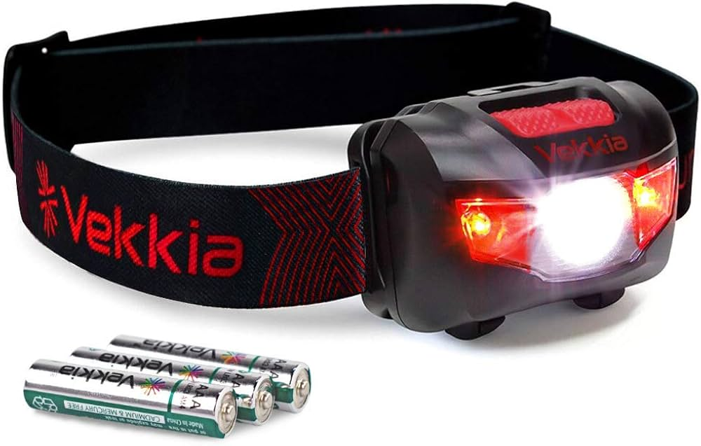

- Two flashlights, with spare batteries
  - Large white flash light for preflight
  - A smaller red flashlight for use in the cockpit
- Don't preflight with the red light, since hydraulic fluid may be read
- Headlamps with a white/red setting can be helpful in the cockpit

---

## Night VFR - Required Equipment (91.205c)

- FLAPS
  - **F**uses (spares)
  - **L**anding light
  - **A**nti-collision light
  - **P**osition lights
  - **S**ource of electrical power

---

## Position Light Requirements (91.209)

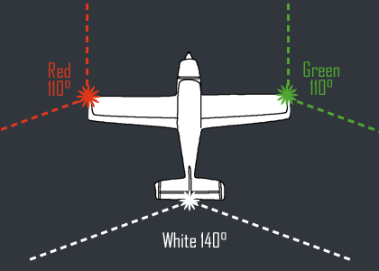

- Anti-collision or beacon lights must be on all the time
- Position lights must be on from sunset to sunrise

---

# Airport Lighting

---

## Rotation Beacons

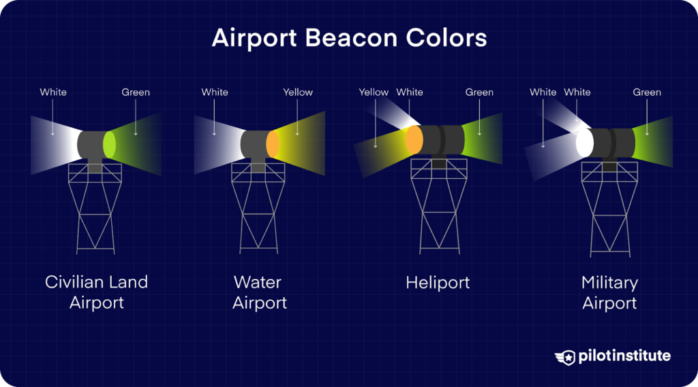

- White/green: Lighted land airport
- Two white flashes/green: Military airport
- White/yellow: Lighted water airport
- White/yellow/green: Lighted heliport

---

## Runway Lights

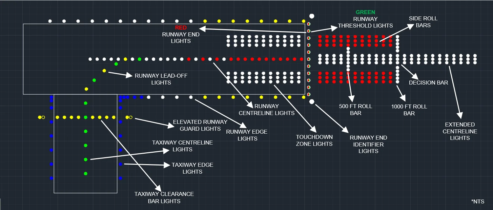

- Various types of approach lighting systems
- Run/green bidirectional lights are used to mark the end of the runway

---

## Runway Lights (cont.)

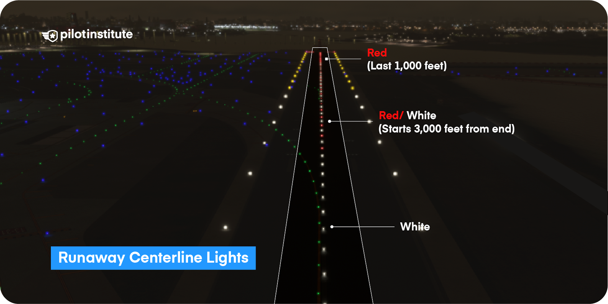

- Centerline lights
  - White lights mark the centerline of the runway
  - Last 3000' of runway: Alternate red and white lights
  - Last 1000' of runway: All red lights
- Edge lights
  - White lights
  - Last 2000' of runway: Yellow lights

---

## Pilot-Controlled Lighting

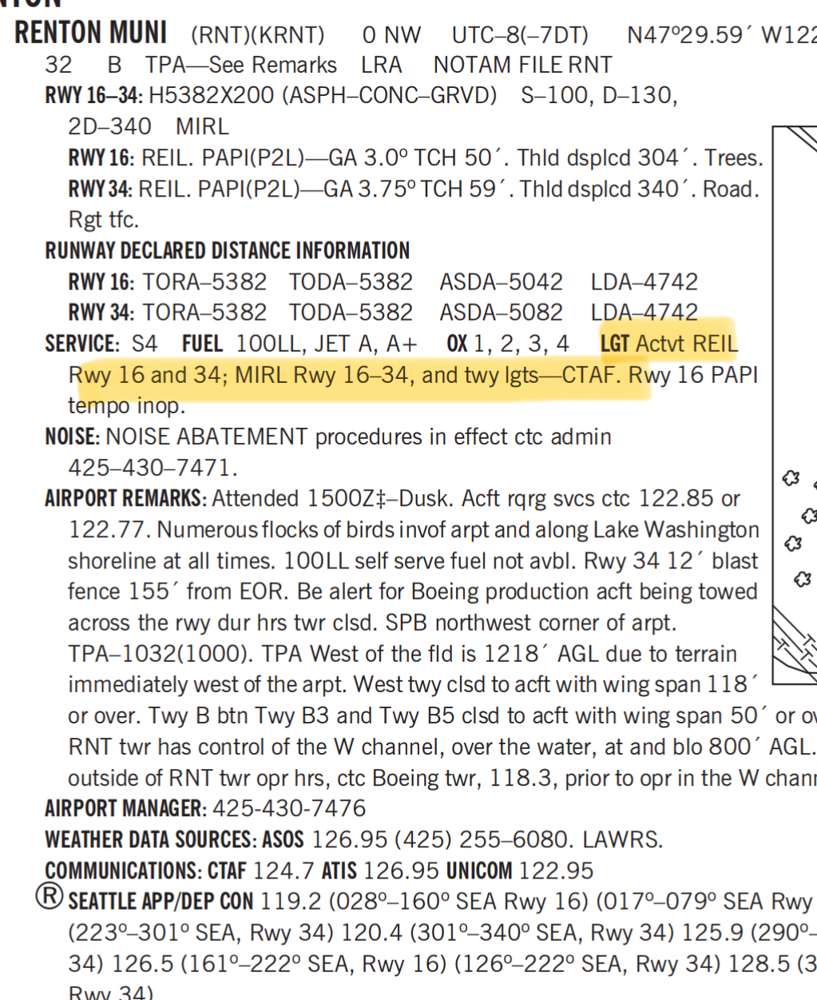

- Usually on the CTAF frequency
  - Check chart supplement to confirm
- Clicking the microphone changes the intensity
  - 3 clicks: low intensity
  - 5 clicks: medium intensity
  - 7 clicks: high intensity

---

## Taxiway Lights

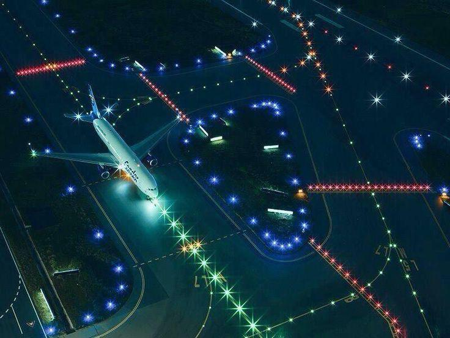

- Blue lights outline the taxiway
- Green lights mark the taxiway centerline (at some airports)

---

# Summary
