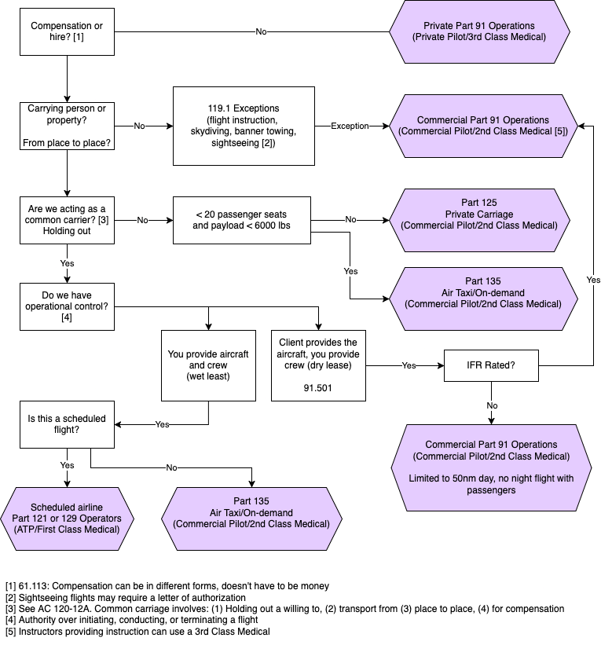

# Endorsements and Pilot Qualifications

## Commercial Pilots, 61 Subpart F

---

### 61 Subpart F: Commercial Pilots

# 61.123 Eligibility

- Must be 18 years old
- Be able to read, speak, write, and understand the English language
  - ICAO Level 4 English
  - See AC 60-28B, Appendix A for evaluation
- Hold a private pilot certificate
- Pass a knowledge test
- Meet the aeronautical experience 61.129

---

### 61 Subpart F: Commercial Pilots

# 61.125 Aeronautical Knowledge

- Student must receive and log ground training or complete a home-study course on the areas listed in 61.125(b).
- Take a knowledge test, after the following endorsement
  - The [A.34 endorsement](#) for ground training
  - The [A.82 endorsement](#) for a home study course

---

### 61 Subpart F: Commercial Pilots

# 61.127 Flight Proficiency

Need ground and flight training around these areas:

- Preflight/postflight preparation, procedures
- Airport operations, takeoffs, landings, and go-arounds
- Performance maneuvers (steep turns, lazy 8s, etc.)
- Ground reference maneuvers
- Navigation
- Slow flight and stalls
- Emergency operations
- High-altitude operations

---

### 61 Subpart F: Commercial Pilots

# 61.129 Aeronautical Experience

250 hours total flight time, including:

- 100 hours in powered aircraft, of which 50 hours must be in airplanes
- 100 hours of PIC time, including:
  - 50 hours in airplanes
  - 50 hours of XC flight, of which 10 hours must be in airplanes

---

### 61 Subpart F: Commercial Pilots

# 61.129 Aeronautical Experience (cont.)

- 20 hours of flight training, including:
  - 10 hours of instrument training, 5 hours must be in a single-engine airplane
    - This must be specifically logged to the requirements in [61.129(3)(i)](</_references/14-CFR/61.129(3)(i)>)
    - This training must be done by a CFII
  - 10 hours of complex, turbine, or TAA aircraft
  - One dual 2-hour day XC flight >100nm
  - One dual 2-hour night XC flight >100nm
  - 3 hours within 2 months of the practical test

---

### 61 Subpart F: Commercial Pilots

# 61.129 Aeronautical Experience (cont.)

- 10 hours of solo flight time OR 10 hours performing the duties of PIC (PDPIC) with an instructor:
  - Restrictions:
    - The solo time and PDPIC time _cannot_ be combined
    - No instruction can be given on PDPIC flights
    - PDPIC cannot be used on the 300nm solo requirement
  - One 300nm flight with landings at 3 points, which is a straight-line distance of at least 250nm from the departure point
  - 5 hours of night flight in VFR conditions, including:
    - 10 takeoffs and landings at an airport with an operating control tower

<!--
The no solo requirement comes from a legal interpretation from the FAA given in
https://www.faa.gov/about/office_org/headquarters_offices/agc/practice_areas/regulations/interpretations/Data/interps/2016/Grannis_2016_Legal_Interpretation.pdf
 -->

---

### 61 Subpart F: Commercial Pilots

# 61.133 Privileges and Limitations

- Without an instrument rating, flights are limited to:
  - 50nm with passengers for hire
  - No night flight with passengers for hire
- Have the same privileges as a private pilot, including:
  - Carrying passengers or property for hire
- Must comply with common carriage rules per Part 119.1

---

### 61 Subpart F: Commercial Pilots

# 61.133 and 119.1 Privileges and Limitations

- A commercial pilot is free to work _for_ a commercial operator, who is certificated for the operations they perform.
- They may also act _as_ an operator themselves, but the services they offer may require a operating certificate.
- A person _or_ an organization can be a commercial operator

---

### 61 Subpart F: Commercial Pilots

# 119.1 Common Carriage

- 4 requirements for common carriage:
  1. Holding out a willingness to
  2. Transport persons or property
  3. From place to place
  4. For compensation
- Any operations of a "common carrier" requires an operator certificate
- "Holding" out could be many things
  - Advertising to the general public is an unambiguous sign of holding out
  - This is a matter of degree and subject to interpretation

---

---

### 61 Subpart F: Commercial Pilots

# 119.1 Commercial Operators Exceptions

- Certain operations do not require an operator's certificate (&lt;20 seats, &lt;6000 lbs)
  - Student instruction
  - Nonstop Commercial Air Tours (defined per 119.1(e)(2))
  - Ferry/training flights
  - Crop dusting, banner towing, fire fighting, photography/survey, power line/pipeline patrol
  - Sightseeing in balloons/gliders
  - Parachute operations (within 25nm)

---

### 61 Subpart F: Commercial Pilots

# Recommendation for the Practical Test

1. A.34 endorsement or A.82 endorsement to take the knowledge test
2. Passing knowledge test result
3. A.1 endorsement: Preparation for the practical test
4. A.2 endorsement: Review of any missed questions on knowledge test (if required)
5. A.35 endorsement: Flight proficiency/practical test
