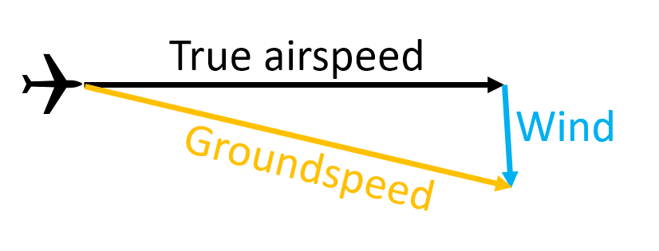
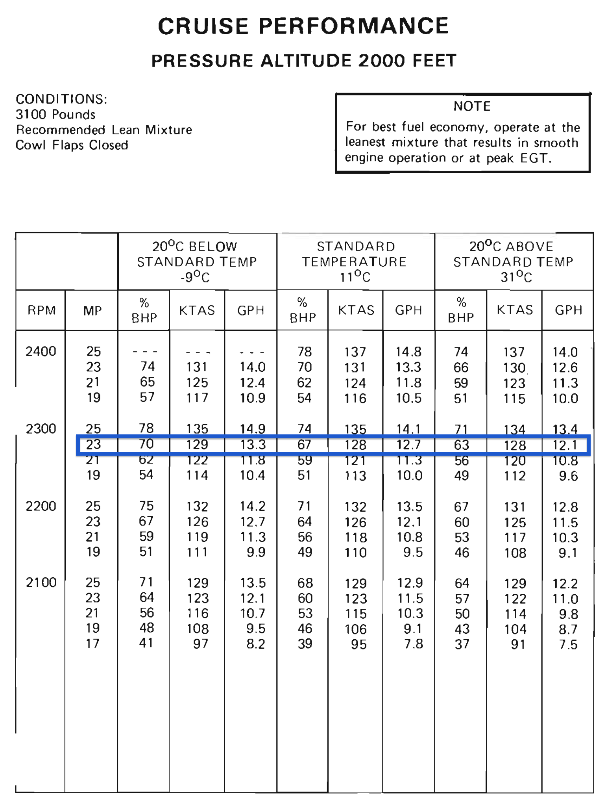
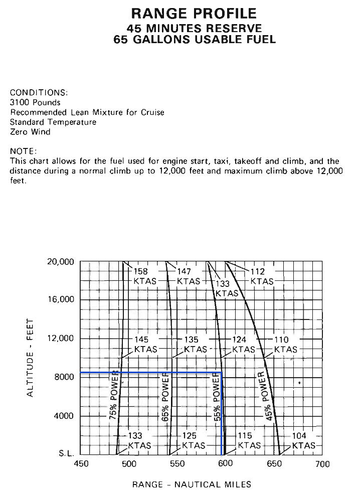

# Performance and Limitations

---

## Objective

Gain an intuitive understanding of how atmospheric conditions affect aircraft performance, and how to use our airplane's performance charts to compute specific performance numbers.

## Motivation

Altitude, temperature, and pressure affect all aspects of our airplane's performance. All pilots need to understand how these factors affect the airplane, and what limitations are present in its design.

Instruction: Known to unknown, building on aerodynamics

---

## Overview

- Airplane and performance
- Air and density
  - Density altitude
  - International Standard Atmosphere
  - Types of altitude
  - Types of airspeed
  - How density affects performance
- Airplane performance charts
  - Performance scenario using Cessna charts
  - Other chart styles

---

# Performance Concepts

---

## Airplane Weight

- The greater the weight, the greater the lift provided
- The greater the lift, more induced drag
- Thus more **weight = less airplane performance**
  - Slower cruise speed
  - Higher takeoff speed, longer takeoff roll
  - Slower climb performance
  - Higher landing speed, longer landing roll

---

## Air and Density

- Our airplane swims through the air, air molecules bounce off the airplane
  - As these air molecules are deflected downward, our airplane is forced upward
  - Our propeller pushes air backwards which pushes us forwards
  - Our engine "breaths" air from outside, burns that air with fuel to produce power

---

## High and Low Air Density

- All of this depends on how close the air molecules are together
- Tightly spaced = more air to grab on to
  - Wings can produce more lift
  - Propeller can produce more thrust
  - Engines can produce more power
- Density constantly changes with
  1. Pressure
  2. Temperature
  3. Humidity

---

## Thing That Affect Density: Ambient Pressure (Variable #1)

- As we climb
  - Ambient pressure decreases
  - Air density decreases
  - Pressure decreases on average 1" Hg per 1000' (_pressure lapse rate_)
- The pressure outside varies from day to day
  - On high pressure days, air is more dense
  - On low pressure days, air is less dense

---

## Things That Affect Density: Temperature (Variable #2)

- Hot air molecules bounce off each other more energetically
- This causes the molecules to spread out and become less dense
- Likewise, cold air molecules are less excited become more dense

---

## Humidity: Temperature (Variable #3)

- Water vapor in the air also takes up space
- The higher the humidity, the lower the air density
- Effect of density is small relative to pressure and temperature
  - Usually omitted from performance chats and calculations

---

## Rolling it All Up

- That's a lot of variables to consider
- What if there was one number that would combine the effects of:
  - Altitude
  - Ambient pressure
  - Temperature

---

## International Standard Atmosphere (ISA)

- What if we made a fake atmosphere with known conditions?
  - Density can defined as an altitude in this atmosphere
- The higher the altitude, the lower our airplane's performance
- ISA Definitions
  - At sea level, the pressure is 29.92" Hg
  - Pressure lapses (reduces) at 1" Hg per 1000'
  - Temperature: 15&deg; C at S.L.
  - Temperature lapse rate: 2&deg;C per 1000' (to 24,000)

---

## How do we compute this magic density number?

First, gather your information:

- Field elevation **4170 ft.**
- Temperature **84&deg; F, 29&deg; C**
- Pressure **29.88" Hg**

---

## Start with variable #1: Altitude

- Start with the field elevation
- If we were in the airplane we'd read this directly off the altimeter, what we call _indicated altitude_

---

## Correct for Variable #2: Ambient Pressure

1. We get this from the current altimeter setting
   - Subtract the S.L. pressure of 29.92" Hg
   - $(29.92 - 29.88) = 0.04\text{" Hg}$
2. Since we know the standard atmosphere lapses at 1" per 1000':
   - Multiple this by 1000 to get the change in feet
   - $0.04 * 1000 = 40$
3. Add this difference to our field elevation:
   - $4170 + 40 = 4210$
   - The altitude in the standard atmosphere where the current _pressure_ is found
4. This is called **pressure altitude**

---

## Pressure altitude another way: Have the altimeter do the math

- As you rotate the Kollsman window the altimeter moves up and down at that same rate 1" per 1000'
- If we set our altimeter to 29.92" (the pressure of S.L. in the standard atmosphere), it will give us pressure altitude

---

## Correct for Variable #3: Temperature

- The temperature in the standard atmosphere decreases as we ascend:
  - Temperature is 15&deg;C at sea level
  - The temperature lapse rate is 2&deg; per 1000'
  - We care about the different between _actual_ temperature and _standard_ temperature
- At a pressure altitude of 4210'
  - $15\degree C - 2 * (4210 / 1000) = 6.58\degree C$
- If the pressure outside is 29&deg;C
  - $29 - 6.58 = 22.4\degree C \text{ above standard}$

---

## Correct for Variable #3: Temperature

- Now need factor this temperature difference into our density altitude
- Apply the formula:
  - $\text{Pressure altitude} + 118.8 * (\text{Temperature difference from standard})$
  - $4210\text{ ft} + 118.8 * 22.4 \degree C = 6871\text{ ft}$
- This is our magic number: **density altitude**
  - If our airplane were flying in the standard atmosphere, it would feel like it's flying at **6871** feet

---

## Density Altitude with an Electronic 56-B

- `P-D/ALT` mode
- Set Indicated altitude - IALT
- Altimeter setting - BARO
- Outside temperature - T&deg;C
- Gives
  - Pressure altitude PALT
  - Density altitude DALT

---

## Review of Altitude Types

- Ambient pressure/Altimeter setting: Set in the Kollsman window
- **Indicated** altitude: Read directly off the altimeter
- **Pressure** altitude: Height in the ISA where current pressure is found
- **Density** altitude: Height in the ISA where the current pressure is found, plus any correction for temperature

---

## Airspeed

---

## Pitot Tube and Indicated Airspeed

- How many molecules are hitting the pitot tube
- Really a measure of pressure:
  - $\text{Airspeed} = \text{RAM air pressure} - \text{Static air pressure}$

---

## Pitot Tube As A Molecule Counter

- More forward movement: More molecules we hit
- More air density: Molecules tightly spaced so more to hit
- Less air density: Molecules less tightly spaced, less to hit
- Tells us how many air molecules is moving over the wings

---

## Types of Airspeed: Calibrated Airspeed

- The pitot tube is attached at a certain angle
- This might not be directly into the relative wind
- With a high angle of attack, the relative wind will be at a steeper angle
- To account for this, we compute **calibrated airspeed**
  - This is usually given in a table in the POH

---

### Computing Calibrated Airspeed

- Examples
  - Indicated airspeed of 120 means a calibrated airspeed of 118
  - Indicated airspeed of 60 means a calibrated airspeed of 65
- Notice how the error increases the slower we are

---

## Types of Airspeed: True Airspeed

- Adjusts the "molecule count" based on the air density
  - Uses the same 3 variables: Altitude, pressure, temperature
- True airspeed in the speed you're moving through the _air mass_
- For a given indicated airspeed:
  - Higher air density: Slower the TAS
  - Lower air density: Fast the TAS

---

### True Airspeed with an Electronic E6B

`ACT TAS` Mode
Pressure altitude (PALT): 4210'
Outside air temperature (OAT): 29&deg;C
Calibrated airspeed (CAS): 118 knots

Result TAS is **130.1 knots**

- This means we're flying _faster_ through the air mass than the airspeed indicator would have us believe.
- With no wind, we'd be moving 130 knots over the ground

---

## Types of Airspeed: Ground Speed

- The air mass itself might be moving due to wind
- We add wind velocity to our true airspeed to get our speed over the ground
- With zero wind: Ground speed = true airspeed

---

## Types Of Airspeeds

- **Indicated** airspeed (IAS): Read from altimeter
- **Calibrated** airspeed (CAS): Calibrated for position/instrument errors
  - At slow airspeeds this may be several knots off
- **True** airspeed (TAS): CAS corrected for altitude and nonstandard temperature
- **Ground** speed (GS): Actual speed over the ground
  - TAS adjusted for wind

---

## Knowledge Check

Assuming all other variables are the same:

- Where will an airplane have a longer takeoff roll, in Denver or in Orlando?
- Where will an airplane have a longer landing roll, when the temperature is 2&deg; C or 30&deg; C?
- Which aircraft will have a higher ground speed on takeoff, when the pressure is 20.79" or 30.44" Hg?
- When will our (normally-aspirated) airplane produce the most power, on the ground or at 8000 feet?

---

# Performance Planning

---

# Performance

On a real flight we want to know:

- How much runway distance we will use for takeoff
- How long the flight will take
- How much fuel we will burn
- How mush landing distance we will use

---

## Aircraft Performance Charts

- Published in our POH/AFM
- Based on a new airplane, engine, and propeller
- Based on a test pilot flying with excellent technique (airspeed control, proper leaning)
- Formatted in a variety of ways
  - Some use pressure altitude + temperature (Cessnas)
  - Some use density altitude only

---

## Takeoff Distance - Temperature

Ground Roll

- S.L. at 0&deg; C: 700'
- S.L. at 40&deg; C: 960'
- **260** ft. increase from temperature alone

---

## Takeoff Distance - Ground Roll vs Obstacle Clearance

---

## Takeoff Distance - Wind

Sea level, 20&deg;C

18 knot headwind:
20% decrease
820 \* 0.8 = **656 ft.**

4 knot tailwind:
20% increase
820 \* 1.2 = **984 ft.**

---

## Realistic Performance

- Takeoff performance
  - New engine, new propeller
  - Test pilot with excellent technique
- Landing performance
  - Excellent technique, energy management
  - No gusty winds, or gust factor
  - Maximum braking
- A safety factor helps in managing this discrepancy
  - We'll use a safety factor of **+50%** for takeoff and landing

---

## Takeoff Distance - Safety Factor

Ground roll = **820 ft.**
Over 50' obstacle = **1535 ft.**

With 50% safety factor:

820 \* 1.5 = **1230 ft.**
1535 \* 1.5 = **2302 ft.**

---

## Time, Distance, Fuel to Climb (Normal Climb) - Altitude

Airport: 4000'
Cruise: 8000'

16 - 8 = 8 minutes
5.7 - 2.8 = 2.9 gallons
27 - 13 = 14nm

Climb rate decreases as we ascend

---

## Time, Distance, Fuel to Climb (Normal Climb) - Temperature

8 minutes, 2.9 gallons, 14nm

14&deg;C above standard
20% increase

8 \* 1.2 = **9.6 minutes**
2.9 \* 1.2 = 3.5 gallons
14 \* 1.2 = **16.8nm**

+2 gal start/taxi/takeoff
3.5 + 2 = **5.5 gallons**

---

## Cruise Performance - Altitude and Temperature

---

---

## Landing Distance (Short Field)

Headwind: 9 knots
Pressure altitude: S.L.
Temperature: 20&deg;C

Decrease distances 10%

0.9 \* 600 = **540 ft. ground roll**
0.9 \* 1365 = **1231 ft. over 50' obs.**

---

## Landing Distance (Short Field) - Safety Factor

540 ft. ground roll
1231 ft. over 50' obs.

Ground roll:
540 \* 1.5 = **810 ft**

Over 50' obstacle:
1231 \* 1.5 = **1846 ft**

---

4100' press. altitude
22&deg; C
2300 lbs.
7 knots headwind

**~1150 ft.**

---

## Differences between Actual and Estimated Performance

- Conditions are different from forecast
- Pilot technique
  - Takeoff
  - Landing
  - Engine leaning
- Age of engine, propeller, airframe
- Runway slope: Up or down
- Wet runway: Braking action

---

# Limitations

---

## Where do we find limitations?

- POH limitations section
- Placards and markings
- Performance charts

---

## Engine Limitations

---

## Airspeed Limitations

---

## Load Factor Limits

---

## Operating Limits

---

## High Temperatures

Is it advisable to fly when it's > 40&deg;C?

---

# Summary

- Performance concepts
  - Air and density
  - International Standard Atmosphere
  - Types of Altitude
  - Types of Airspeed
  - How density affects performance
- Airplane performance charts
  - Computing performance values using Cessna charts
- Airplane limitations
