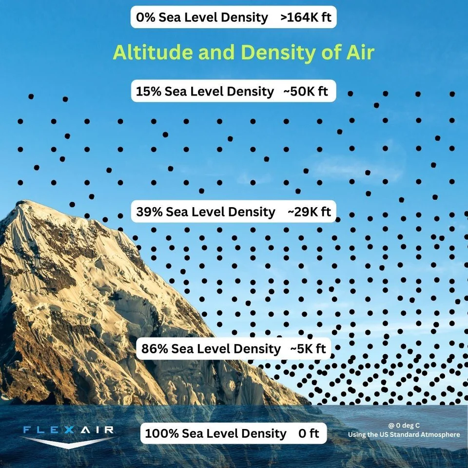

# Performance and Limitations

---

## Objective

Gain an intuitive understanding of how atmospheric conditions affect aircraft performance, and how to use our airplane's performance charts to compute specific performance numbers.

## Motivation

Altitude, temperature, and pressure affect all aspects of our airplane's performance. All pilots need to understand how these factors affect the capabilities of the airplane and how that affects the safety of flight.

---

## Overview

- Air and density
  - International Standard Atmosphere
  - Types of Altitude
  - Types of Airspeed
  - How density affects performance
- Airplane performance charts
  - Performance scenario using Cessna charts
  - Other chart styles

---

# Performance Concepts

---

## Air and Density

- Air has mass
- Our airplane swims through the air, air molecules bounce off the airplane
  - As these air molecules are deflected downward, our airplane is forced upward
  - Our propeller pushes air backwards which pushes us forwards
  - Our engine "breaths" air from outside, burns that air with fuel to produce power

---

## High and Low Air Density

- All of this depends on how close the air molecules are together
- Tightly spaced = more air to grab on to
  - Wings can produce more lift
  - Propeller can produce more thrust
  - Engines has more air molecules to burn, just like a campfire
- Sparely spaced = less air to grab on to
  - Wings produce less lift
  - Propellers can't produce as much thrust
  - Engine has less air molecules to burn

---

## Things That Affect Density: Altitude (Variable #1)

- Density decreases as we get farther from the Earth's surface due to gravity
- The rate at which this occurs is called the pressure _lapse rate_
- The average lapse rate is 1" Hg per 1000 ft.

---

## Thing That Affect Density: Ambient Pressure (Variable #2)

- The pressure outside varies from day to day
- On high pressure days, the air is more dense
- On low pressure days, the air is less dense

---

## Things That Affect Density: Temperature (Variable #3)

- Hot air molecules bounce off each other more energetically
- This causes the molecules to spread out and become less dense
- Likewise, cold air molecules are less excited become more dense

---

## Rolling it All Up

- That's a lot of variables to consider
- What if there was a magic "density" number which could combine:
  - Altitude
  - Ambient pressure
  - Temperature
- Then give us one number which represents the density of the air

---

## International Standard Atmosphere (ISA)

- A fake atmosphere with ideal conditions
  - Our "magic" density number is a height in this atmosphere
  - This height would have an _equivalent_ density to the real conditions
- ISA Definitions
  - At sea level, the pressure is 29.92" Hg (1013.2 millibars)
  - Pressure lapses (reduces) at 1" Hg per 1000'
- The higher the altitude, the lower our airplane's performance

---

## How do we compute this magic density number?

First, gather your information:

- Field elevation **4170 ft.**
- Temperature **84&deg; F, 29&deg; C**
- Pressure **29.88" Hg**

---

## Start with variable #1: Altitude

- Start with the field elevation
- If we were in the airplane we'd read this directly off the altimeter, what we call _indicated altitude_

---

## Correct for Variable #2: Ambient Pressure

1. We get this from the current altimeter setting
   - Subtract the S.L. pressure of 29.92" Hg
   - $(29.92 - 29.88) = 0.04\text{" Hg}$
2. Since we know the standard atmosphere lapses at 1" per 1000':
   - Multiple this by 1000 to get the change in feet
   - $0.04 * 1000 = 40$
3. Add this difference to our field elevation:
   - $4170 + 40 = 4210$
   - The altitude in the standard atmosphere where the current _pressure_ is found
4. This is called **pressure altitude**

---

## Pressure Altitude Chart

---

## Pressure altitude another way: Have the altimeter do the math

- As you rotate the Kollsman window the altimeter moves up and down at that same rate 1" per 1000'
- If we set our altimeter to 29.92" (the pressure of S.L. in the standard atmosphere), it will give us pressure altitude

---

## Correct for Variable #3: Temperature

- The temperature in the standard atmosphere decreases as we ascend:
  - Temperature is 15&deg;C at sea level
  - The temperature lapse rate is 2&deg; per 1000'
  - We care about the different between _actual_ temperature and _standard_ temperature
- At a pressure altitude of 4210'
  - $15\degree C - 2 * (4210 / 1000) = 6.58\degree C$
- If the pressure outside is 29&deg;C
  - $29 - 6.58 = 22.4\degree C \text{ above standard}$

---

## Correct for Variable #3: Temperature

- Now need factor this temperature difference into our density altitude
- Apply the formula:
  - $\text{Pressure altitude} + 118.8 * (\text{Temperature difference from standard})$
  - $4210\text{ ft} + 118.8 * 22.4 \degree C = 6871\text{ ft}$
- This is our magic number: **density altitude**
  - If our airplane were flying in the standard atmosphere, it would feel like it's flying at **6871** feet

---

## Review of Altitude Types

- Ambient pressure/Altimeter setting: Set in the Kollsman window
- Indicated altitude: Read directly off the altimeter
- Pressure altitude: Height in the ISA where current pressure is found
- Density altitude: Height in the ISA where the current pressure is found, plus any correction for temperature

---

## Pitot Tube As A Molecule Counter

- More forward movement: More molecules we hit
- More air density: Molecules tightly spaced so more to hit

---

## Imagine an Airplane Traveling 100 Feet

- Plane travels 100 feet at the same speed:
  - If the air density is high, it's going to hit 200 molecules - higher airspeed shown
  - If the air density is low, it's going to hit 100 molecules - lower airspeed shown
- Which is going to produce more lift force?

---

## Types of Airspeed: Indicated Airspeed

- How many molecules are hitting the pitot tube
- Really a measure of pressure:
  - $\text{Airspeed} = \text{RAM air pressure} - \text{Static air pressure}$

---

## Types of Airspeed: Calibrated Airspeed

- The pitot tube is attached at a certain angle
- This might not be directly into the relative wind
- With a high angle of attack, the relative wind will be at a steeper angle
- To account for this, we compute **calibrated airspeed**
  - This is usually given in a table in the POH

---

### Computing Calibrated Airspeed

- Examples
  - Indicated airspeed of 120 means a calibrated airspeed of 118
  - Indicated airspeed of 60 means a calibrated airspeed of 65
- Notice how the error increases the slower we are

---

## Types of Airspeed: True Airspeed

- Similar to altitude, we can account for non-standard temperature and pressure in airspeed
- This adjusts the "molecule count" based on the air density
  - Uses the same 3 variables: Altitude, pressure, temperature
- True airspeed in the speed you're moving through the _air mass_

---

### True Airspeed: Example

- Pressure altitude (PALT): 4210'
- Outside air temperature (OAT): 29&deg;C
- Calibrated airspeed (CAS): 118 knots

Using an E6B computer, we compute true airspeed (TAS) as **130.1 knots**

- This means we're flying _faster_ through the air mass than the airspeed indicator would have us believe.
- With no wind, we'd be moving 130 knots over the ground

---

## Types of Airspeed: Ground Speed

- The air mass itself might be moving due to wind
- We add wind velocity to our true airspeed to get our speed over the ground
- With zero wind: Ground speed = true airspeed

---

## Types Of Airspeeds

- Indicated airspeed (IAS): Read from altimeter
- Calibrated airspeed (CAS): Calibrated for position/instrument errors
  - At slow airspeeds this may be several knots off
- True airspeed (TAS): CAS corrected for altitude and nonstandard temperature
- Ground speed (GS): Actual speed over the ground
  - TAS adjusted for wind

---

## Knowledge Check

- Assuming all other variables are the same:
  - Where will an airplane have a longer takeoff roll, in Denver or in Orlando?
  - Where will an airplane have a longer landing roll, when the temperature is 2&deg; C or 30&deg; C?
  - Which aircraft will have a higher ground speed on takeoff, when the pressure is 20.79" or 30.44" Hg?
  - When will our (normally-aspirated) airplane produce the most power, on the ground or at 8000 feet?

---

# Performance Planning

---

# Performance

On a cross-country flight we want to know:

- How long the flight will take
- How much fuel we will burn
- How mush landing distance we will use
- How much runway distance we will use

---

## Aircraft Performance Charts

- Published in our POH/AFM
- Based on a new airplane, engine, and propeller
- Based on a test pilot flying with excellent technique (airspeed control, proper leaning)
- Formatted in a variety of ways
  - Some use pressure altitude + temperature (Cessnas)
  - Some use density altitude only

---

## Performance Scenario

- Depart: Lewiston Municipal (KLWT)
  - Elevation: 4170'
  - Altimeter: 29.88" Hg
  - Temperature: 29&deg;C
- Cruise at 8500 ft.
- Arrive: Harve City County (KHVR)
  - Elevation: 2591'
  - Altimeter: 29.95" Hg
  - Temperature: 25&deg; C

- Aircraft
  - 50 gallons of fuel aboard
  - Max gross weight (3100 lbs)

---

## Takeoff Distance

Headwind: 4 knots
Pressure altitude: 4210
Temperature: 29&deg;C

30&deg; line, 4000':
1165' ground roll
2145 over 50' obstacle

4 kts headwind, -5%:
$1165 * 0.95$ = **1107 ft.**
$2145 * 0.95$ = **2137 ft.**

---

## Time, Distance, Fuel to Climb (Normal Climb)

Airport: 4170'
Cruise: 8500'
Above standard: 22 &deg; C

8000' line: 16 minutes, 5.7 gal, 27m
4000' line: 8 minutes, 2.8 gal, 13nm
16 - 8 = 8 minutes
5.7 - 2.8 = 2.9 gallons
27 - 13 = 14nm

---

## Time, Distance, Fuel to Climb (Normal Climb)

8 minutes, 2.9 gallons, 14nm

22 / 7 = 3.14
3.14 \* 10% = 31% increase

8 \* 1.31 = **10.5 minutes**
2.9 \* 1.31 = 3.8 gallons
14 \* 1.31 = **18.3nm**

+2 gal start/taxi/takeoff
3.8 + 2 = **5.8 gallons**

---

## Cruise Performance (8000 ft.)

13&deg; C above standard
2200 RPM
21" manifold pressure

KTAS: 126 and 127 = 127 KTAS

$(10.8 - 11.3) / (19 - -1) = -0.025$
$(13 - -1) = 14$
$11.3 - 0.025 * 14 =$ **11.0 gph**

$(56 - 59) / (19 - -1) = -0.15$
$59 - 0.15 * 14 =$ **58 % bhp**

---

---

---

## Landing Distance (Short Field)

Headwind: 4 knots
Pressure altitude: 2500
Temperature: 20&deg;C

Average 1440 and 1485 = 1462 ft.
Average 645 and 670 = 658 ft.

4&deg; / 9&deg; = 0.44, decrease 4.4%

0.95 \* 1462 = **1389 ft. over 50' obs.**
0.95 \* 658 = **625 ft. ground roll**

---

4100' press. altitude
22&deg; C
2300 lbs.
7 knots headwind

**~1150 ft.**

---

# Summary

- Air and density
  - International Standard Atmosphere
  - Types of Altitude
  - Types of Airspeed
  - How density affects performance
- Airplane performance charts
  - Computing performance values using Cessna charts
