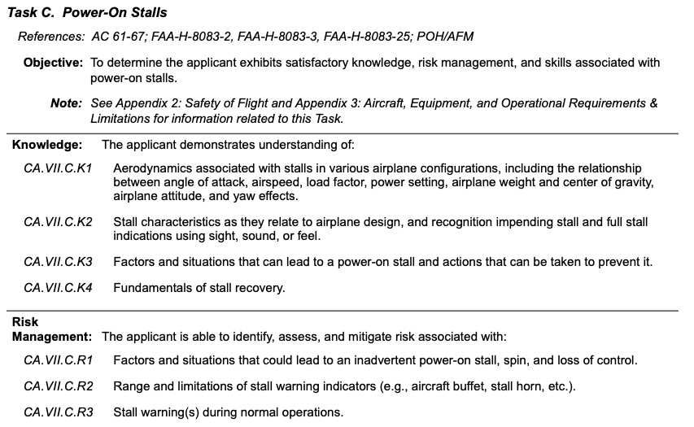
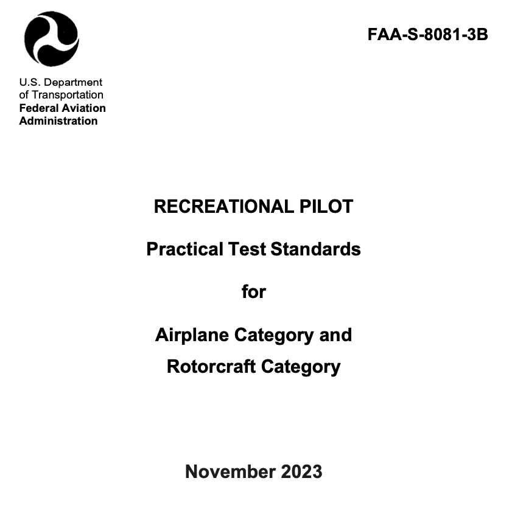
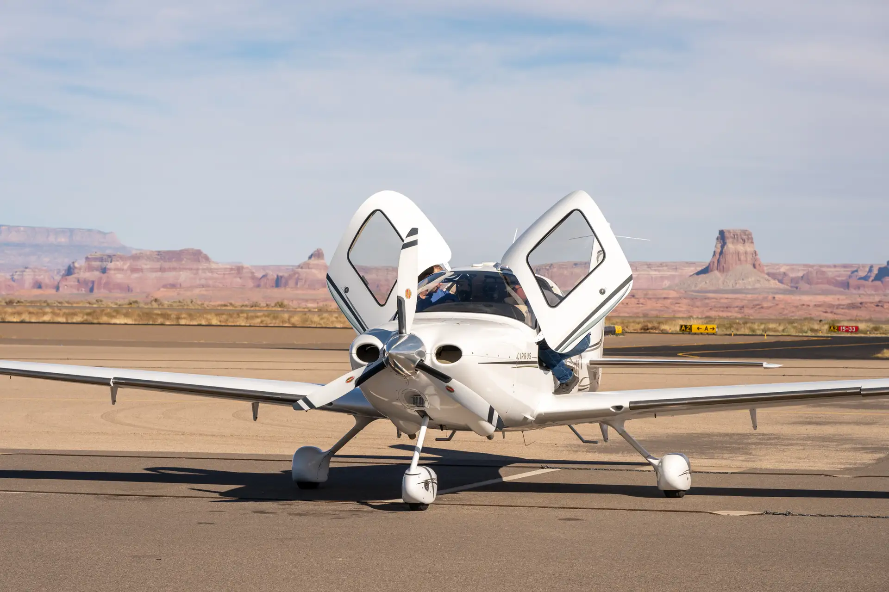
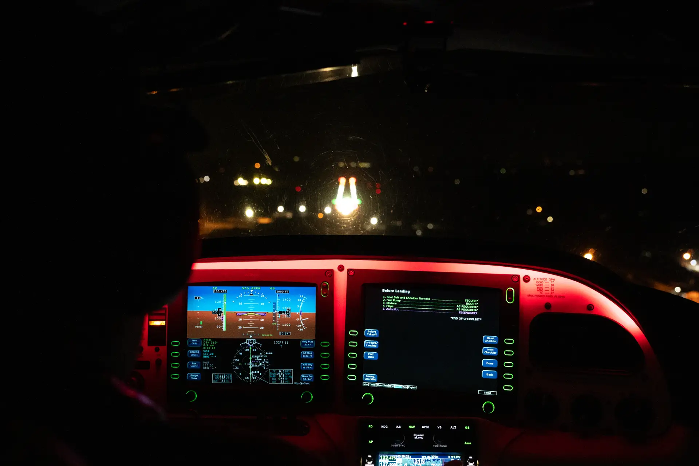
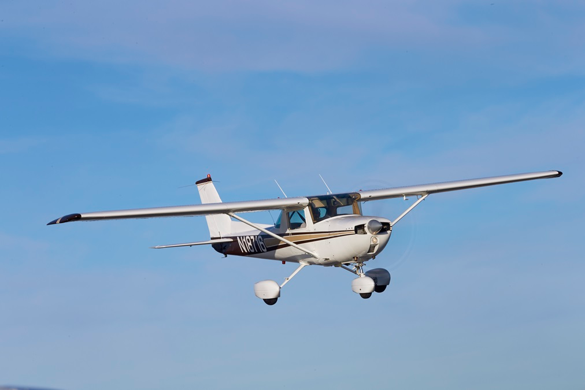
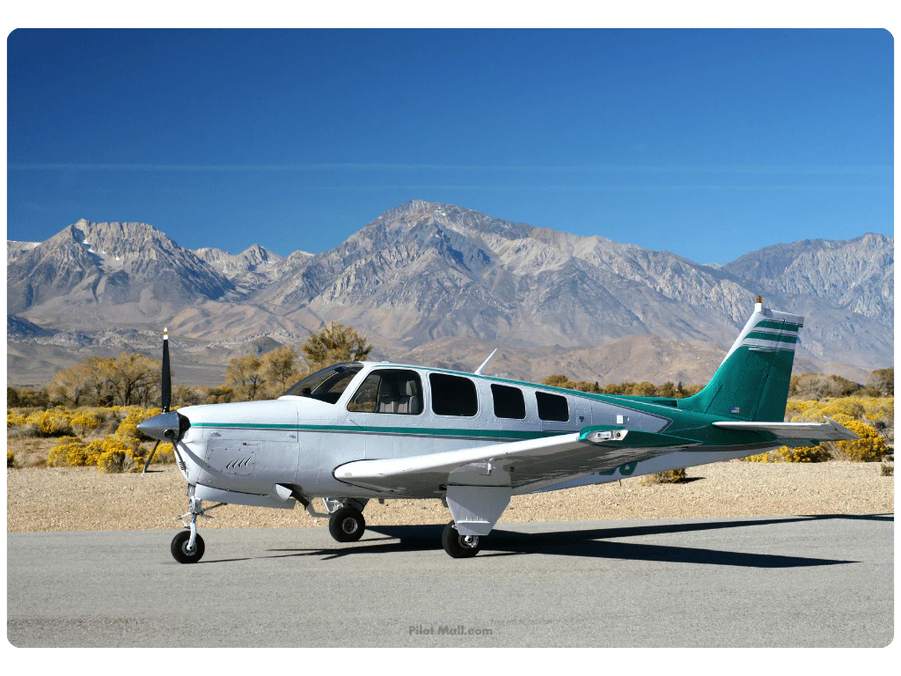
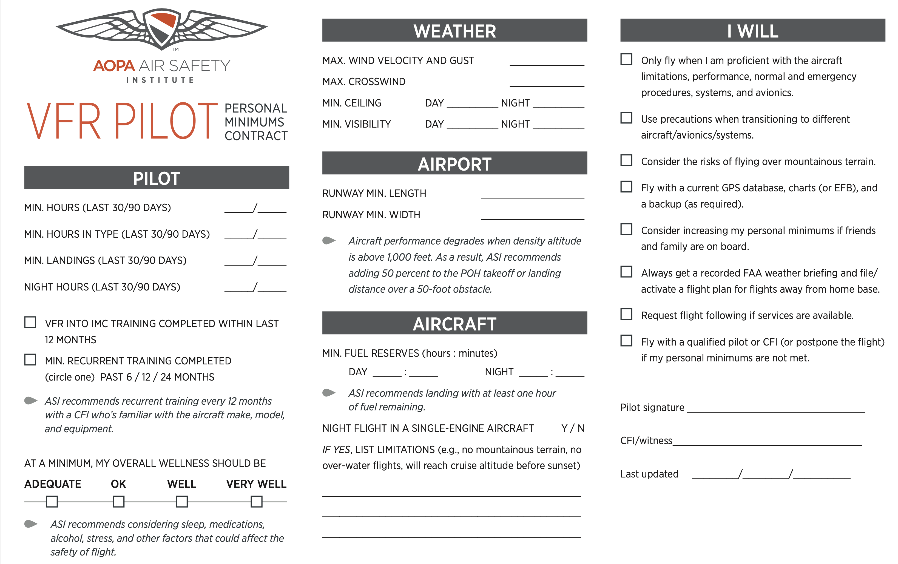
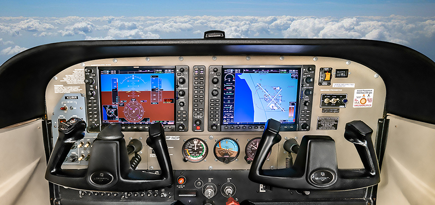
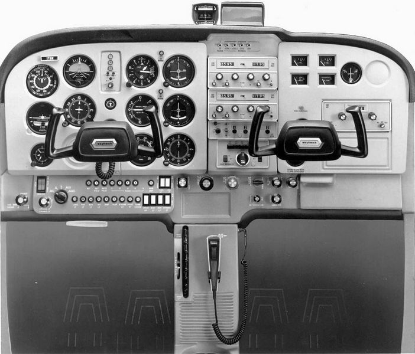

# Pilot Qualifications

---

## Objective

Just as we determine the airworthiness of the airplane, we need to evaluate the pilot's qualifications to fly legally and safely.

## Motivation

All pilots need to understand their legal requirements before piloting an aircraft.

---

## Overview

- FAR Part 61 Overview
- Endorsements
- ACS and PTS
- Flight Reviews
- 90-day currency (day/night)
- Logbook entries
- Student Pilots Review
- Private Pilots
- Commercial Pilots
- Recreational Pilots
- Sport Pilots

- Medicals
- Documents pilots must have to fly
- Proficiency versus currency
- Unfamiliar aircraft: Legal vs safe

---

## Part 61 - Pilot Recency and Certification

Subpart A General 61.1 – 61.60
Subpart B Aircraft Ratings and Pilot Authorizations 61.61 – 61.77
Subpart C Student Pilots 61.81 – 61.95
Subpart D Recreational Pilots 61.96 – 61.101
Subpart E Private Pilots 61.102 – 61.120
Subpart F Commercial Pilots 61.121 – 61.141
Subpart G Airline Transport Pilots 61.151 – 69.171
Subpart H Instructors Other than Instructors With a Sport Pilot Rating 61.181 – 61.201
Subpart I Ground Instructors 61.211 – 61.217
Subpart J Sport Pilots 61.301 – 61.327
Subpart K Flight Instructors With a Sport Pilot Rating 61.401 – 61.429

---

## Endorsements

- AC 61-65J has practical information about flight training and endorsements
- Appendix A has endorsements listed by certificate, A.1 - A.92
- See [Endorsements and Logbook Lesson](https://flightdocs.io/assets/files/endorsements-logbooks-b6f385263bfad877d4f0ead6674302c5.pdf)

---

## ACS and PTS

- Rubric used for grading checkrides
- Lists "area of operations" that a certificated pilot must know
- Lists the tolerances for all maneuvers (Steep turns &pm; 100 ft. altitude)
- Two formats:
  - Practical Test Standards (PTS): Old format
  - Airmen Certification Standards (ACS): New format

---

### Practical Test Standards (PTS)

- Old style of the standard
- Still used on many practical tests
  - Flight Instructor - Instrument
  - Recreational Pilot
  - Gliders
- Includes "special emphasis areas"

---

### Airmen Certification Standards (ACS)

- New style, replacing most PTS
- Includes risk management on each area of operation
- Defines knowledge _and_ practical test criteria

---

# 61.56 Flight Reviews

- Minimum of 1 hour of flight training and 1 hour of ground training
  - A review of the current general operating and flight rules of part 91 of this chapter; and
  - A review of those maneuvers and procedures that, at the discretion of the person giving the review, are necessary for the pilot to demonstrate the safe exercise of the privileges of the pilot certificate.
- Completion with the A.65 endorsement
- Good for 2 years (to the end of the month)

---

# 61.56 Flight Reviews (cont.)

- Things that can be used as a flight review:
  - A pilot proficiency check or practical test conducted by an examiner
  - The issuance of a flight instructor certificate
  - An additional rating on a flight instructor certificate
  - A practical test to reinstate a flight instructor privileges

---

## 90-Day Currency ([61.57](https://www.ecfr.gov/current/title-14/section-61.57))

No person may act as pilot in command of an aircraft unless, in the previous 90 days:

- Person has made 3 takeoffs and three landings
- As the sole manipulator of the controls
- The landings were in the same category, class, and type (if a type rating is required)
- In a tailwheel airplane, the landings must be to a full stop

---

## 90-Day Currency - Night ([61.57](https://www.ecfr.gov/current/title-14/section-61.57))

No person may act as PIC of an aircraft **at night** unless, in the previous 90 days:

- Performed 3 takeoffs and three landings to a full stop
- As the sole manipulator of the controls
- Landings were in the same category, class, and type (if a type rating is required)

Night is defined as 1 hour after sunset to 1 hour before sunrise.

---

### Logbook Requirements ([61.51](https://www.ecfr.gov/current/title-14/section-61.51))

- Pilots need to maintain records:
  - For the requirements of a certificate or rating
  - For recent flight experience requirements (90-day, flight review, IPC)
- Logbook entries
  - Date
  - Total flight time or lesson time
  - Origin and destination
  - Type and identification of aircraft (or sim or ATD)
  - The name of a safety pilot, if required
  - Type of pilot experience or training: Solo, dual, PIC, SIC
  - Conditions of flight: Day, night, actual instrument, simulated instrument, simulator

<!-- Also NVG -->

---

# Pilot Qualifications and Limitations

## Part 61

---

## Student Pilots Overview - 61 Subpart C

- Requires a 3rd Class Medical or BasicMed
- Must be 16, read/write/understand English
- Phases
  - Initial Solo
  - Repeated flights within 25nm
  - Cross-Country Training
  - Repeated flights within 50nm
  - Cross-Country Solo
- Limitations: No passengers, strict VFR
- See [Endorsements and Logbook Lesson](https://flightdocs.io/assets/files/endorsements-logbooks-b6f385263bfad877d4f0ead6674302c5.pdf) for details

---

### Recreational Pilots Overview - 61 Subpart D

- Must by 17, read/write/understand English, student or sport pilot certificate
- Aeronautical experience
  - 15 hours flight training
  - 2 hours flight training to an airport > 25nm away
    - 3 takeoffs and landings at the other airport
  - 3 hours of training before the practical test
  - 3 hours solo flight time
- Limitations
  - 180 HP, no complex, max 4 seats, 1 passenger only
  - No night flight, no flights >50nm without an endorsement
- See [Recreational Pilot lesson](https://flightdocs.io/slides/d-recreational.pdf) for more details

---

## Private Pilots Overview - 61 Subpart E

- Must by 17
- Read/write/understand English
- Hold a student, sport, or recreational pilot certificate
- See [Private Pilot lesson](https://flightdocs.io/slides/e-private.pdf) for more details

---

## Private Pilot Aeronautical Experience - 61 Subpart E

- 40 hours total flight time
- 20 hours of flight training, including
  - 3 hours XC flight training
  - 3 hours night flight training, including
    - 1 night XC flight over 100nm
    - 10 takeoffs and landings at night
  - 3 hours of flight solely by reference to instruments
    - On the operations listed in (a)(3), climbs, descents, turns
  - 3 hours of flight training within 2 calendar month of the practical test

---

## Private Pilot Limitations - 61 Subpart E

- Cannot carry passengers for compensation or hire
- _Can_ fly "in connection with" a business (as long as its incidental)
- Pay less than the pro-rata share of operating expenses
- Passenger must share a "common purpose" for the flight
- Charitable or community flight event per 91.146
- May be reimbursed for search and rescue operation
- With 200 hours, can demonstrate an airplane as a salesperson
- Can tow gliders

---

## Commercial Pilots Overview - 61 Subpart F

- Must by 18
- Read/write/understand English
- Hold a private pilot certificate
- Privileges
  - Fly for hire, working for a commercial operator
  - Fly for hire, acting as a commercial operator
    - Provided they adhere to common carriage and holding out rules
- See [Commercial Pilot lesson](https://flightdocs.io/slides/f-commerical.pdf) for more details

---

## Commercial Pilots Aeronautical Experience

250 hours total flight time, including:

- 100 hours in powered aircraft, 50 hours in airplanes
- 100 hours of PIC time, including:
  - 50 hours in airplanes
  - 50 hours of XC flight, 10 hours in airplanes

---

## Commercial Pilots Aeronautical Experience (cont.)

- 20 hours of flight training, including:
  - 10 hours of instrument training, 5 hours must be in a single-engine airplane
  - 10 hours of complex, turbine, or TAA aircraft
  - One dual 2-hour day XC flight >100nm
  - One dual 2-hour night XC flight >100nm
  - 3 hours within 2 months of the practical test
- 10 hours of solo flight time:
  - One 300nm flight with landings at 3 points, at least 250nm from departure
  - 5 hours of night flight in VFR conditions, including:
    - 10 takeoffs and landings at an airport with an operating control tower

---

## Sport Pilots Overview - 61 Subpart J

- Must by 17
- Hold a **U.S. Driver's License**, BasicMed, or FAA Medical
- Aeronautical experience
  - 20 hours flight time
  - 2 hours XC training
  - 5 hours solo, one solo XC (3 points, one point 75mn away)
- Some of the limitations
  - Allowed to fly a light sport airplane (&lt;1320 lbs.)
  - 1 passenger only
  - Aircraft speed restrictions, no night flight
- See [Sport Pilot lesson](https://flightdocs.io/slides/f-commerical.pdf) for more details

---

# Medicals

---

# 61.23 Medical Certificates

1. First-class medical: Privileges of an airline transport pilot certificate
2. Second-class medical: Privileges of commercial pilot certificate (not balloon or glider)
   - Also SIC for ATP operations
   - Not needed to give flight instruction (only a 3rd class is needed)
3. Third-class medical: Privileges of private, recreational, or student pilot certificate
   - Also needed to take a practical test (unless operating under BasicMed)

---

# 61.23 Medical Certificate Expiration

- First-class medical
  - 12 months for those under 40, when flying as an ATP
  - 6 months for those over 40, when flying as an ATP
  - 12 months for exercising commercial pilot privileges
- Second-class medical:
  - 12 months for SIC under ATP or commercial pilot privileges
- Third-class medical
  - 60 months (5 years) for those under 40
  - 24 months (2 year) for those over 40
- A first- or second-class will "fail down" to a third class after 6 or 12 months

---

## 61.53 - Temporary Disqualification

Even if you have a medical certificate, no person may act as PIC if they

- Know of any medical condition that would make them unable to meet the requirements of a medical
- Is taking medication or receiving other treatment for a medical condition that would make them ineligible for a medical

^This depends on the kind of operation, and the class of medical it requires.

---

# 61.113(i) BasicMed: Requirements

BasicMed is an alternative method to medically certifying pilots without the
traditional medical certification process of Part 67. It can be used in lieu of a 3rd class medical.

- Hold a valid US driver's license
- Hold or have held an FAA medical certificate at some point since July 14th, 2006
- Answer the health questions on the Comprehensive Medical Examination Checklist (CMEC)
- A physical examination by any State-licensed physician, who will complete the CMEC
  - This needs to be done every 48 months (4 years)
- Take the BaseMed online medical education course
  - This needs to be done every 12 months (1 year)

---

# 61.113(i) BasicMed: Restrictions

- Fly an airplane with no more than 5 passengers
- Fly an airplane authorized to carry no more than 6 passengers
- Fly an airplane with a maximum certificated takeoff weight of < 6,000 lbs.
- Flights within the U.S., at less than 250 KIAS, and less than 18,000' MSL
- Cannot fly for compensation or hire
- Cannot exercise the privileges of a commercial or ATP pilot certificate (which
  requires a 1st or 2nd class medical)
- The most recently issued medical certificate cannot have been suspended or revoked

---

## Documents Pilots Must Possess To Fly (61.3)

- Pilot certificate or temporary certificate
- Government-issued photo ID from U.S. Government or State, or passport
- Medical certificate
- Flight instructor certificate, if giving instruction
- Student pilot endorsements

---

## Proficiency Versus Currency

You haven't flown in almost 2 years since you last flight review, but it hasn't expired and you medical is still valid. Are you safe to fly?

- Currency: Legal to fly
  - 90-day currency
  - Current flight review
  - Current medical
- Proficiency: Safe and competent
  - Have you flown recently?
  - Have you flown with an instructor recently?
  - What kind of flying have you done?

---

## Establishing Personal Minimums

- Come up with your own set of hard requirements for when you will fly vs not fly:
  - X knots of crosswind
  - X knots of gust factor
  - Fly for 6 months without an instructor
  - After work
- Write down these minimums and hold yourself to them
  - As you gain more training and experience, you can increase these

---

---

## Unfamiliar Aircraft: Legal vs Safe

- Regulations require takeoffs/landings in the same category/class
- Category and class is quite broad
  - Doesn't account for tailwheel or high performance airplanes
  - Doesn't account for avionics

---

## Summary

- ACS and PTS: Checkride rubrics
- Flight Reviews: 1 hour flight, 1 hour ground, every 2 years
- 90-day currency (day/night)
- Pilot certificate overviews
  - Student pilots: Training
  - Recreational pilot: 1 passenger, no night flight
  - Sport pilots: Driver's license only, light-sport airplane
  - Commercial pilot: 250 hours, fly for compensation or hire
  - Medicals: 3rd class good for 5 years or 2 years
- Documents needed to fly: Pilot certificate, medical, photo ID
- Proficiency versus currency, Safe vs legal: Personal minimums

---

# Knowledge Check

You regularly train in a G1000-equipped Cessna 182, but your friend asks you to ferry his airplane to another airport. You plan to pay for all operating expenses. His airplane is a steam-gauge Cessna 172.

What are your thoughts?

---

# Knowledge Check

You got a Class II medical on March 25th, 2025, before your 60th birthday.

- What is the latest date at which you can exercise your commercial pilot privileges?
- What about private pilot privileges?

---

# Knowledge Check

A friend, who's never flown before, approaches you and says he wants to being flight training. He read online that you don't need a medical anymore and plans to fly under BasicMed.

What would you tell him?

---

# Knowledge Check

Are you able to fly at night with a sport pilot certificate? How about a recreational pilot certificate?

---

# Knowledge Check

You completed a flight review on September 4th, 2025. When will you be due for another flight review?

---

# Knowledge Check

What's one difference between the ACS and the PTS?
