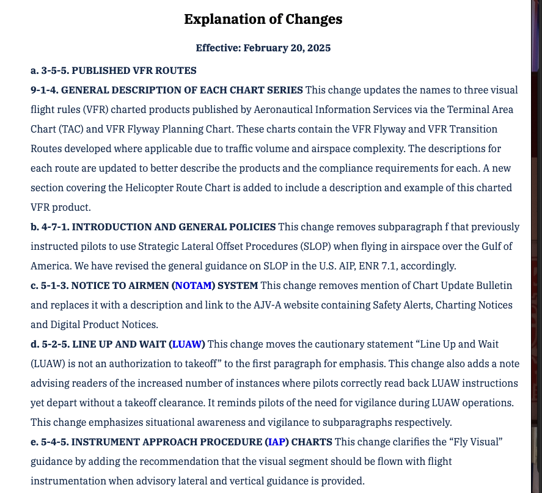
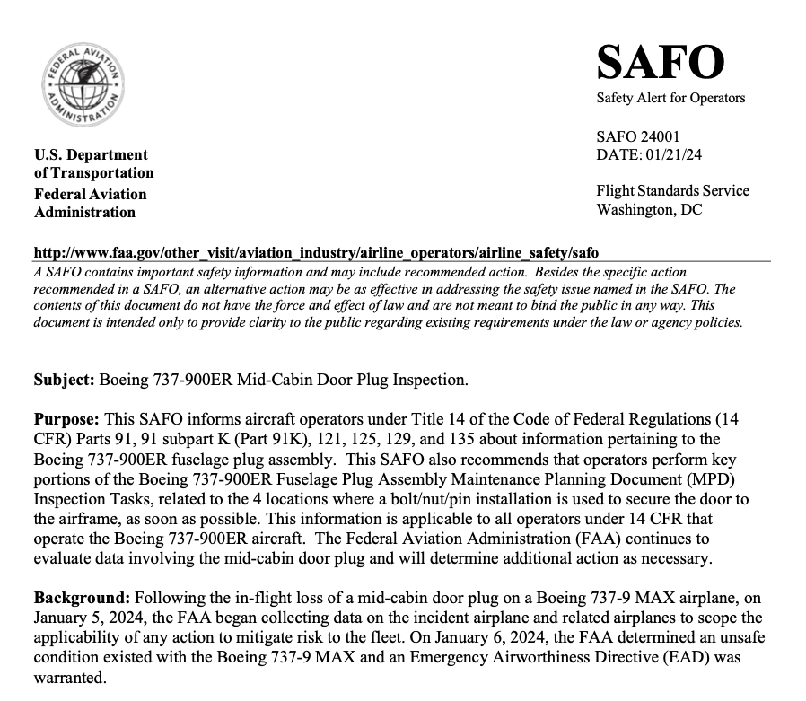
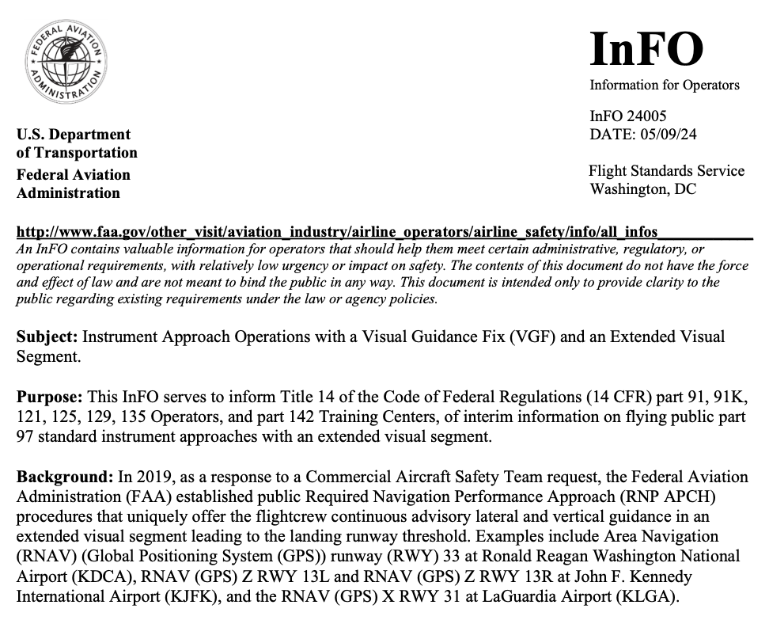

# 14 CFR and Publications

---

## Objective

To understand the governing documents for safe and legal flight, where to find them, and how they are updated over time.

## Motivation

Pilots need to understand the scope and organization of regulatory information that pertain to their flight. Flight instructors need to understand the scope and level of information found in the various handbooks, advisory circulars, and other documents.

---

## Overview

1. Overview of 14 CFR
2. 14 CFR Part 1
3. 14 CFR Part 61
4. 14 CFR Par 91
5. 49 CFR part 830: NTSB Reporting Information
6. Aeronautical Information Manual (AIM)
7. Advisory Circulars, INFOs, and SAFOs
8. Airman Certification Standards or Practical Test Standards.

---

## Title 14 of the Code of Federal Regulations (14 CFR)

- Relevant parts:
  - Part 1: Definitions and General Requirements
  - Part 21: Airworthiness Standards, Normal Category
  - Part 43: Maintenance
  - Part 61: Airmen Certification, Pilots and Instructors
  - Part 67: Medical Standards
  - Part 91: General Operating and Flight Rules
- Where to find the FARs
  - [eCFR Website](https://www.ecfr.gov/current/title-14/)
  - ForeFlight documents
  - ASA FAR/AIM App

---

## 14 CFR Part 1: Definitions

- Part 1 defined acronyms and terms used throughout
  - Aircraft "category": E.g. Airplane; rotorcraft; glider; and lighter-than-air
  - Aircraft "class": E.g. Single engine; multiengine; land; water; gyroplane
  - Weather "ceilings": Overcast or broken cloud or sky obscuration
  - Controlled airspace: Any airspace where ATC is provided to IFR/VFR flight

---

## 14 CFR Part 61

- Subpart A General: 61.1 – 61.60
  - 61.23 Medical durations
  - 61.31 Type ratings, complex, tailwheel, high-performance
  - 61.53 Medical deficiencies
  - 61.56 Flight reviews
  - 61.57 Currency
  - 61.51 Pilot logbooks

---

## 14 CFR Part 61 (cont.)

- Subpart B Aircraft Ratings and Pilot Authorizations: 61.61 – 61.77
  - 61.63 Additional category/class ratings
  - 61.75 Foreign pilot license

---

## 14 CFR Part 61: Pilot Qualifications

- Subpart C Student Pilots: 61.81 – 61.95
- Subpart D Recreational Pilots: 61.96 – 61.101
- Subpart E Private Pilots: 61.102 – 61.120
- Subpart F Commercial Pilots: 61.121 – 61.141
- Subpart G Airline Transport Pilots: 61.151 – 69.171

- For each license:
  - Applicability
  - Eligibility
  - Aeronautical experience
  - Flight proficiency
  - Privileges and limitations

---

## 14 CFR Part 61: Instructor Qualifications

- Subpart H Instructors Other than Sport 61.181 – 61.201
- Subpart I Ground Instructors: 61.211 – 61.217
- Subpart J Sport Pilots: 61.301 – 61.327
- Subpart K Flight Instructors With a Sport Pilot Rating: 61.401 – 61.429

- For each license:
  - Applicability
  - Eligibility
  - Aeronautical experience
  - Flight proficiency
  - Privileges and limitations

 

---

## 14 CFR Part 91

- Contains general operating rules applicable to all aircraft
- Subparts
  - General
  - Flight rules
  - VFR Operations
  - IFR Operations
  - Equipment and Instruments
  - Special Flight Operations
  - Maintenance and Preventative Maintenance

---

## 14 CFR Part 91 - General Rules

- 91.3: Responsibility and authority of PIC
- 91.7: Aircraft airworthiness
- 91.9: Flight manuals, markings, placards
- 91.15: Dropping objects
- 91.17: Alcohol and drugs

---

## 14 CFR Part 91 - Flight Rules

- 91.103 Preflight items
- 91.107 Use of seatbelts
- 91.111 Operating near other aircraft
- 91.113 Right of way rules
- 91.117: Speed limits
- 91.119: Minimum safe altitude
- 91.121: Altimeter settings
- 91.123: ATC instructions
- 91.125 ATC light signals

---

## 14 CFR Part 91 - Flight Rules, Airspace

- 91.126: Operations in Class G airspace
- 91.126: Operations in Class E airspace
- 91.129: Operations in Class D airspace
- 91.130 Operations in Class C airspace
- 91.131: Operations in Class B airspace
- 91.133: Restricted and prohibited areas
- 91.135: Operations in Class A airspace

---

## 14 CFR Part 91 - Flight Rules, VFR

- 91.151: Fuel requirements for VFR
- 91.153: VFR flight plan required information
- 91.155: VFR weather minimums
- 91.157: SVFR weather minimums
- 91.159: VFR cruising altitude

---

## 14 CFR Part 91 - Equipment, Instrument, Certification

- 91.203: Airworthiness and registration certificates
- 91.205: Required VFR and IFR equipment (ATOMATOFLAMES)
- 91.207: ELTs
- 91.209: Aircraft lights
- 91.211: Supplemental oxygen
- 91.213: Inoperative equipment
- 91.215: Transponder requirements
- 91.225: ADS-B Out requirements

---

## 14 CFR Part 91 - Special Flight Operations

- 91.303: Aerobatic flight
- 91.309: Glider towing
- 91.319: Experimental aircraft

---

## 14 CFR Part 91 - Maintenance and Preventative Maintenance

- 91.407: Return to service by A&P mechanic, test flight after large operation
- 91.409: Annual and 100 hour inspections
- 91.411: Altimeter and Mode C inspections
- 91.413: Transponder inspections
- 91.417: Maintenance records

---

### 49 CFR Part 830 - NTSB

## Definition Aircraft Accidents, Incidents, Overdue Aircraft

- Accident: Death or serious injury, or aircraft receives substantial damage
- Serious injury:
  - Hospitalization of more than 48 hours
  - Bone fractures, severe bleeding, nerve, muscle or tendon damage
  - Internal organ damage
  - 2nd/3rd degree burns
- Aircraft incident: Anything other than an accident which could affect safety of operations

---

### 49 CFR Part 830 - NTSB

Requires _immediate_ notification of accident, or the following serious incidents:

- Flight control failure/malfunction
- Flight crewmember unable to perform duties due to illness or injury
- In-flight fire
- Aircraft collision in flight
- Damage to property &gt; $25,000
- Release of a propeller blade
- Complete loss of EFIS display information
- Aircraft is overdue and believed to be involved in an accident

---

### 49 CFR Part 830 - NTSB

## Report Requirements

- After an accident: A report must be filed within 10 days
- After an overdue is aircraft is missing: A report must be filed after 7 days
- After an aircraft incident: A report is only needed if requested

---

## Aeronautical Information Manual

- Information about basic flight procedure and ATC services within the National Airspace System
- Non-regulatory in nature
- Contains things like:
  - Traffic patterns
  - ATC phraseology
  - Human factors
  - IFR operations
- Issued annually and revised several times per each

---

## AIM - Explanation of Changes

- Lists changes for the latest edition of the AIM
- Where to find the AIM
  - [FAA.gov website](https://www.faa.gov/air_traffic/publications/atpubs/aim_html/chap4_section_3.html#$paragraph4-3-2)
  - ForeFlight documents
  - ASA FAR/AIM App

---

## Advisory Circulars (ACs)

- Advisory circulars are official FAA documents published to delivery non-regulatory information to the aviation community
- They contain guidance for things like:
  - Airworthiness compliance
  - Pilot certification
- Give recommendations for complying with FARs
- Help resolve misunderstandings resulting from the FARs
- Organized by CFR part (00, 61, 91), given a new letter after each revision
  - E.g. 61-65J
- Where to find ACs
  - [FAA.gov AC page](https://www.faa.gov/regulations_policies/advisory_circulars/)

---

## Example Advisory Circulars

- 60-28B: FAA English Language Standards
- 61-65J: Guidance for instructors and pilot applications, list of endorsements
- 68-1A: Guidance for BasicMed
- 90-48E: Pilots Role in Collision Avoidance
- 43-12A: Preventative Maintenance

---

## Safety Alert for Operators (SAFOs)

A Safety Alert for Operators (SAFO) is an information tool that alerts, educates, and makes recommendations to the aviation community. This community includes air carrier certificate holders, fractional ownership.

Example:

- SAFO 25001: Risks Associated with Visual Approaches
- SAFO 24001: Boeing 737ED Exit door plugs

Find on the [FAA.gov SAFO page](https://www.faa.gov/other_visit/aviation_industry/airline_operators/airline_safety/safo/all_safos)

---

## Information For Operators (InFOs)

InFOs contain information for operators that help them meet certain administrative, regulatory, or operational requirements with low urgency or impact on safety.

Similar to SAFOs, but less urgent and not safety-related.

Find on the [FAA.gov InFOs page](https://www.faa.gov/other_visit/aviation_industry/airline_operators/airline_safety/info/all_infos)

---

## Letters of Interpretation

- Letters in response to airmen questions, providing legal interpretation
- Used to define gray-areas in the regulations
- Examples:
  - Logging vs acting PIC time: Many letters have dealt with this topic in various scenarios

Find with the [FAA Interpretation Search](https://www.faa.gov/about/office_org/headquarters_offices/agc/practice_areas/regulations/interpretations)

---

## Airmen Certification Standards and Practical Test Standards

- Both are used are the rubric for evaluating pilots during a checkride
- Practical Test Standards (PTS)
  - Legacy standards
  - Contain "special emphasis areas"
- Airmen Certifications Standards (ACS)
  - New form of the standard
  - Includes risk management section for each task
  - Also includes knowledge test standards
- Many PTS have been rewritten into ACS documents

Available on [FAA.gov ACS/PTS pages](https://www.faa.gov/training_testing/testing/acs)

---

## Summary

1. Overview of 14 CFR
2. 14 CFR Part 1: Definition
3. 14 CFR Part 61: Airmen certification, medicals, currency
4. 14 CFR Par 91: Flight rules, inspections, airworthiness
5. 49 CFR part 830: NTSB Reporting Information
6. Aeronautical Information Manual (AIM): Non-regulatory guidance
7. Advisory Circulars, INFOs, and SAFOs: Non-regulatory guidance with different purposes
8. Airman Certification Standards or Practical Test Standards

---

## Knowledge Check

Where would you find information about the required equipment needed for VFR operations?

---

## Knowledge Check

Where would you find the the amount of flight hours needed to obtain a private pilot certificate?

---

## Knowledge Check

You overhear a flight that had a rudder failure during landing. Will this require any notification to the NTSB? What about a report?

---

## Knowledge Check

Where would you find information about annual inspections?

---
