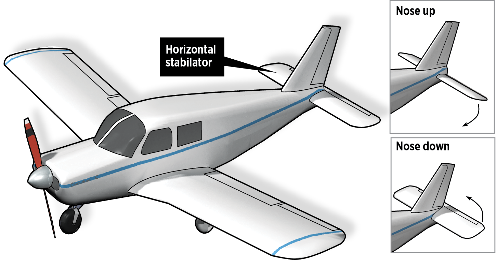

# Flight Controls

---

## Why do we learn about flight controls?

To understand the primary and secondary flight controls on an airplane, how they work, and how to use them.

## Motivation

Knowledge of the flight controls is important so you can gain an intuitive understanding of how they operate, and be able to recognize normal and abnormal operations.

---

## Overview

- Primary flight controls: Elevator, aileron, rudder
  - Types of ailerons
  - Stabilators
- Secondary flight controls
  - Flaps
  - Trim tabs
  - Leading edge devices

---

## Primary Flight Controls

The main way we control the airplanes movement

---

## Three basic flight control: Elevator, aileron, and rudder

---

## Airplane rotates about its center of gravity

---

## Control surfaces are lifting surfaces

- Require airspeed to function
- Control effectiveness increases as airspeed increases
- The more disturbance the more drag

---

## Ailerons: Control wheel, bank left or right

---

## Adverse Yaw

- Down aileron produces more lift, thus more drag
- Up aileron produces less lift, thus less drag
- This causes a yaw in the opposite direction of the intended turn

---

### Differential Ailerons

- Adverse yaw isn't symmetrical:
  - The up aileron (lower AoA) decreases drag a relatively small amount
  - The down aileron (higher AoA) increase drag a relatively large amount
- We can raise the up aileron slightly more than we lower the down aileron
  - This compensates for difference in yaw

---

## Frise Ailerons

---

## Elevator: Yoke forward/back, pitch up or down

---

## Elevator Operation

---

### Stabilator

---

## Rudder: Yaws airplane right/left

Controlled with rudder pedals

---

## Toe Brakes

---

## Construction

- Most flight controls are cable driven
- Flaps are often driven by an electronic motor, or a manual rod

---

## Secondary Flight Controls

---

## Flaps

---

## Effect of Flaps

- Increase chord of the wing, which increases angle of attack
- Increases lift and increases drag
- Useful when you want to descend without gaining airspeed, like during landing

---

## Types of Flaps

- Some types produce more lift
- Some types produce less pitching up movement when deployed

---

## Plain and Split Flaps

- Plain flap
  - Increases camber of the wing
  - Creates drag
  - Moves center of pressure backwards
  - Creates nose-down pitching moment
- Split flap
  - Deflects
  - More lift than a plain flap
  - Same amount of drag as plain flap

---

## Slotted Flaps

- Most common type of flap
- Like a split flap, but there's a gap between the wing and the flap
- Slot energizes boundary layer behind the flap, which delays the critical AoA before stall
- Can have multiple slots

---

## Fowler Flaps

- Fowler flap
  - Flaps which "slide" down and back from the wing
  - Increase wing surface area
  - Small deflection adds lift
- Slotted fowler flap
  - Combines the advantages of fowlers and slotted flaps

---

## Leading Edge Devices

- Delay the separation of the boundary layer until a higher AoA, meaning more lift/slow stall speed
- Fixed slats are set out in front of the wing
- Moveable slats more in and out with AoA, or deployed manually
- Leading edge flaps: Change wing camber
- Leading edge cuff: Extension of the wing camber

---

### Leading Edge Slots

---

### Moveable Slats

---

### Leading Edge Flap

---

## Leading Edge Cuff

---

## Trim

### Elevator Trim

- Help hold elevator pressure at a certain position
- Cessna's use a trim tab

---

### Trim Tab Movement

---

## Elevator Alternative: Stabilators

- Entire horizontal stabilizer moves instead of just an elevator
- Common on Piper aircraft

---

### Anti-servo Tab - Stabilators

- Stabilators can produce a lot of force, so the antiservo tab counteracts the motion, making the controls less sensitive
- They are still adjusted up/down with the trim control in the cockpit

---

### Rudder Trim

- Help hold coordinated flight in a given flight attitude
- May be flight or ground adjustable

---

## Summary

- Primary fight controls:
  - Rudder (yaw), aileron (roll), elevator (pitch)
- Secondary flight controls
  - Flaps
  - Trim tabs
  - Leading edge devices

---

## Knowledge Check

How does the trim tab help us control the airplane?

---

## Knowledge Check

If we were unable to lower our flaps, how would our approach to landing change?

---

## Knowledge Check

If our elevator were to get jammed, what could we use for pitch control?
