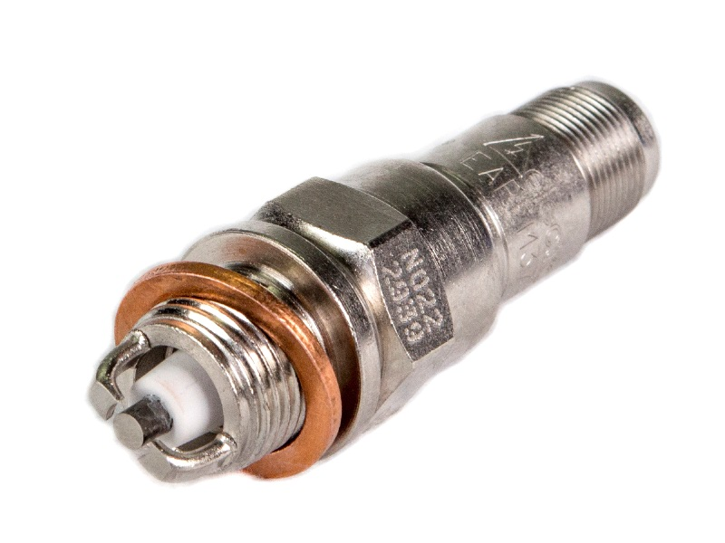
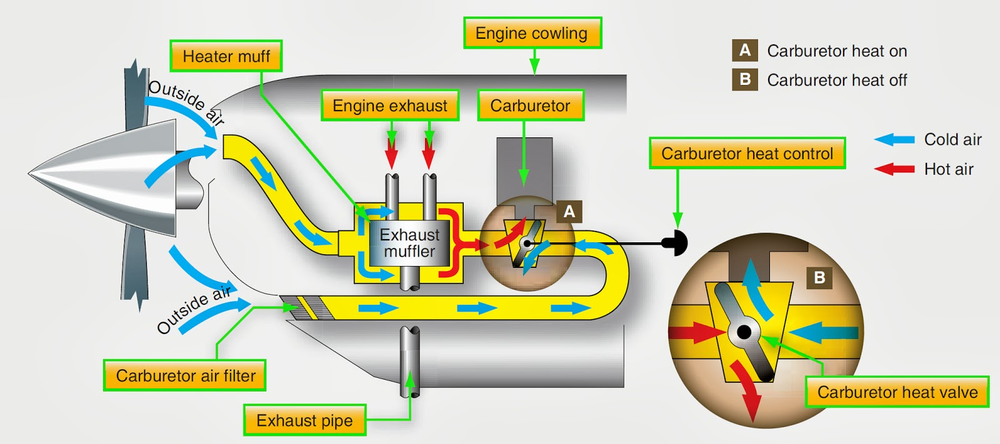
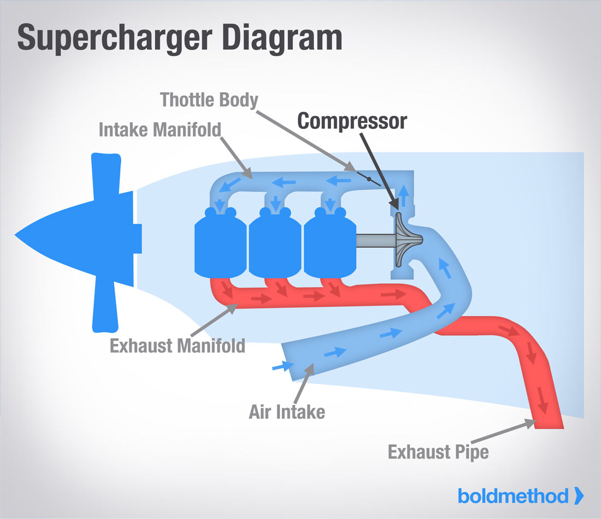

# Powerplants and Propellers

---

## Objective

To understand the basics of a reciprocating engine and a propeller and how it produces thrust in the airplane.

## Why do we need to know about the engine?

We want an intuitive understanding of how an engine operates to use the engine controls effectively, troubleshoot issues as they arise, and take good care of our aircraft's engine.

---

## Overview

- Reciprocating engines principles
- Engine instrumentation (RPM, manifold pressure)
- Ignition system and magnetic
- Induction system and carburetors
- Turbochargers
- Fixed-pitch propellers
- Constant-speed Propellers

---

### Reciprocating Engines

- Most light airplane engines are 4- or 6-cylinder, horizontally-opposed, air-cooled

---

### Cylinders

- Cylinders produce controlled explosions that drive the crankshaft
- The crankshaft then drives the propeller

---

## The Power Cycle (4-stroke engine)

- 4 strokes of an engine
  - Intake: Fuel/air sucked in
  - Compression: Fuel/air is compressed
  - Combustion: Spark plugs ignite fuel/air mixture
  - Exhaust: Exhaust gasses are expelled
- Each cylinder makes two up/down movements for a power cycle
- Each cylinder is a different part of this cycle at any point

---

<!-- Camshaft is responsible for opening/closing the intake/exhaust values in the correct sequence on the cylinder -->

---

<!-- Camshaft is responsible for opening/closing the intake/exhaust values in the correct sequence on the cylinder -->

---

## Crankshaft and Camshaft

---

# 2-stroke Engines

- 2-stroke engines perform a power cycle on each stroke
- Available on some light aircraft

---

# Tachometer: Engine RPM

- Primary indication of power on a fixed-pitch propeller
- Indicates hundreds of RPM
- Green indicates normal operating range
- Red line should never be exceeded
- RPM output can change with altitude

---

# Manifold Pressure: Engine Power

- Partial vacuum of the engine "sucking in" air
- Primary power indication with a constant-speed propeller
- Reads ambient pressure when engine is off

---

## Ignition System

- Provides the spark which ignite the fuel/air mixture
- Usually drive by magnetos, small generators which generate electrical current
- Magnetos are driven directly from the engine, independent of the electrical system

---

## Dual-Magneto Systems

- Two sets of spark plugs in each cylinder, one from each magneto
- Magnetos can be selected independently
  - Both magnetos results in better burning of the fuel/air mixture
  - One magneto has a slightly lower power output

---

## Spark Plugs

- Current wants to jump the gap between leads
- Dual-magnetos will have two spark plugs per cylinder
- Leaded gasoline can leave lead deposits on the spark plugs

---

## Starter Systems

- Key engages a starter cog, which turns a flywheel
  - Once the engine starts, starter cog retracts
- Most starters are low-duty electric motors
  - Don't crank for long periods, allow for cooldown between attempts
- Stuck starters

---

## Induction System: Gets air into the engine

---

#### Carburetor

<!--

- Completely mechanical control mixing of fuel and air
- Venturi is a narrowing that accelerates the air, forcing fuel to flow out of the discharge nozzle
- Mixture needle control mixture
- Throttle valve controls flow of entire fuel/air mixture into the cylinders
- Float-type carburetor: Float regulates the fuel entering the float chamber
- Carburetor icing occurs due to the decrease in air pressure in the venturi

-->

---

## Carburetor Icing

- Acceleration of air + vaporization of fuel drastically cools the air
- Carburetor heat is used to combat this

---

## Fuel Injection

- Alternative to a carburetor
- Found on newer engines
- Fuel is mixed in a manifold just before entering the cylinder
- Relies on a fuel pump for continuous fuel pressure
- Produces more even cylinder temperatures, since each cylinder gets the same fuel

<!-- - Cylinder temperatures tend to be more even -->

---

## Engine Oil System

- Lubricates, cools, cleans, seals engine components
- Also prevents rust
- Lubricates the crankshaft, pushrods, cylinder heads

---

## Types of Oil Systems: Dry or Wet Sump

<!--

- An oil pump is used to circulate oil to the primary component
- Dry-sump systems hold oil in a separate tank

-->

---

## Engine Cooling: Air Cooling

- Air-cooling through baffles
- Oil cooler at the front of the airplane

---

## Engine Cooling: Liquid Cooling

- Coolant is circulated through the engine and absorbs heat
- Coolant is passed through a radiator to expel heat energy
- Similar to a car's radiator

---

## Detonation

- Detonation: Uncontrolled, explosive ignition of the fuel-air mixture within the cylinder
- May happen with:
  - Lower fuel grade
  - Excessively lean mixture / high power
  - Low RPM / high power

---

## Pre-Ignition

- Occurs when the fuel-air mixture ignites prior to the engine’s normal ignition time
- Carbon build up and create hot spot in the combustion chamber
- Can cause damage since the cylinder is being pushed on the compression stroke

---

## Preigintion and Detonation Remedy

- Engine running rough, but we may not know which one
- Lower power
- Open cowl flaps and shallow climb angle
- Enrichen mixture to enhance cooling

---

## Fuel System

- High-wing airplanes are usually gravity-fed
- Low-wing airplanes have a fuel-pump system
  - Electrical pump and an engine-driven pump
- Fuel tanks: Wet wings vs wing tanks or bladders

---

## Fuel System (cont.)

- Fuel primer is used to draw fuel into the cylinders prior to starting
- Fuel selector valves
  - High-wing airplanes may have a "both" option
  - Low-wing airplanes often do not, must be switched periodically
- Running a fuel tank dry may cause vapor lock and impurities to enter the engine

<!-- One of the most common fuel-starvation causes is failure to switch tanks -->

---

## Fuel Sumps

- Fuel sumps and drains are usually present
  - At the lowest point on each tank
  - At the lowest point in the system

---

## Fuel Grades

- AVGAS 80 and 100 aren't available
- Can never mix JET-A and AVGAS
- 100UL is an unleaded variety now available - colored yellow
- Automobile gasoline may also be available (mogas)

---

# Turbochargers and Superchargers

- Normally-aspirated engines lose horsepower as they climb into thinner air
- Boosting intake air pressure can maintain horsepower, burning more fuel
- Turbonormalization: Boosting to sea-level pressure
- Turboboosting: Boosting to more than sea-level
- They are especially useful when flying high

---

## Turbocharger Operation

<!--

- Turbo turbine can spin as fast as 80,000 rpm
- Lubricated with engine oil
- Turbo-cool down
- Overboosting can lead to detonating

 -->

---

# Turbo Wastegate

- Controls how much exhaust is vented into the turbine
- Wastegate slowly closes as you climb, meaning more pressure and constant power
- At the critical altitude the wastegate is completely closed, no more boost

---

## Wastegate Control

- Different airplanes have different wastegate control mechanisms
  - Some airplanes open/close automatically to maintain a give manifold pressure
  - Manual wastegates are common on aftermarket turbochargers
  - The T182 is mechanically linked to the throttle
    - Need to be careful not to overboost

---

## Turbo Failures

- Failure of the turbine/compressor
  - Engine essentially because a normally-aspirated engine with constricted airflow
- Failure of the wastegate
  - May fail open, closed, or partially open
  - Need to modulate throttle to prevent over boosting
- Turbo cool-down
  - Allow for the RPM bearing temperature to equalize

---

## Supercharger Operation

- Same principle as turbochargers, but different energy source
- Compressor is driven by the engine directly, not from the exhaust

---

# Propellers

---

## Rotating airfoils

- Subject to angle of attack, stalls (exceeding critical AoA)

---

## Propeller Twist

- The propeller area near the hub is spinning slower than the tip

---

# Fixed-pitch propellers

- Propellers are calibrated for a single speed
  - High/fine pitch: Small "bite" of air
  - Low/coarse pitch: Big "bite" of air
- Corollary to gears on a bike: Climb prop is a low gear, cruise prop is a high gear
- A climb prop has lower pitch, less drag:
  - More RPM, horsepower, which increases takeoff and climb performance
- A cruise prop has a higher pitch, more drag:
  - Less RPM, bigger "bite" of air, but increased efficiency

---

# Ground-Adjustable Propeller

- Some airplanes have "adjustable" pitch propellers, which can be adjusted on the ground

---

# Variable-Pitch Propellers

- What if we could vary the prop angle in flight?
- Variable-pitch propellers allow us to dynamically set the blade angle
  - Constant-speed propellers automatically vary the pitch of the propeller to maintain an given RPM

---

## Constant-Speed Propellers

- Effect of pitch on RPM
  - A "finer" or large pitch of a propeller increases RPM
  - A "coarser" or smaller pitch of the propeller decreases RPM

---

## Propeller Governor

The propeller governor controls the pitch of the propeller to maintain a pilot-selected RPM

---

## Constant-Speed Prop Operation

- Engine oil is boosted into the propeller hub assembly
- A spring is tensioned to hold the prop in the full fine or large pitch setting
- Engine oil must work against this to coarsen the blade
  - The engine oil forces a piston which changes the angle of the blade

---

## Governing Oil Pressure

Oil pressure is governed by a set of fly-weights, tuned to a specified RPM

- Prop spins faster: flyweights move outward, more oil is forced into the blade angle piston
- Prop spins slower: flyweights fall inward and less oil is allowed to enter the blade angle piston

---

## Constant-Speed Prop Usage

- When increasing power: Increase prop first, then engine power
- When decreasing power: Decrease power first, then decrease prop
- Always change RPM slowly and smoothly

---

## Constant-Speed Prop Failures

- Loss of oil pressure
  - Propeller should fail in the high pitch position (high RPM)
- Prop control linkage failure
  - May get stuck at a particular RPM setting
  - Modulate with engine power to prevent overspeed

---

## Constant-Speed Prop Pros/Cons

- Pros
  - Better performance at high altitudes
  - Better performance for climb and cruise
- Cons
  - Complexity, risk of failure
  - Weight
  - Maintenance

---

## Summary

- 4-stroke engine on most light aircraft
- RPM and manifold pressure are our primary indications
- Magnetos are self-contained electrical systems that power the spark plugs
- The induction system gets air into the engine
- Turbochargers: Help us maintain sea-level pressure and high altitude
- Fixed-pitch propellers are common on most trainers
- Constant-speed propellers are used for efficiency in cruise and climb

---

## Knowledge Check

Will the engine run if the master switch is off?

---

## Knowledge Check

What effect would low oil pressure have on a constant-speed prop?

---

## Knowledge Check

Two airplanes take off at sea level. One has a normally aspirated 150 H.P. engine, the other has a turbo-normalized 150 H.P. engine.

Which one will produce more power?

---

## Knowledge Check

You come out to the airplane one morning and notice your fuel sump is completely clear, but not blue. What should you suspect?

---

## Knowledge Check

You come out to the airplane one morning and notice your fuel sump is completely clear, but not blue. What should you suspect?
