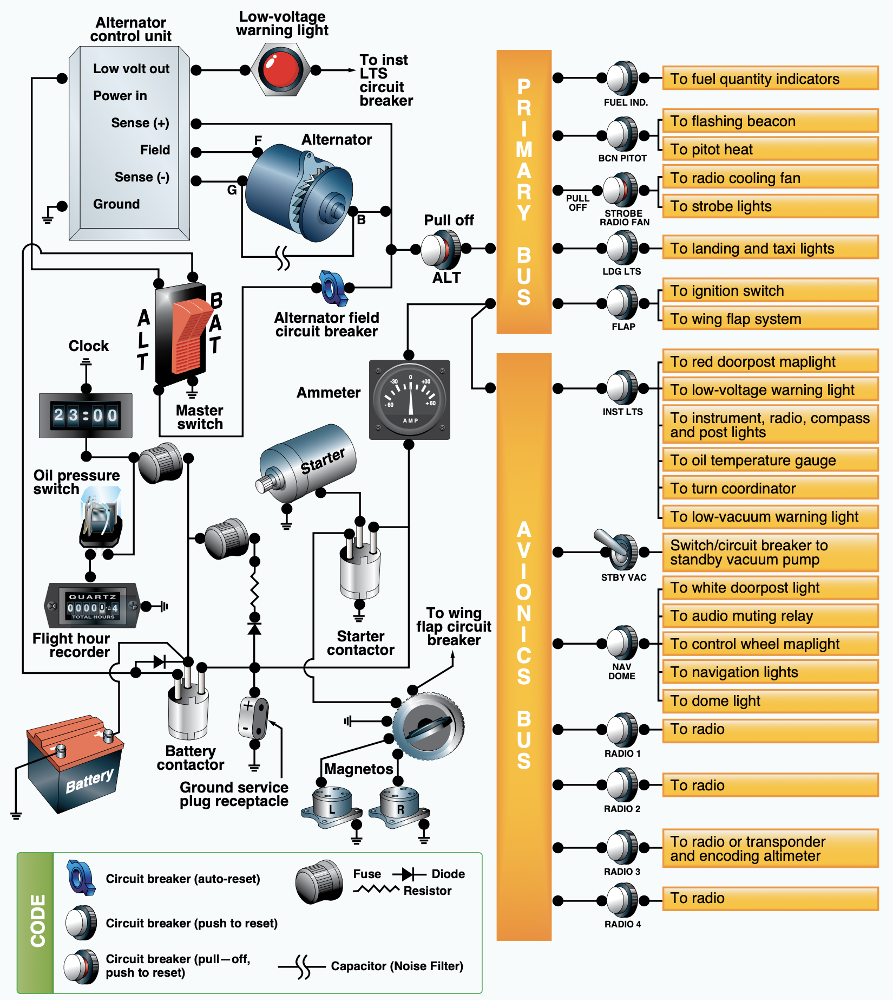

# Aircraft Systems

---

## Objective

To understand the basics electrical, environmental, and deicing systems of a trainer aircraft.

## Motivation

It is important to have an intuitive understanding of how the electrical system of airplane works to troubleshoot issues, and to understand common failure modes of the flight instruments.

---

## Overview

- Hydraulic brakes
- Brake system
- Landing gear
- Electrical system
- Circuit vs Water
- Light Aircraft Electrical Systems
- Alternators
- Environmental Systems
- Deice and Anti-ice system
- Deicing Systems

---

## Hydraulic systems

- Incompressible fluid is forced through a hydraulic line to a piston
- Piston moves whatever needs to be moved

---

## Hydraulic Brakes

- Hydraulic lines connect brake pedals to brake calipers
- Toe pedals applies pressure to the fluid, which in turn closes the brake caliper

---

## Landing Gear

- Tricycle landing gear common on trainers
- Nosewheels can be steerable or free-castering
- Retractable landing gear
  - Electronic or hydraulically actuated

---

## Tricycle Landing Gear

- Supports stability on landing since CG is forward of main landing gear
- Less susceptible to ground-looping
- Good visibility on the ground

---

## Taildragger or Conventional Landing Gear

- More propeller clearance
- Less visibility when taxiing
- Since C.G. is behind the main gear it they are susceptible to ground-looping
  - If airplane were to swerve, pilot may not have enough rudder authority to prevent tail from swinging around

---

# Electrical System

---

## Electrical system

- Basic circuit:
  - Voltage (pressure)
  - Current (volume)
  - Resistance/load (anything impeding the flow of water)

---

## Circuit vs Water

---

---

## Light Aircraft Electrical Systems

- Direct current systems are common in most training airplanes
- Cessna usually have 28V electrical systems
- Batteries: Capacity measured in amp-hours (17 amp-hours means 17 amps for 1 hour, or visa-versa)

---

### Generating Electricity: Generators

- DC current is induced by the spinning magnet
- Current is proportional to the speed of the spin

---

## Generating Electricity: Alternators

- Instead of spinning a magnet, we spin an electromagnet
- This produces AC current, which we convert to DC using a rectifier
- Gives more consistent current output at low RPMs than a generator
- Voltage must be higher than the battery to charge it
  - At 24V battery with a 28V alternator is common

---

### Electrical Components

- Contactors/Relays/Solenoid
  - Essentially a "remote switch"
  - Avoids all the current to have to pass through the physical switch
- Master switch
  - Left half for alternator master
  - Right half for battery master

---

### Electrical Components: Circuit Breakers

- Bus bars: efficient way of connecting may components to power
- Overcurrent protection for individual circuits
  - Circuit breakers: Push/pull devices which can be reset
  - Fuses: Need to be replaces
- If a circuit breaker pops, it could be a sign of a short circuit or overcurrent
  - Try resetting it once
  - If it pops again, leave it popped

---

### Electrical Instrumentation

- Ammeter: Is the alternator is producing sufficient power for the current load?
  - A discharge on the ammeter indicates a draw from the battery
- Load meter: Shows a percentage of the load placed on the alternator/generator
- Low voltage warning light

---

### Electrical Problems

- Alternator failure
  - Discharge on the ammeter, meaning we're drawing from the battery
  - Eventually a LOW VOLTS illumination
- Stuck starter
  - Starter solenoid remains engaged after engine start
  - Draws enormous load from the battery, alternator begins charging at a fast rate
  - Ammeter will show high positive charge
- "Load shedding" - Turning off unnecessary equipment to conserve battery

---

## Environmental Systems

- Fresh air vents
- Heated air vents
  - Usually ducted over the hot exhaust manifold to heat the air
  - If the manifold has any leaks, this pumps exhaust directly into the cockpits
  - Potential source of CO in the cockpit

---

## Deice and Anti-ice system

- Airplanes can be certified for flight into known icing (FIKI)
  - See 91.527
  - Most training aircraft are not FIKI certified
- Pitot heat (deice and anti-ice)
- Windscreen defrost can also be used

---

## Deicing Systems: Wet Wings

- Some aircraft use a "weeping wing"
  - TKS fluid (a ethylene-glycol liquid) is force out of a porous membrane on the leading edge
  - Cirrus aircraft use this

---

## Deicing Systems: Pneumatic Boots

- Boots are inflated with air break off accumulated ice
- Can only be used once some ice has formed on the wing
- Can be cycled as many times as needed
  - Unlike a wet wing system, which has a certain capacity

---

## Summary

- Hydraulic brakes
- Brake system
- Landing gear
- Electrical system
- Circuit vs Water
- Light Aircraft Electrical Systems
- Alternators
- Environmental Systems
- Deice and Anti-ice system
- Deicing Systems

---

## Knowledge Check

As you're flying you notice that the volt meter on your engine monitor is reading 25 volts, and the ammeter is showing a discharge.

What could this mean? What would you do?

---

## Knowledge Check

True or false: All of the current for the primary and avionics bus are flowing through the master switch when you turn it on.

---

## Knowledge Check

Flying home from a business meeting on the coast the circuit breaker for your second COM radio pops.

What should you do?
