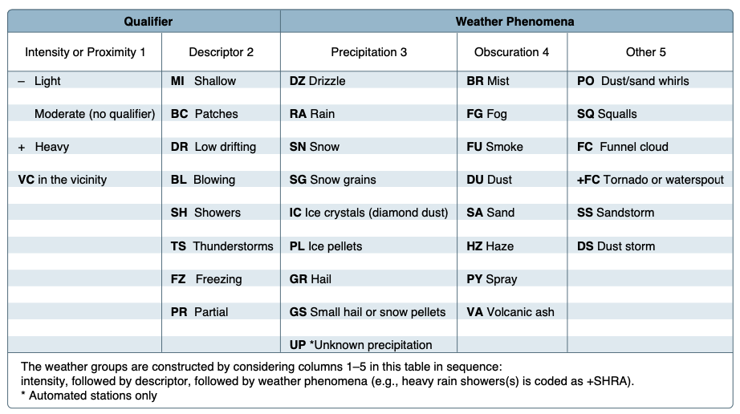
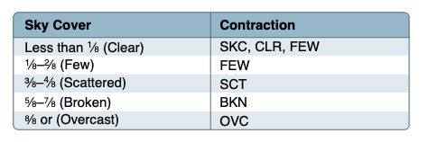
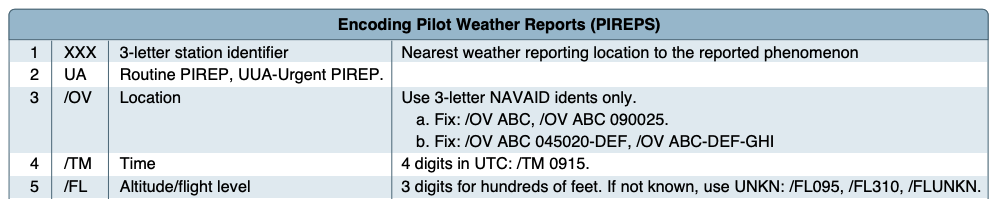
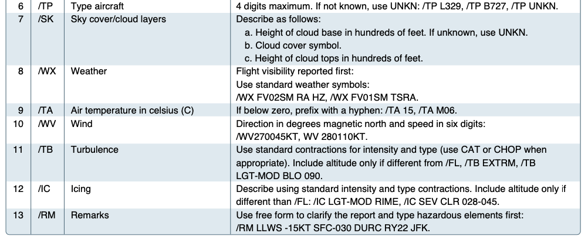
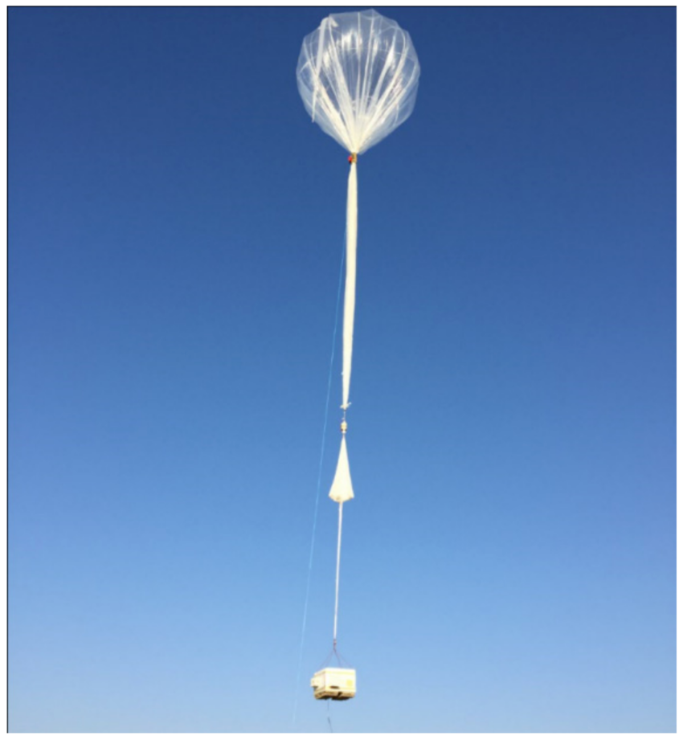
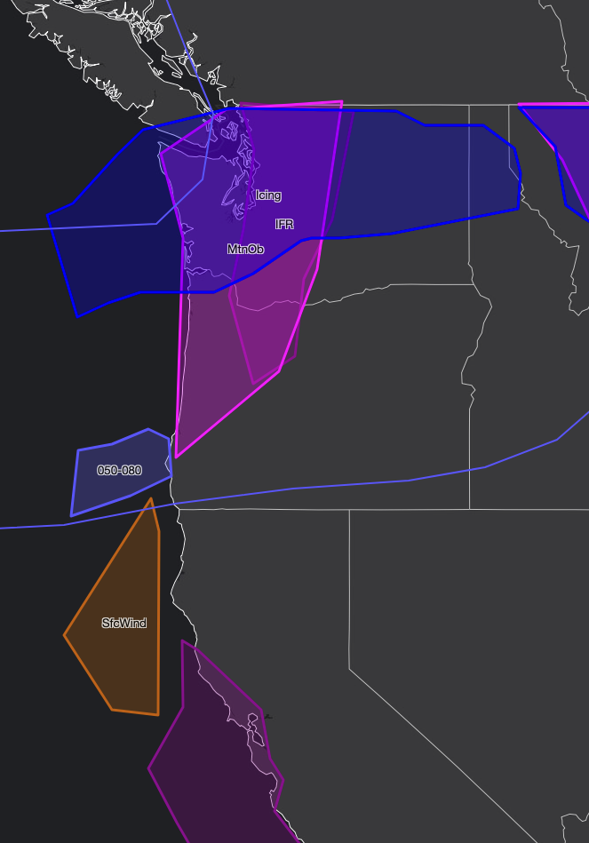
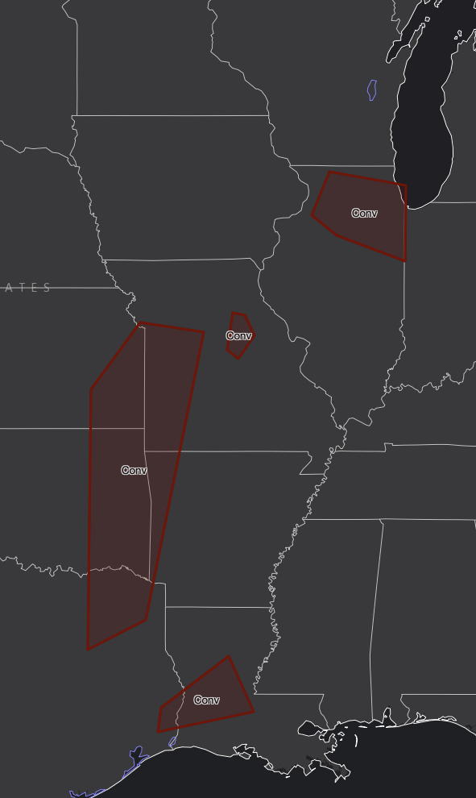
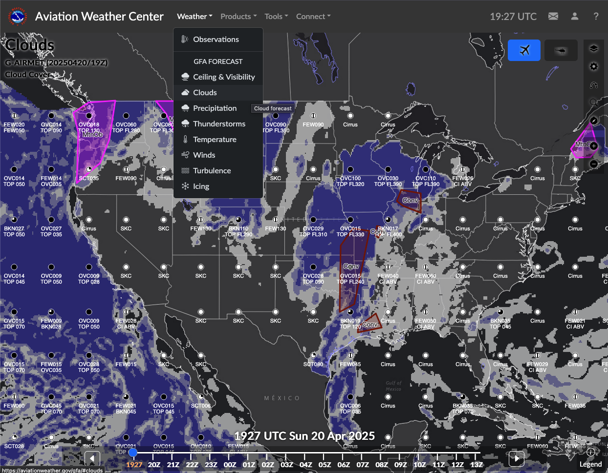
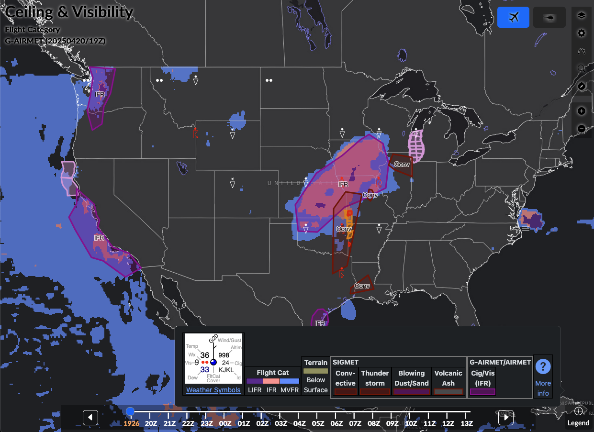

# Weather Products

---

## Overview

- Talk about standard weather products (METARs, TAFs, Winds Aloft, Prog Charts)
- Flight planning exercise in ForeFlight
- In-airplane weather products

---

## Weather Data Sources

- EFBs: ForeFlight, Garmin Pilot
- AviationWeather.gov
- 1800wxbrief.com (Leidos Flight Service)
- In-cockpit weather

---

## Aviation Routine Weather Report (METAR)


- Observation of current surface weather reported in a standard international format
- Update on a regular interval, often once per hour
- SPECI reports can be issued in between scheduled reports

---

## Aviation Routine Weather Report (METAR)

```
METAR KGGG 161753Z AUTO 14021G26KT 3/4SM
+TSRA BR BKN008 OVC012CB 18/17 A2970 RMK
PRESFR
```

- Type of report: METAR or SPECI
- Station: ICAO code of the airport or station identifier
- Time of report: 1753Z time on the 16th of the month
- AUTO: Means automatic reporting station
  - AO1: No precipitation discriminator
  - AO2: Precipitation discriminator
- Wind: 140 &deg; _True_ at 21 knots, with peak gusts of 26 knots
  - Variable wind reported as VRB

---

## Aviation Routine Weather Report (METAR, cont.)

```
METAR KGGG 161753Z AUTO 14021G26KT 3/4SM
+TSRA BR BKN008 OVC012CB 18/17 A2970 RMK
PRESFR
```

- Visibility:
  - May also report runway visual range (RVR): `R17L/1400FT`
- Weather: Made up of qualifiers and descriptors
  - (-): Light, ( ): Moderate, (+): Heavy
  - VC means "in vicinity of", 5-10 miles from the airport

---

## Aviation Routine Weather Report (METAR): Weather Descriptors



---

## Aviation Routine Weather Report (METAR): Sky Condition

```
METAR KGGG 161753Z AUTO 14021G26KT 3/4SM
+TSRA BR BKN008 OVC012CB 18/17 A2970 RMK
PRESFR
```



- Broken at 800' _AGL_
- Overcast at 1,200 ft. AGL, cumulonimbus
  - Can also be `TCU`: Towering cumulonimbus
- `VV003`: Vertical visibility 300 ft.
  - Sky obscured by ground clouds

---

## Aviation Routine Weather Report (METAR): Altimeter, Temperature

```
METAR KGGG 161753Z AUTO 14021G26KT 3/4SM
+TSRA BR BKN008 OVC012CB 18/17 A2970 RMK
PRESFR
```

- Temperature 18&deg; C / Dewpoint 17&deg; C
- Altimeter setting: 29.70" Hg
- `PRESFR` - Pressure falling
- `PRESRR` - Pressure rising

---

## Pilot Report (PIREPS)

- Reports from other airplanes aloft
- If ceiling is below 5,000', ATC will solicit PIREPs from pilots

---

## Pilot Report (PIREPS): Required Components

```
UA/OV GGG 090025/TM 1450/FL 060
```



---

## Pilot Report (PIREPS): Weather Conditions

```
UA/OV GGG 090025/TM 1450/FL 060/TP C182/SK
080 OVC/WX FV04SM RA/TA 05/WV 270030KT/TB
LGT/RM HVY RAIN
```



---

## Pilot Report (PIREPS): Sample

```
UA/OV GGG 090025/TM 1450/FL 060/TP C182/SK
080 OVC/WX FV04SM RA/TA 05/WV 270030KT/TB
LGT/RM HVY RAIN
```

- Routine report (UA)
- Location 25nm on the Greg County (GGG) VOR
- Time 1450Z
- Altitude 6000 ft.
- Aircraft Cessna 182
- Sky condition 8000' overcast
- Flight visibility 4s.m. in rain

---

## Pilot Report (PIREPS): Sample (cont.)

```
UA/OV GGG 090025/TM 1450/FL 060/TP C182/SK
080 OVC/WX FV04SM RA/TA 05/WV 270030KT/TB
LGT/RM HVY RAIN
```

- Temperature 5&deg;C
- Wind 270&deg;T at 30 knots
- Light turbulence
- Remarks: Heavy rain

---

## Terminal Aerodrome Forecasts (TAF)


- Report for the 5sm area around an airport
- Valid for a 24 or 30-hour time period
- Updated four times a day at 0000Z, 0600Z, 1200Z, and 1800Z

---

## Terminal Aerodrome Forecasts (TAF)

```
KORD 201814Z 2018/2124 09014G20KT 6SM -SHRA SCT040 OVC060
    TEMPO 2019/2020 3SM TSRA OVC040CB
  FM202100 10015G23KT P6SM OVC050
  FM210200 13015G23KT P6SM VCSH OVC040
    TEMPO 2105/2108 3SM SHRA BKN025 OVC040
  FM211800 27018G30KT P6SM OVC025
```

- Station identifier: KORD
- Time: 20th day of the month, 1814Z
- Valid from: 1800Z on the 20th to 2400Z on the 21st
- Wind: 90&deg; T @ 14 knots, peak gusts 20 knots
- Visibility 6 s.m., light rain showers
- Scattered at 4000 ft. AGL, overcast 6000 ft. AGL

---

## Terminal Aerodrome Forecasts (TAF) - cont.

```
KORD 201814Z 2018/2124 09014G20KT 6SM -SHRA SCT040 OVC060
  FM202100 10015G23KT P6SM OVC050
  FM210200 13015G23KT P6SM VCSH OVC040
    TEMPO 2105/2108 3SM SHRA BKN025 OVC040
  FM211800 27018G30KT P6SM OVC025
```

- From 2100Z on the 20th:
  - Wind 100&deg;T gusting 23 knots, visibility +6sm, overcast 5000 ft.
- TEMPO: Temporarily from 0500Z on the 21st to 0800Z on the 21st:
  - Visibility 3sm, rain showers, broken 2500 ft., overcast 4000 ft.

---

## Winds and Temperature Aloft Forecast (FB)



- Based on the radiosonde (weather ballon) soundings
- Winds are always in true north

---

## Winds and Temperature Aloft Forecast (FB): Sample

```
FD1US1
DATA BASED ON 201200Z
VALID 201800Z   FOR USE 1400-2100Z. TEMPS NEG ABV 24000

FT  3000    6000    9000   12000   18000   24000  30000  34000  39000
PDX 2711 3117-03 3016-06 2922-12 2830-23 2841-37 276249 286854 274855
GEG      9900-01 2611-08 2819-14 2627-25 2638-37 254753 264854 273852
SEA 2311 2409-03 2813-08 2820-14 2828-26 2834-38 273852 284553 274252
YKM 2807 2607-01 2509-07 2817-13 2825-25 2735-37 275151 275353 274554
```

---

## Winds and Temperature Aloft Forecast (FB): Sample

```
FT  3000    6000    9000   12000   18000   24000  30000  34000  39000
YKM 2807 2607-01 2509-07 2817-13 2825-25 2735-37 275151 275353 274554
```

- 3000' MSL: Wind 280&deg; T at 7 knots
- 6000' MSL: Wind 260&deg; T at 7 knots, temperature -7 &deg;C
- Above 24,000' temperatures are assumed to be negative

---

## Winds and Temperature Aloft Forecast (FB): Other Cases

- `9900`: Winds are calm (&lt; 5 knots)
- `731960`: Winds are great than >100 knots
  - Encoding add 50&deg; to the direction, subtracts 100 from the wind speed
  - Wind direction: 73 - 50 = 23, 230&deg; T
  - Wind velocity: 100 + 19 = 119 knots
  - Temperature -60&deg;C

---

## AIRMETs and Graphical AIRMETs



- In-flight weather advisories for these conditions:
- Moderate icing
- Moderate turbulence
- Sustained surface winds &#8805;30 knots
- Widespread areas where conditions are less than basic VFR
- Extensive mountain obscuration

---

## SIGMETs

- Stands for **SIG**nificant **MET**eorological Information
- Issued for the following non-convective weather phenomena:
  - Heavy hail (greater than 3/4" diameter)
  - Severe turbulence (also clear air turbulence, CAT)
  - Icing (severe or moderate with severe icing)
  - Widespread duststorm or sandstorm reducing visibility to &lt; 3 miles
  - Volcanic ash
- Valid for 4 hours

---

## Convective SIGMETs



- Condition that
- Pretain to severe thunderstorms (surface winds &gt; 50 knots)
- Hail larger than 3/4" in diameter
- Tornadoes

---

## Surface Analysis Charts


- Issued every 3 hours
- Based on surface pressure observations

---

## Weather Depiction Chart (Prognostic Charts)


- Surface-analysis forecasts
- Shows high/low/frontal positions
- Show precipitation, IFR/VFR conditions

---

## Convective Outlook


- Shows likelihood of severe thunderstorms forming
  - TSTM: 10% or higher probability of thunderstorms is forecast
  - SLGT: Slight risk, organized severe storms, limited coverage/intensity
  - ENH: Enhanced risk, severe thunderstorms, varying levels of intensity
  - MDT: Moderate risk, widespread severe weather, several tornadoes and/or severe thunderstorms
  - HIGH: High risk, severe weather outbreak, hurricane force-winds, numerous tornadoes

---

## Graphical Forecast for Aviation



- Series of map-based products
- Replaces the legacy text-based area forecasts

---

## GFA: Ceiling and Visibility Chart



---

## In-Cockpit Weather Systems


- ADS-B in weather products:
  - FIS-B, Flight Information Service: METARs, TAFs
  - TIS-B, Traffic Information Service: Real-time traffic

---

### Flight Information Service (FIS-B)


- METARs/SPECIs/TAFs
- PIREPs
- AIRMETs/SIGMETs
- Graphical AIRMETs
- Icing
- Lightning
- NEXRAD (CONUS and Regional)
- NOTAMS
- Center Weather Advisories
- Winds and temperatures aloft
- Turbulence

---

## Cautions of Using NEXRAD

- NEXRAD display depicts where the weather WAS, not where it IS
- Several fatal accidents have occurred where pilot attempt to fly around severe weather using NEXRAD displays
- Always reference the publish date of the imagery
- Know whether your system is regularly receiving updates
