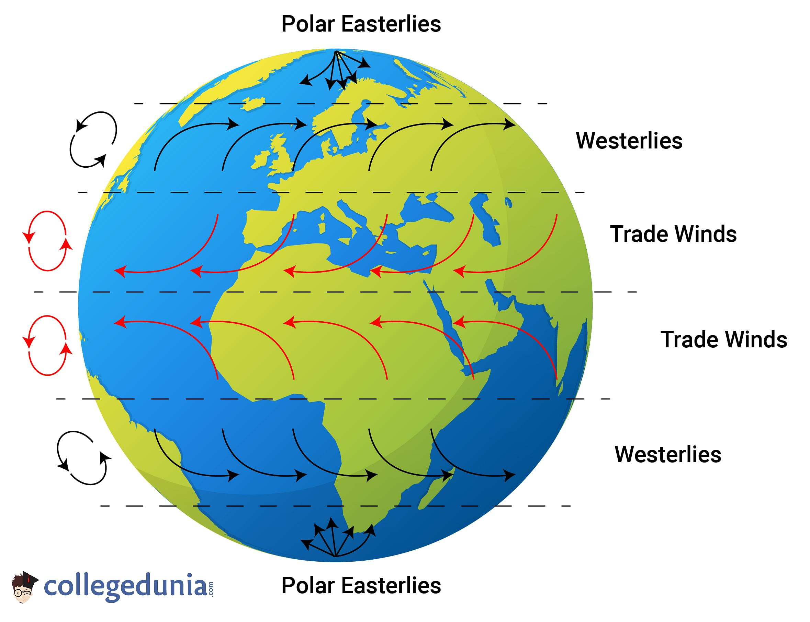
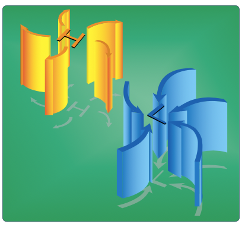
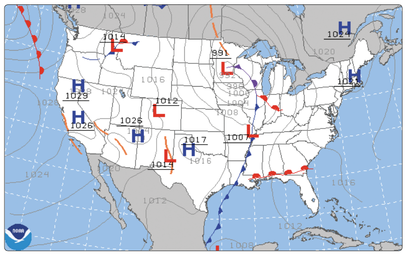
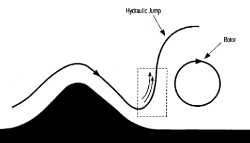

# Weather Theory

---

## Atmosphere

- Most weather occurs in the troposphere
- Air is around 78% nitrogen, 21% oxygen

---

## Ambient Pressure

- Barometer: Measures pressure
- Ambient pressure: ~14.7 psi at sea level
- International standard atmosphere is a common reference

---

Barometric pressure decreases with altitude:

- On average, 1" Hg per 1000'
- Wings, engine, propellers are all less efficient with less pressure

---

## Less Pressure = Less Performance

---

## Coriolis Force

- Hot air means lower pressure: air rises
- Radiation from the sun strikes the Earth strongly at the equator
- Since the earth is rotating, this causes circular wind patterns

---

In the northern hemisphere:

- Low pressure, inward and clockwise: anticyclonic
- High pressure, outward and counterclockwise: cyclonic

---

## Surface pressure maps

- Closer the contours: Greater the pressure differential
- Surface wind speeds are less

---

## Convective Heating

- Paved areas, plowed fields, dirt absorb and give off more heat quickly
- Trees, water, vegetation give off heat more slowly
- This uneven heating makes more warm pockets of air that cause turbulence

---

## Uneven Surface Heating

---

## Sea breeze vs land breeze

- Sea breeze:
  - Land heats quickly, hot air rises
  - Low pressure which draws cool air from the sea onshore (on-shore wind)
- Land breeze:
  - Land cools faster, so warm air over water rises
  - Draws air towards the sea (off-shore wind)

---

## Turbulent flows from obstructions

- Near the ground: hangars, buildings
- Mountains, ridges, bluffs

---

## Low-level wind shear

- Microbursts, often the vicinity of thunderstorms
- Especially dangerous near the ground

---

## Atmospheric stability

- The ability of the atmosphere to resist or encourage vertical motion
- Adiabatic cooling: Air loses temperature as it rises, since the ambient pressure decreases
- A parcel of air from the surface will cool at roughly the dry adiabatic lapse rate (3 °C (5.4 °F) per 1,000 feet)

---

If the parcel cools faster than the surrounding air, it will want to descend: **stability**

---

If the parcel cools slower than the surrounding air, it will want to ascend: **instability**

---

## Moisture and Stability

- The average lapse rate is 2&deg; per 1000'
- Moisture decrease air density. Moist air cools at a slower rate

- In summary:
  - Cool, dry air is very stable and resists vertical movement
  - Warm, moist air produces the most instability

---

## Temperature Inversions

- Temperature inversions: Layers where temperature _increases_ with altitude
  - Often occurs on clear, cool nights, when the ground cools the air above it
  - Can trap pollutants

---

- Moisture
  - Every 20&deg;F increase in temperature increases the capacity of water the air can hold
  - The relative humidity is the percentage of water present vs the total amount the air could hold
  - Dewpoint is the point at which the air would be completely saturated by the current level of humidity
  - Clouds often form when unstable air rises and cools to the dewpoint
  - Saturated air bring clouds, fog, and precipitation

---

- Dew and frost: form when surfaces cool beyond the dewpoint and water condenses on the side
- Fog: Ground clouds that form when the ground temperature is low
  - Radiation fog: Clear, windless nights, the ground cools and cools the air above it
  - Advection fog: Warm, moist air moves over a colder surface at night. This requires wind (usually up to 15 knots) to move the air
  - Upslope fog: Forms when air is forced up a slope and cools
  - Steam fog: Cold, dry air moves over water

---

- Clouds
  - Three ingredients for clouds to form: Moisture, cooling, condensation nuclei
  - Moisture condenses onto minicsule particles of matter
  - Low clouds, middle clouds, high clouds
  - Towering cumulus clouds contain very turbulent air and potential for thunderstorms

---

- Air masses
  - Form from large "source regions", where conditions may develop for days (deserts, oceans, large lakes, polar caps)
  - Cold over warm: unstable
  - Warm over cold: stable

---

- Fronts
  - Fronts are boundaries between two different air masses
    - As a front pass, the pressure will rise and climb, the temperature will change, and the wind direction will change
  - Warm front
    - Warm, often moist air that slides slowly over a colder air mass (shallow frontal slope)
    - Ahead of the front, cirriform or stratiform clouds and light precipitation
    - Poor visibility, haze as the front passes
  - Cold front
    - Cold, dense, stable air advances and quickly slide under and replaces a warmer air mass (steep frontal slope)
    - Prior the passage of a warm front, cumulonimbus clouds are common
    - A fast-moving cold front may produce a concentrated band of precipitin and thunder storms
    - Squall lines may form ahead of a fast-moving cold front
  - Stationary front
    - Air masses with relatively equal forces can remain stationary for several days
    - Weather is a mixture of cold front/warm front conditions
  - Occluded front
    - Occurs when a cold front overtakes a slow-moving warm front
    - Cold-front occlusion: Fast-moving cold front air is colder than the cooler air ahead of the warm front
      - Mixture of cold/warm front weather, relatively stable
    - Warm-front occlusion: Fast-moving cold front air is warmer than the cold air ahead of the warm front
      - The cold front "rides up" over the warm front, and instability occurs. This can sauce severe thunderstorms, rain, and fog

---

## Thunderstorms

- Three ingredients:
  - Instability
  - Lifting action
  - Moisture
- Heavy rain, hail, strong winds

---

## Stages of a Thunderstorm

- Cumulus stage
  - Air rises, strong updrafts occur
- Mature stage
  - Moisture is too heavy for cloud to support, precipitation starts falling, this causes a downdraft
  - Vertical motion is stalled, and top of the cloud forms the anvil shape
- Dissipating stage
  - Downdrafts spread and replace updrafts

---

## Thunderstorm Hazards

- Heavy rain
- Engine water ingestion
- Hail which may be thrown miles from the storm
- Violent turbulence in the storm and in the vicinity
- Wind shear turbulence and microbursts near the surface
- Supercooled water droplets that can freeze on impact with an airplane
- Lightning: Temporarily blindness, radio interference, magnetic compass errors

---

## Microbursts

- Result of strong downdrafts that form out of a storm (> 6000 fpm)
- Can cause severe windshear when they impact the ground
- Approximately 1-3 miles in diameter, last for 5-15 minutes

---

## Squall Lines

- Large line of steady-state thunderstorms
- Often associated with the passage of a fast-moving cold front

---

## Thunderstorm Avoidance

- It is impossible to fly over most thunderstorms, especially in a light aircraft
- Circumnavigate a severe or large-echo thunderstorm by at least 20nm
- Visual appearance to be a reliable indicator of turbulence
- Never use NEXRAD for navigating through thunderstorms
- More information in 00-24C

---

## Mountain Wave

