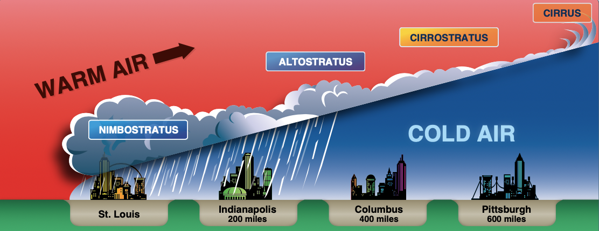
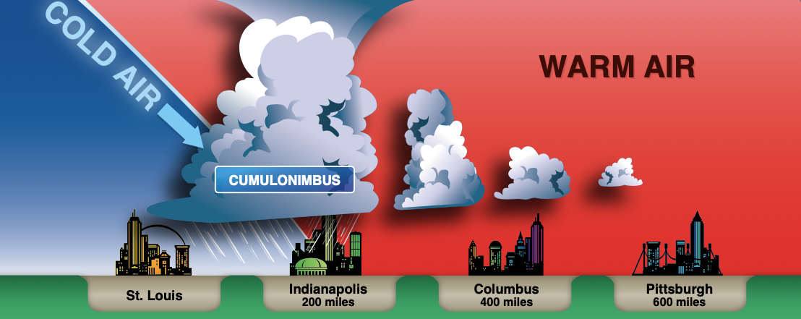

# Weather Theory

---

## Why learn about weather theory?

- How does weather affect airplane performance
- How do we interpret weather information

## What are the most important weather decisions we will make?

- Go/no go
- Decision to divert

---

## Overview

- Atmosphere
- Pressure
- Air masses
- Turbulence
- Stability
- Thunderstorms
- Mountain Wave

---

## Atmosphere

- Air is around 78% nitrogen, 21% oxygen
- Constant proportion as you ascend

---

## Ambient Pressure

- Barometer: Measures pressure
- Ambient pressure: ~14.7 psi at sea level

---

Barometric pressure decreases with altitude:

- On average, 1" Hg per 1000'
- Wings, engine, propellers are all less efficient with less pressure

---

## How does pressure change with temperature?

- How does air change with temperature?

---

## Less Pressure = Less Performance

---

## Uneven Heating of the Earth

- Sun's energy is most intense at the equator
- Hot air means lower pressure: air rises
- Since the earth is rotating, this causes circular wind patterns

---

## Coriolis Force

- Because the earth is spinning, objects in the atmosphere are deflected to the right

---

## Surface Pressure Maps

- Take all the pressure readings and plot them
- Isobars have the same pressure
  - Like contours on a topographical map

---

## Wind and Isobars

- Wind wants to flow across the isobars
- Due to the Coriolis force deflected and flows parallel to the isobars

---

In the northern hemisphere:

- Low pressure, inward and clockwise: anticyclonic
- High pressure, outward and counterclockwise: cyclonic

---

## Convective Heating

- Paved areas, plowed fields, dirt absorb and give off more heat quickly
- Trees, water, vegetation give off heat more slowly
- This uneven heating makes more warm pockets of air that cause turbulence

---

## Uneven Surface Heating

---

## Sea breeze vs land breeze

- Sea breeze:
  - Land heats quickly, hot air rises
  - Low pressure which draws cool air from the sea onshore (on-shore wind)
- Land breeze:
  - Land cools faster, so warm air over water rises
  - Draws air towards the sea (off-shore wind)

---

## Turbulence

---

## Turbulent flows from obstructions

- Near the ground: hangars, buildings
- Mountains, ridges, bluffs

---

## Low-level wind shear

- Microbursts, often the vicinity of thunderstorms
- Especially dangerous near the ground

---

## Convection / Conduction / Radiation Cycles

---

## Atmospheric stability

- The ability of the atmosphere to resist or encourage vertical motion
- Adiabatic cooling: Air loses temperature as it rises, since the ambient pressure decreases
- A parcel of air from the surface will cool at roughly the dry adiabatic lapse rate (3 °C (5.4 °F) per 1,000 feet)
- The average lapse rate is 2&deg; per 1000'

---

If the parcel cools faster than the surrounding air, it will want to descend: **stability**

Example:

- Parcel's 3&deg; per 1000'
- Average's 2&deg; per 1000'

---

If the parcel cools slower than the surrounding air, it will want to ascend: **instability**

Example:

- Parcel's 3&deg; per 1000'
- Average's 3.5&deg; per 1000'

---

## Moisture and Stability

- Moisture decreases air density
- Moist air cools at a slower rate
- In summary:
  - Cool, dry air is stable and resists vertical movement
  - Warm, moist air produces the most instability

---

## Temperature Inversions

- Layers where temperature _increases_ with altitude
- Often occurs on clear, cool nights, when the ground cools the air above it
- Can trap pollutants below the layer
- Smooth air can often be found above the inversion

---

## Moisture

- Every 20&deg;F increase doubles the capacity of water the air can hold
- The relative humidity is the percentage of this "saturation" of the air by water
- Dewpoint is the point at which the air would be completely saturated by the current amount of water
- Saturated air bring clouds, fog, and precipitation
  - Clouds often form when unstable air rises and cools to the dewpoint
  - Dew and frost: form when surfaces cool beyond the dewpoint and water condenses on the side

---

## Fog: Ground Clouds

- Radiation fog: Clear, windless nights, ground cools the air above it
- Advection fog: Warm, moist air moves over a colder surface at night.
  - Requires wind (up to 15 knots)
- Upslope fog: Forms when air is forced up a slope and cools
- Steam fog: Cold, dry air moves over water, causing evaporation

---

## Cloud Formation

- Three ingredients for clouds to form: Moisture, cooling, condensation nuclei
  - Moisture condenses onto minuscule particles of matter

---

---

## Air Masses

- Form from large source regions
- Deserts, oceans, large lakes, polar caps
- Source conditions may develop for days

---

## Fronts

- Fronts form as interactions between these air masses
- As front pass:
  - Pressure will change
  - The temperature will change
  - The wind direction will change

---

### Warm Fronts - Shallow frontal slope

- Warm, often moist air that slides slowly over a colder air mass (shallow frontal slope)
- Ahead of the front, cribriform or stratiform clouds and light precipitation
- Poor visibility, haze as the front passes

---

## Cold Fronts - Steep frontal slope

- Cold, dense, stable air quickly slides under and replaces a warmer air mass
- May produce a concentrated band of precipitation and thunderstorms
- Squall lines may form ahead of a fast-moving cold front

<!-- Remember cooling aloft means instability -->

---

## Stationary Front

- Air masses with relatively equal forces can remain stationary for several days
- Weather is a mixture of cold front/warm front conditions
- Precipitation is common

---

## Occluded front

- Cold fronts typically move faster than warm fronts, so they catch up to warm fronts
- Cold-front occlusion: A air is colder than B air
  - Cold front pushes warmer air aloft, stability
  - Mixture of cold/warm front weather
- Warm-front occlusion: B air is colder than A air

  - Cold front "rides up" over the warm front, cooling aloft, instability
  - Can cause severe thunderstorms, rain, fog

---

## Thunderstorms

- Three ingredients:
  - Instability
  - Lifting action
  - Moisture
- Heavy rain, hail, strong winds

---

## Stages of a Thunderstorm

- Cumulus stage
  - Air rises, strong updrafts occur
- Mature stage
  - Moisture is too heavy for cloud to support, precipitation starts falling, this causes a downdraft
  - Vertical motion is stalled, and top of the cloud forms the anvil shape
- Dissipating stage
  - Downdrafts spread and replace updrafts

---

## Thunderstorm Hazards

- Heavy rain
- Engine water ingestion
- Hail which may be thrown miles from the storm
- Violent turbulence in the storm and in the vicinity
- Wind shear turbulence and microbursts near the surface
- Supercooled water droplets that can freeze on impact with an airplane
- Lightning: Temporarily blindness, radio interference, magnetic compass errors

---

## Microbursts

- Result of strong downdrafts that form out of a storm (> 6000 fpm)
- Can cause severe windshear when they impact the ground
- Approximately 1-3 miles in diameter, last for 5-15 minutes

---

## Squall Lines

- Large line of steady-state thunderstorms
- Often associated with the passage of a fast-moving cold front

---

## Thunderstorm Avoidance

- It is impossible to fly over most thunderstorms, especially in a light aircraft
- Circumnavigate a severe or large-echo thunderstorm by at least 20nm
- Visual appearance to be a reliable indicator of turbulence
- Never use NEXRAD for navigating through thunderstorms
- More information in 00-24C

---

## Mountain Wave

## Thunderstorms

- Three ingredients:
  - Instability
  - Lifting action
  - Moisture
- Heavy rain, hail, strong winds

---

## Stages of a Thunderstorm

- Cumulus stage
  - Air rises, strong updrafts occur
- Mature stage
  - Moisture is too heavy for cloud to support, precipitation starts falling, this causes a downdraft
  - Vertical motion is stalled, and top of the cloud forms the anvil shape
- Dissipating stage
  - Downdrafts spread and replace updrafts

---

## Thunderstorm Hazards

- Heavy rain
- Engine water ingestion
- Hail which may be thrown miles from the storm
- Violent turbulence in the storm and in the vicinity
- Wind shear turbulence and microbursts near the surface
- Supercooled water droplets that can freeze on impact with an airplane
- Lightning: Temporarily blindness, radio interference, magnetic compass errors

---

## Microbursts

- Result of strong downdrafts that form out of a storm (> 6000 fpm)
- Can cause severe windshear when they impact the ground
- Approximately 1-3 miles in diameter, last for 5-15 minutes

---

## Squall Lines

- Large line of steady-state thunderstorms
- Often associated with the passage of a fast-moving cold front

---

## Thunderstorm Avoidance

- It is impossible to fly over most thunderstorms, especially in a light aircraft
- Circumnavigate a thunderstorm radar echo by at least 20nm

---

## Mountain Wave

---

Things to add:

- Local weather examples
- Conclusion and questions
- Turbulence
- Add frontal/precipitation fog
- Morning fog
-
- Photos from each type of fog
- Types of icing slide
-
