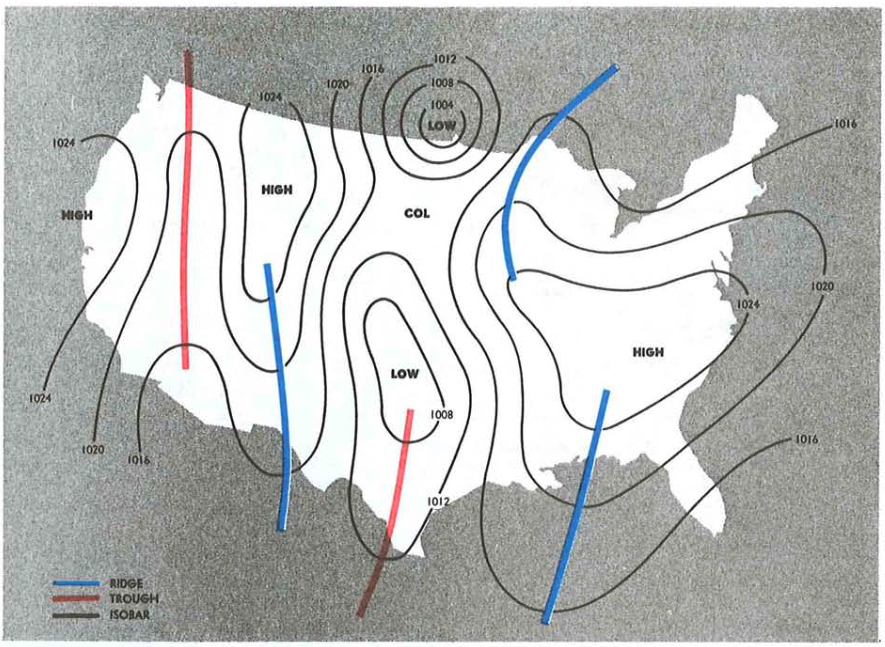
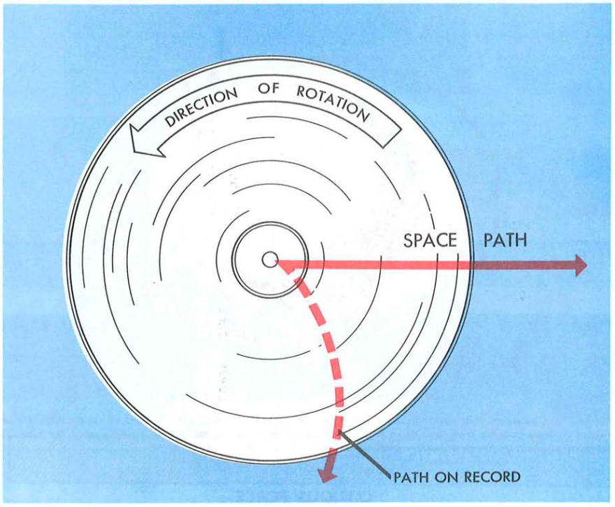

# Weather Theory

---

## Objective

To understand basic meteorology concepts and how they relate to aviation, especially those that affect the safety of flight.

## Motivation

- We need to understand how weather affects airplane performance
- We want to effectively interpret weather data

---

### What are the most important weather decisions we will make?

- Go/no go decisions
- Route planning
- Decisions to divert

---

## Overview

- The Atmosphere
- Temperature
- Pressure
- Wind
- Turbulence
- Stability
- Moisture and Clouds
- Thunderstorms
- Mountain Wave

---

## Atmosphere

Air is around 78% nitrogen, 21% oxygen.

Remains a constant proportion as you ascend.

---

## The Standard Atmosphere

- The real atmosphere is always changing
- We use the **International Standard Atmosphere** as a fixed reference
  - 29.92 inches Hg at sea level
  - 15&deg; C (59&deg; F) at sea level
  - Temperature drops 2&deg; per 1000 feet
  - Pressure drops 1" per 1000 feet

---

## Temperature

- Temperature describes the heat energy contained in a substance
- Substances absorb and retain heat differently
  - Land will become hot quickly and radiate lots of heat
  - Water will absorb and emit little heat energy

---

## Temperature Variation

- Diurnal variation: Changes in temperature from day to night
- Seasonal variation: Summer vs winter temperatures
- Latitude variation: Equatorial regions are hotter than polar regions

---

## Temperature Variation (cont.)

- Topography variation
  - Dry, barren surfaces emit heat more than wet or vegetated regions
- Altitude variation: Temperature decreases with altitude
  - Rate is given by the **lapse rate**
  - Average lapse rate is **2**&deg; per 1000 feet

---

## Pressure

- Atmospheric pressure is the force per unit area exerted by the weight of the atmosphere
- Pressure units:
  - Pounds per square inch (PSI)
  - Millibars
  - Inches of mercury (e.g. 29.92" Hg)
- Ambient pressure at sea level:
  - ~14.7 (PSI)
  - 1013.2 millibars
  - 29.92" Hg

---

## How does pressure change with altitude?

- Pressure decreases as you ascend in the atmosphere
- Barometric pressure is about 50% dense at 18,000 ft
- Standard atmosphere
  - 29.92" Hg at sea level
  - Pressure drops 1" Hg per 1000 feet

---

## Less Pressure = Less Performance

---

## How does pressure change with temperature?

- How does air change with temperature?
- Higher temperature = higher pressure
- Air expands as it gets warmer

---

## Mapping Pressure

- What if we plot ambient pressure on a map?
- Black lines are called **isobars**: Lines of equal pressure
  - Like contours on a topographical map
  - Tightly spaced = big change in pressure over a small distance

---

## Wind and Advection

- Differences in temperature create differences in pressure
- Areas of high pressure want to equalize (move towards) areas of lower pressure
- This results in a **pressure gradient force**, which results in wind

---

## Coriolis Force

- The Earth is spinning, so objects that move in a straight line in space appear to be deflected to the right on the surface
- This "force" is zero at the equator and increases towards the poles

---

- The Coriolis force acts proportionally to wind speed and opposite the pressure gradient force
- This results in wind flowing _parallel_ to the isobars

---

## Wind and Isobars

In the northern hemisphere:

- Low pressure, inward and clockwise: anticyclonic
- High pressure, outward and counterclockwise: cyclonic

---

## Surface Friction

- When wind is close to the ground additional friction influences the wind direction
- Wind will flow at an angle across the isobars

---

## Sea breeze and land breeze

- Sea breeze:
  - Land heats quickly, hot air rises
  - Low pressure which draws cool air from the sea onshore (on-shore wind)
- Land breeze:
  - Land cools faster, so warm air over water rises
  - Draws air towards the sea (off-shore wind)

---

# Turbulence

---

## Convective Heating

- Paved areas, plowed fields, dirt absorb and give off more heat quickly
- Trees, water, vegetation give off heat more slowly
- This uneven heating makes more warm pockets of air that cause turbulence

---

## Uneven Surface Heating

---

## Turbulent flows from obstructions

- Near the ground: hangars, buildings
- Mountains, ridges, bluffs

---

## Wind shear

- Turbulent area with mixing between two air different air masses

---

## Low-level wind shear

- Microbursts, often the vicinity of thunderstorms
- Especially dangerous near the ground

---

## Mountain Wave

- Large updrafts on the upwind side of the ride
- Large downdrafts on the leeward side
- Turbulence can be violent in the rotor
- Can extend for 100 miles downwind

---

## Atmospheric Stability

The tendency of atmosphere to resist or encourage vertical motion

---

## Adiabatic Cooling

- Adiabatic cooling: Air loses temperature as it rises, since the ambient pressure decreases
- A parcel of air lifted from the surface will cool at the **dry adiabatic lapse rate**
  - 3 °C (5.4 °F) per 1,000 feet
  - This is independent of the lapse rate of the air mass surrounding it

---

If the parcel cools faster than the surrounding air, it will want to descend: **stability**

Example:

- Parcel lapse rate: 3&deg; per 1000'
- Atmospheric lapse rate: 2.5&deg; per 1000'

---

If the parcel cools slower than the surrounding air, it will want to ascend: **instability**

Example:

- Parcel lapse rate: 3&deg; per 1000'
- Atmospheric lapse rate: 3.5&deg; per 1000'

---

## Moisture and Stability

- Moisture decreases air density
- Moist air cools at a slower rate than dry air
- **Conditionally unstable** means air is unstable until it saturates, then it becomes stable

---

## Stability Summary

- Cool, dry air is stable and resists vertical movement
- Warm, moist air produces the most instability
  - A fast lapse rate indicates an unstable atmosphere

---

## Temperature Inversions

- Layers where temperature _increases_ with altitude
- Often occurs on clear, cool nights, when the ground cools the air above it
- Can trap pollutants below the layer
- Smooth air can often be found above the inversion

---

## Moisture and Clouds

---

## Moisture and Temperature

Every 20&deg;F increase in temperature doubles the capacity of water the air can hold

---

## Dewpoint and Relative Humidity

- **Relative humidity** is the percentage of water in the air vs. how much water the air could hold at that temperature
- **Dewpoint** is the point at which the air would be completely saturated by the current amount of water

---

## Saturated Air

Saturated air bring clouds, fog, and precipitation

- Clouds often form when unstable air rises and cools to the dewpoint
- Dew and frost: form when surfaces cool beyond the dewpoint and water condenses on the side

---

## Fog - Ground Clouds

Fog forms when the ground cools the air above it to its dewpoint, then the water vapor condenses and forms a cloud.

---

## Radiation fog

- Clear, windless nights with sufficent humidity
- Ground cools the air above it
- Dissipates quickly with a rise in temperature or light winds

---

## Advection fog

- Warm, moist air moves over a colder surface
- Requires wind, up to 15 knots
- Coastal regions are particularly effected (U.S. west coast)

---

## Upslope fog

- Moist air is forced up a slope
- Air then adiabatically cools to dewpoint and fog forms

---

## Steam fog

Cold, dry air moves over water, causing evaporation from the water

---

## Front / Precipitation Fog

- Often associated with a warm front
- Rain falls into air mass below it, raising it's humidity

---

## Clouds

---

## Cloud Formation

- Three ingredients for clouds to form: Moisture, cooling, condensation nuclei
  - Moisture condenses onto minuscule particles of matter

---

---

## Air Masses

- Form from large source regions
- Deserts, oceans, large lakes, polar caps
- Source conditions may develop for days

---

## Fronts

- Fronts form as interactions between these air masses
- As front pass:
  - Pressure will change
  - The temperature will change
  - The wind direction will change

---

### Warm Fronts - Shallow frontal slope

- Warm, often moist air that slides slowly over a colder air mass (shallow frontal slope)
- Ahead of the front, cribriform or stratiform clouds and light precipitation
- Poor visibility, haze as the front passes

---

## Cold Fronts - Steep frontal slope

- Cold, dense, stable air quickly slides under and replaces a warmer air mass
- May produce a concentrated band of precipitation and thunderstorms
- Squall lines may form ahead of a fast-moving cold front

<!-- Remember cooling aloft means instability -->

---

## Stationary Front - Equal air masses

- Air masses with relatively equal forces can remain stationary for several days
- Weather is a mixture of cold front/warm front conditions
- Precipitation is common

---

## Occluded front - Cold front overtaking

- Cold fronts typically move faster than warm fronts, so they catch up to warm fronts
- Two types:
  - Cold-front occlusion: A air is colder than B air
  - Warm-front occlusion: B air is colder than A air

---

## Cold-front Occlusion

- Cold front pushes warmer air aloft, stability
- Mixture of cold/warm front weather

---

## Warm-front Occlusion

- Cold front "rides up" over the warm front, cooling aloft, instability
- Can cause severe thunderstorms, rain, fog

---

## Thunderstorms

- Three ingredients:
  - Instability
  - Lifting action
  - Moisture
- Heavy rain, hail, strong winds

---

## Stages of a Thunderstorm

- Cumulus stage
  - Air rises, strong updrafts occur
- Mature stage
  - Moisture is too heavy for cloud to support, precipitation starts falling, this causes a downdraft
  - Vertical motion is stalled, and top of the cloud forms the anvil shape
- Dissipating stage
  - Downdrafts spread and replace updrafts

---

## Thunderstorm Hazards

- Heavy rain
- Engine water ingestion
- Hail which may be thrown miles from the storm
- Violent turbulence in the storm and in the vicinity
- Wind shear turbulence and microbursts near the surface
- Supercooled water droplets that can freeze on impact with an airplane
- Lightning: Temporarily blindness, radio interference, magnetic compass errors

---

## Microbursts

- Result of strong downdrafts that form out of a storm (> 6000 fpm)
- Can cause severe windshear when they impact the ground
- Approximately 1-3 miles in diameter, last for 5-15 minutes

---

## Squall Lines

- Large line of steady-state thunderstorms
- Often associated with the passage of a fast-moving cold front

---

## Thunderstorm Avoidance

- It is impossible to fly over most thunderstorms, especially in a light aircraft
- Circumnavigate a severe or large-echo thunderstorm by at least 20nm
- Visual appearance to be a reliable indicator of turbulence
- Never use NEXRAD for navigating through thunderstorms
- More information in 00-24C

---

## Icing

---

## Structural Icing

Buildup of ice on the airplane structure can be extremely hazardous

---

## Conditions for Icing

1. Aircraft is flying through visible moisture (clouds, vapor)
2. Temperature at the point where the moisture strikes must be 0&deg; C or colder

---

## Types of Icing

- Clear icing: Often forms when large drops of moisture freeze after contacting the fuselage
  - Common at lower altitude
- Rime icing: Small droplets freeze rapidly, leading to a rough surface
  - Common at higher altitudes

---

## Summary

- The Atmosphere: ISA, most weather is in the troposphere
- Temperature: Uneven heating
- Pressure: Temperature creates pressure differences
- Wind: High pressure to low pressure
- Turbulence: Unstable air, ground interference, mountain wave
- Stability: Fast lapse rate indicates instability
- Moisture, Fog, and Clouds: Clouds forms when air reaches its dewpoint
- Air masses: Air masses interact in frontal areas
- Thunderstorms: Hazardous weather for all aircraft

---

## Knowledge Check

What are the three ingredient needed for a thunderstorm to form?

---

## Knowledge Check

You're planning a flight and trying to determine a cruising altitude. According to the forecasts, the cloud bases are around 4,500' MSL. Which cruising altitude would most likely have a smoother ride, 3000' or 6000'?

---

## Knowledge Check

Coming into land at a new airport, the weather report states that the wind is blowing 12 knots, gusting to 19 knots. How would you change your approach and landing?
