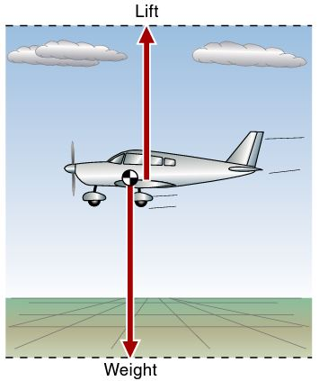
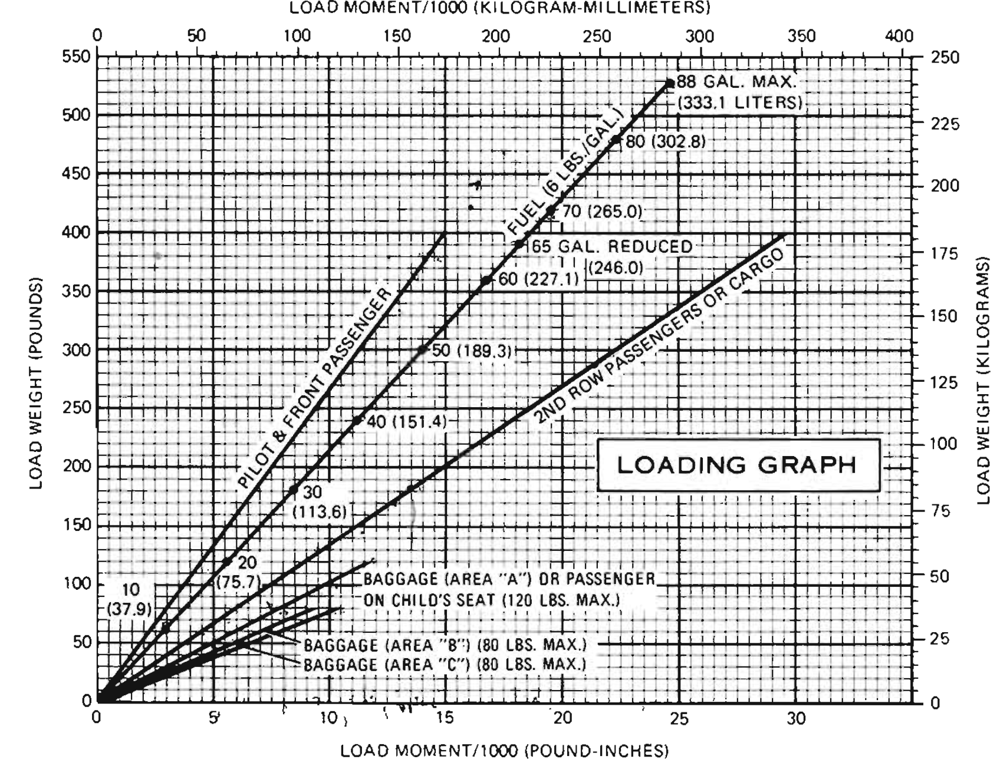
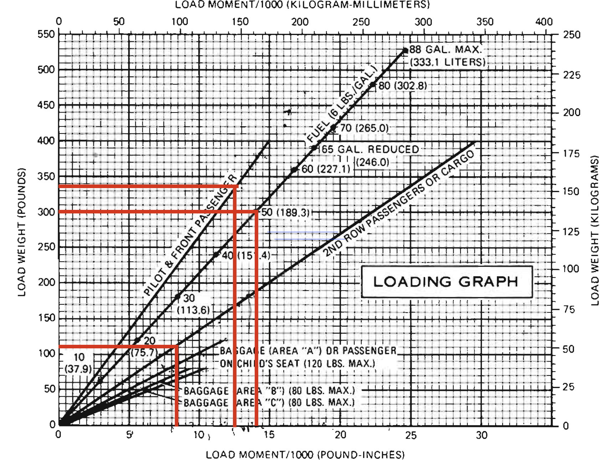
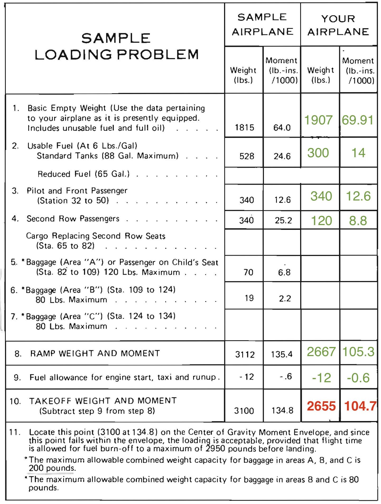
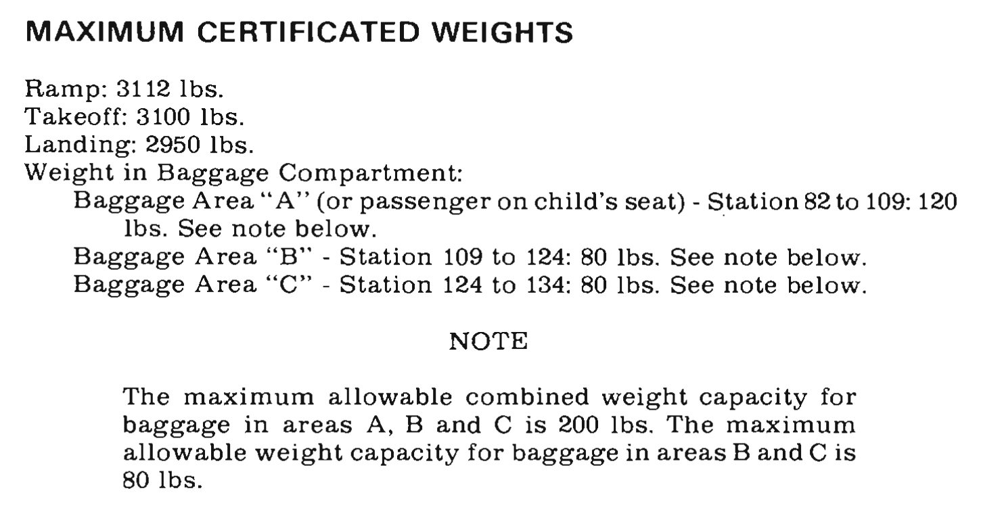

# Weight and Balance

---

## Objective

Understand the concept of weight and balance, the relationship of center of gravity on aircraft performance and limitations, and how to compute a weight and balance problem.

## Motivation

The effect of weight and CG location is critical to the safety of flight and an essential part of cross-country flight planning. Pilots should have a clear understand of the limits of their airplane with regards to weight and balance.

Instruction: Known to unknown, simple to complex

---

## Overview

- Weight and performance
- Weight and balance concepts
  - Torque
  - Moments
- Terms and Definitions
- Sample weight and balance problem
- Weight and balance and performance

---

## Airplane Weight

- The greater the weight, the greater the lift provided
- The greater the lift, more induced drag
- Thus more **weight = less airplane performance**
  - Slower cruise speed
  - Higher takeoff speed, longer takeoff roll
  - Slower climb performance
  - Higher landing speed, longer landing roll

---

## Torque: See-Saw, Moments, Datum, CG

---

## Terms

- Datum: Fixed reference point to measure from
- Station: Area where item can be loaded
- Arm: Distance from datum to the item
- Moment: Item arm \* item weight
- Center of Gravity:
  - Point at which weight appears to be concentrated
  - Location of C.G. = Total moments / total weights
- Loading Envelope: Graph of acceptable weight and CG ranges

---

## Stations

---

## Weights

- **Standard empty weight**: From the factory with standard equipment
  - Includes oil, fuel, and unusable fuel
- **Basic empty weight**
  - Standard empty weight, plus optional equipment
  - What we'll start with for W&B calculations
- **Licensed empty weight**:
  - Older term, does not include full engine oil
- **Max ramp weight (MRW)**: The maximum weight for ground operations (3112 lbs)
- **Max takeoff weight (MTOW)**: Maximum weight for takeoff (3100 lbs)
- **Max landing weight (MLW)**: Max weight for landing (2950 lbs)
- **Useful load**: Max ramp weight - Basic empty weight

---

## W&B Sheet

- Required to be in the airplane
- Changes whenever work is done that changes the W&B

---

# Sample Problem

---

## W&B Problem

- Fuel: 50 gallons of 100LL
  - 100LL is 6 lbs / gal.
- Pilot: 160lbs
- Co-pilot: 180lbs
- Rear passenger: 120lbs
- Expected fuel burn during the flight: 40 gallons

---

---

---

## Alternate Method: Weight \* Arm = Moment

<table>
<tbody>

<tr>
  <th>
    Station
  </th>
  <th>
    Weight
  </th>
  <th>
    Arm
  </th>
  <th>
    Moment
  </th>
  <th>
    Moment / 1000
  </th>
</tr>

<tr>
  <td>
    Basic Empty Weight
  </td>
  <td>
    1907
  </td>
  <td>
    36.68
  </td>
  <td>
    69,910
  </td>
  <td>
    69.91
  </td>
</tr>

<tr>
  <td>
    Usable Fuel
  </td>
  <td>
    300
  </td>
  <td>
    46.66
  </td>
  <td>
    14,000
  </td>
  <td>
    14
  </td>
</tr>

<tr>
  <td>
    Pilot and Front Passenger
  </td>
  <td>
    340
  </td>
  <td>
    37
  </td>
  <td>
    12,600
  </td>
  <td>
    12.6
  </td>
</tr>

<tr>
  <td>
    Second Row Passenger
  </td>
  <td>
    120
  </td>
  <td>
    74
  </td>
  <td>
    8,880
  </td>
  <td>
    8.8
  </td>
</tr>

<tr>
  <td>
    <strong>Ramp Weight</strong>
  </td>
  <td>
    2667
  </td>
  <td>
    39.51
  </td>
  <td>
    105,390
  </td>
  <td>
    105.39
  </td>
</tr>

</tbody>
</table>

---

## CG Moment Envelope

---

## CG Location Envelope

---

## What is our landing weight?

2655 lbs, 104.7 in-lbs / 1000, 40 gallon fuel burn, fuel arm 46.66

---

## What is our landing weight and moment?

- $2655 - 40\text{ gal} * 6\text{ lbs/gal} = 2415\text{ lbs}$
- $104700 - 46.66 * 40\text{ gal} * 6\text{ lbs/gal} = 93501\text{ in-lbs}$

---

## What happens if we move our 180 passenger to the rear seats?

2655 lbs, 104.7 in-lbs / 1000, front seat arm 37, rear seat arm 74

---

## What happens if we move our 180 passenger to the rear seats?

- Weight doesn't change = 2655 lbs
- $104700 - 180\text{ lbs} * 37\text{ in} + 180\text{ lbs} * 74\text{ in} = 111360\text{ in-lbs}$

---

## CG Moment Envelope

---

## What happens if we add a forth passenger to the copilot seat who weighs 200, and we fill the fuel tanks?

2655 lbs, 111.36 in-lbs / 1000, front seat arm 37, fuel arm 46.66

---

## What happens if we add a forth passenger to the copilot seat who weighs 200, and we fill the fuel tanks?

- $2655 + 200 + 38 * 6 = 3083$
- $111360 + 200\text{ lbs} * 37\text{ in} + 38 * 6 * 46.66\text{ in} = 129398\text{ in-lbs}$

---

## CG Moment Envelope

---

## Other Limitations

---

# How W&B Affects Performance

---

## Overweight

&nbsp;

Reduced climb performance, longer takeoff/landing roll, slower cruise speed

---

## CG and Cruise Performance: Rearward CG

&nbsp;

Less drag, faster cruise speed, sensitive controls, less stable

---

## CG Aft of Limits

&nbsp;

Stall recovery may be inhibited

---

## CG and Cruise Performance: Forward CG

&nbsp;

Slower cruise speed, less sensitive controls, more stable

---

## CG Forward of Limits

&nbsp;

---

# Summary

- Weight and balance concepts
  - Torque
  - Moments
- Terms and Definitions
- Sample weight and balance problem
- Weight and balance and performance

---

## Knowledge Check

You show up to the plane, ready to take three friends flying. The last pilot topped off the airplane with 88 gallons, which will put you over gross weight.

How would you deal with the situation?

---

## Knowledge Check

You're planning a cross-country with a passenger who's new to flying. He brings 100lbs of baggage and want to put it in the back, which will put you aft of your CG limits. He says "there's plenty of room!"

How would you respond?

---

## Knowledge Check

You depart in a T182 a gross weight of 3010 pounds with several passengers. One of you passengers immediately starts feeling ill and asks if you can turn back.

What would you say?
