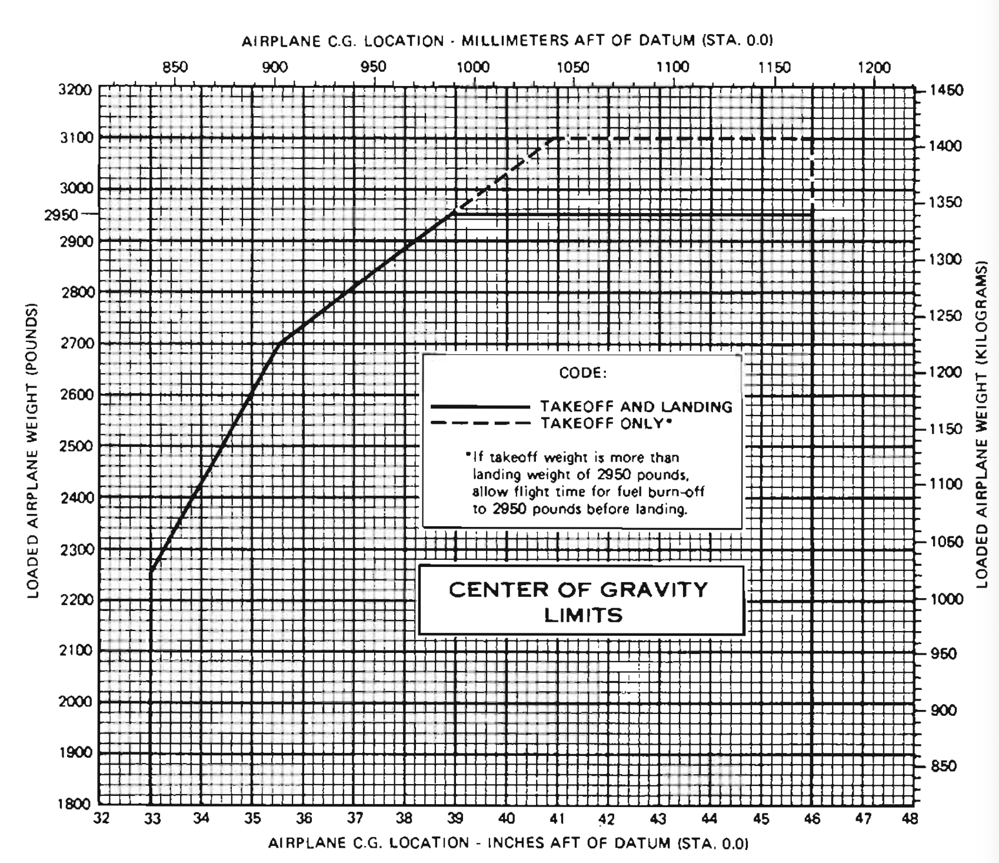

# Weight and Balance

---

## Objective

Understand the concept of weight and balance, the relationship of center of gravity on aircraft performance and limitations, and how to compute a weight and balance problem.

## Motivation

The effect of weight and CG location is critical to the safety of flight and an essential part of cross-country flight planning. Pilots should have a clear understand of the limits of their airplane with regards to weight and balance.

---

## Overview

- Weight and balance concepts
  - Torque
  - Moments
- Terms and Definitions
- Sample weight and balance problem
- Weight and balance and performance

---

## Torque: See-Saw, Moments

---

## Terms

- Datum: Fixed reference point to measure from
- Station: Area where item can be loaded
- Arm: Distance from datum to the item
- Moment: Item arm \* item weight
- Center of Gravity:
  - Point at which weight appears to be concentrated
  - Location of C.G. = Total moments / total weights
- Loading Envelope: Graph of acceptable weight and CG ranges

---

## Stations

---

## Weights

- **Standard empty weight**: From the factory with standard equipment
  - Includes oil, fuel, and unusable fuel
- **Basic empty weight**
  - Standard empty weight, plus optional equipment
  - What we'll start with for W&B calculations
- **Licensed empty weight**:
  - Older term, does not include full engine oil
- **Max ramp weight (MRW)**: The maximum weight for ground operations (no flight)
- **Max takeoff weight (MTOW)**: Maximum weight for takeoff
- **Max landing weight (MLW)**: Max weight for landing
- Fuel: 100LL is 6 lbs / gal.

---

## W&B Sheet

- Required to be in the airplane
- Changes whenever work is done that changes the W&B

---

# Sample Problem

---

## W&B Problem

- Fuel: 50 gallons of 100LL
  - @ 6lbs / gallon
- Pilot: 160lbs
- Co-pilot: 180lbs
- Rear passenger: 120lbs
- Expected fuel burn during the flight: 40 gallons

---

---

## What is the takeoff and landing weight?

---

## What happens if we move our 180 passenger to the rear seats?

---

## What happens if we add a forth passenger to the copilot seat who weighs 200?

---

## Loading Graph

---

## CG Moment Envelope

---

## CG Location Envelope

---

# How W&B Affects Performance

---

## Overweight

&nbsp;

---

## CG and Cruise Performance: Elevator Downwash

&nbsp;

---

## CG Aft of Limits

&nbsp;

---

## CG Forward of Limits

&nbsp;

---

# Summary

- Weight and balance concepts
  - Torque
  - Moments
- Terms and Definitions
- Sample weight and balance problem
- Weight and balance and performance

---

## Knowledge Check

You're planning a cross-country with a passenger who's new to flying. He brings 100lbs of baggage and want to put it in the back, which will put you aft of your CG limits. He says "there's plenty of room!"

How would you respond?
